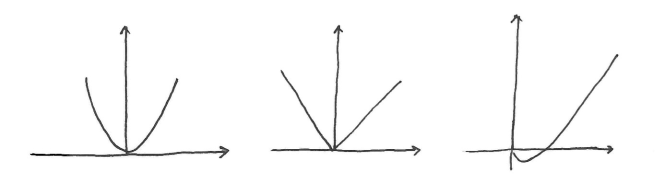
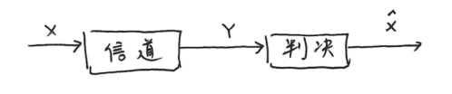
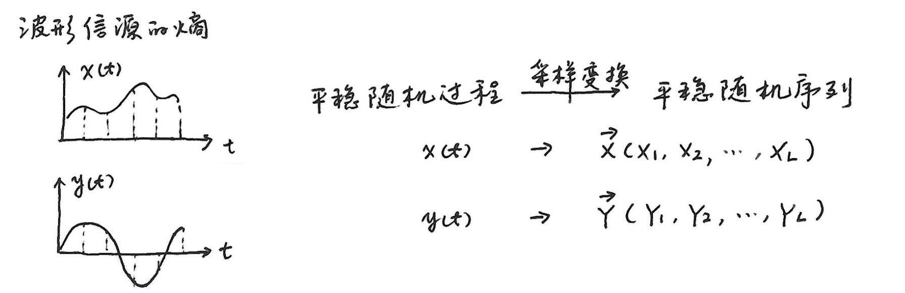

# 第二章 信源与信息熵

---
- [第二章 信源与信息熵](#第二章-信源与信息熵)
    - [2.1 信源的分类及数学模型](#21-信源的分类及数学模型)
        - [无记忆的单符号](#无记忆的单符号)
        - [无记忆的符号序列](#无记忆的符号序列)
        - [有记忆的符号序列](#有记忆的符号序列)
            - [马尔可夫信源](#马尔可夫信源)
        - [时间连续、幅度连续的模拟信号（随机波形信源）](#时间连续幅度连续的模拟信号随机波形信源)
    - [2.2 离散信源熵和互信息](#22-离散信源熵和互信息)
        - [自信息量](#自信息量)
        - [离散信源熵 - 熵的定义](#离散信源熵---熵的定义)
            - [二元信源](#二元信源)
        - [条件熵](#条件熵)
        - [联合熵](#联合熵)
        - [互信息](#互信息)
        - [相对熵](#相对熵)
        - [熵、相对熵与互信息的链式法则](#熵相对熵与互信息的链式法则)
            - [熵的链式法则](#熵的链式法则)
            - [互信息的链式法则](#互信息的链式法则)
            - [相对熵的链式法则](#相对熵的链式法则)
        - [Jensen不等式](#jensen不等式)
            - [凸函数与凹函数](#凸函数与凹函数)
            - [Jensen不等式](#jensen不等式-1)
            - [信息不等式/相对熵的非负性](#信息不等式相对熵的非负性)
            - [互信息的非负性](#互信息的非负性)
        - [熵的性质](#熵的性质)
        - [对数和不等式及其应用](#对数和不等式及其应用)
            - [对数和不等式](#对数和不等式)
            - [相对熵的下凸性](#相对熵的下凸性)
            - [熵的凹性](#熵的凹性)
            - [互信息的凹凸性](#互信息的凹凸性)
    - [2.3 数据处理不等式](#23-数据处理不等式)
        - [三变量互信息](#三变量互信息)
        - [一阶马尔可夫链](#一阶马尔可夫链)
            - [定义](#定义)
            - [结论](#结论)
        - [数据处理不等式](#数据处理不等式)
        - [费诺不等式](#费诺不等式)
            - [定义](#定义-1)
            - [费诺不等式](#费诺不等式-1)
            - [费诺不等式（一般形式）](#费诺不等式一般形式)
            - [其他不等式](#其他不等式)
    - [2.4 离散序列信源的熵](#24-离散序列信源的熵)
        - [离散无记忆信源的序列熵](#离散无记忆信源的序列熵)
        - [离散有记忆信源的序列熵](#离散有记忆信源的序列熵)
        - [离散平稳信源序列熵](#离散平稳信源序列熵)
            - [定义](#定义-2)
            - [结论](#结论-1)
        - [马尔可夫信源的极限熵](#马尔可夫信源的极限熵)
    - [2.5 连续信源的熵和互信息](#25-连续信源的熵和互信息)
        - [微分熵（连续信源熵）](#微分熵连续信源熵)
        - [幅度连续的单符号信源](#幅度连续的单符号信源)
            - [连续信源熵](#连续信源熵)
            - [联合熵、条件熵和互信息](#联合熵条件熵和互信息)
        - [波形信源的熵](#波形信源的熵)
        - [最大熵定理(连续信源)](#最大熵定理连续信源)
    - [2.6 信源的冗余度](#26-信源的冗余度)

---

## 2.1 信源的分类及数学模型

### 无记忆的单符号
- **离散**
    - 信源输出单个符号的消息，出现的消息数是有限的，且只可能是符号集中的一种
    - 各符号出现的概率与信源相互确定
    - **数学表示**：
        \[
        \begin{bmatrix} X \\ P \end{bmatrix} = 
        \begin{bmatrix} a_1 & a_2 & \cdots & a_n \\ p(a_1) & p(a_2) & \cdots & p(a_n) \end{bmatrix}
        \]

        其中符号集 \(A = \{a_1, a_2, \cdots, a_n\}\)，\(X \in A\)。显然有 \(p(a_i) \geq 0\)，\(\sum_{i = 1}^{n} p(a_i) = 1\)。 
- **连续**
    - 信源输出单个符号的消息，出现的消息数是无限的
    - **数学表示**：
        \[
        \begin{bmatrix} X \\ P \end{bmatrix} = 
        \begin{bmatrix} (a,b) \\ p_X(x) \end{bmatrix}
        或
        \begin{bmatrix} R \\p_X(x) \end{bmatrix}
        \]

        显然应满足 \(p_X(x) \geq 0\)，\(\int_{a}^{b} p_X(x) \mathrm{d}x = 1\) 或 \(\int_{R} p_X(x) \mathrm{d}x = 1\)。

### 无记忆的符号序列
- 每次发出一组含2个以上符号的符号序列来代表一个消息
- 需要用随机序列（或随机矢量）\(\mathbf{X}=(X_1,X_2,\cdots,X_l,\cdots,X_L)\)来描述信源输出的消息，用联合概率分布来表示信源特性。
- 最简单的符号序列信源是\(L\)为2的情况，此时信源\(\mathbf{X}=(X_1,X_2)\)，其信源的概率空间为：
    \[
    \begin{bmatrix} \mathbf{X} \\ P \end{bmatrix} = 
    \begin{bmatrix} a_1,a_1 & a_1,a_2 & \cdots & a_n,a_n \\ p(a_1,a_1) & p(a_1,a_2) & \cdots & p(a_n,a_n) \end{bmatrix} \quad 
    \]

    显然有 \(p(a_i,a_j)\geq0\)，\(\sum_{i,j = 1}^{n} p(a_i,a_j) = 1\)。 

- ***无记忆***
    - 符号序列的各维相独立（**有放回取球**）
    - \(p(X_1,X_2,\cdots,X_l,\cdots,X_L) = p(X_1)p(X_2)\cdots p(X_l)\cdots p(X_L)\)

- ***平稳***
    - 信源发出的序列的统计性质与时间的推移无关，是平稳的随机序列。
    - 强：信源输出序列的各维概率分布都不随时间推移而发生变化
    - 弱：信源输出序列的均值与起始时刻无关、协方差函数也与起始时刻无关而仅与时间间隔有关

- ***独立同分布(i.i.d.)***
    - 离散、平稳、无记忆、具有相同概率空间
    - \(p(X_1)=p(X_2)=\cdots =p(X_l)=\cdots =p(X_L)\)
    - \(p(X_1,X_2,\cdots,X_L)=\prod_{l = 1}^{L}p(X_l)=[p(X)]^L\)
    -  其中 \(X \in A = \{a_1, a_2, \cdots, a_n\}\)，\(\mathbf{X}\)有\(n^L\)种可能性，\(\sum_{i = 1}^{n^L} p(\mathbf{X}=\mathbf{X_i}) = 1\)。 

### 有记忆的符号序列
- 信源在不同时刻发出的符号之间是相互依赖的。（**不放回取球**）
    \[
    \begin{align*}
    p(x_1,x_2,x_3,\cdots,x_L)&=p(x_L\mid x_1,x_2,x_3,\cdots,x_{L - 1})p(x_1,x_2,x_3,\cdots,x_{L - 1})\\
    &=\cdots\\
    &=p(x_1)p(x_2|x_1)p(x_3|x_2,x_1)\cdots p(x_L|x_{L-1},\cdots, x_1)
    \end{align*}
    \]
- 表述的复杂度将随着序列长度的增加而增加。

#### 马尔可夫信源
- **m阶马尔可夫信源**
    - 当信源的记忆长度为\(m+1\)时，该时刻发出的符号与前m个符号有关联性，而与更前面的符号无关
        \[
        \begin{align*}
        p(x_1,x_2,x_3,\cdots,x_L)&=p(x_L\mid x_1,x_2,x_3,\cdots,x_{L - 1})p(x_1,x_2,x_3,\cdots,x_{L - 1})\\
        &=p(x_L\mid x_{L - m},\cdots,x_{L - 1})p(x_1,x_2,x_3,\cdots,x_{L - 1})\\
        &=p(x_L\mid x_{L - m},\cdots,x_{L - 1})p(x_{L - 1}\mid x_{L - m - 1},\cdots,x_{L - 2})p(x_1,x_2,x_3,\cdots,x_{L - 2})\\
        &=\cdots
        \end{align*}
        \]
    - 若\(m=1\)，则称为**一阶马尔可夫信源**，有：
        \[
        p(x_1,x_2,x_3,\cdots,x_L)=p(x_L\mid x_{L - 1})p(x_{L - 1}\mid x_{L - 2})\cdots p(x_2\mid x_1)p(x_1)
        \]
    - **齐次马尔可夫信源**：条件概率与时间起点无关

- **状态\(s_i\)**
    - 对于 \(m\) 阶马尔可夫信源，将该时刻以前出现的 \(m\) 个符号组成的序列定义为状态 \(s_i\)
    - \(s_i=(x_{i_1},x_{i_2},\cdots,x_{i_m})\quad x_{i_1},x_{i_2},\cdots,x_{i_m}\in A=(a_1,a_2,\cdots,a_n)\)
    - \(s_i\) 共有 \(Q = n^m\) 种可能取值，即状态集 \(S = \{s_1,s_2,\cdots,s_Q\}\)
    - 则有：
        \[p(x_j\mid x_{j - m},\cdots,x_{j - 1}) = p(x_j\mid s_i)\quad i = 1,2,\cdots,Q, j = 1,2,\cdots,n\]

- **状态转移概率**
    - 在时刻 \(m\) 系统处于状态 \(s_i\)（即 \(S_m=s_i\)）的条件下，经 \(n - m\) 步后转移到状态 \(s_j\) （即 \(S_n=s_j\)）的概率用状态转移概率 \(p_{ij}(m,n)\) 表示：
    - \[
    p_{ij}(m,n)=P\{S_n = s_j\mid S_m = s_i\}=P\{s_j\mid s_i\}\quad s_i,s_j\in S
    \]
    - 性质：
        1. \(p_{ij}(m,n)\geq0\)，\(i,j\in S\)
        2. \(\sum_{j\in S}p_{ij}(m,n)=1\)，\(i\in S\)

- **状态转移矩阵**
    - 一步转移矩阵\(\mathbf{P}=\{p_{ij},i,j\in S\}\)
        \[
        \mathbf{P}=
        \begin{bmatrix}
        p_{11} & p_{12} & \cdots & p_{1Q} \\
        p_{21} & p_{22} & \cdots & p_{2Q} \\
        \vdots & \vdots & \ddots & \vdots \\
        p_{Q1} & p_{Q2} & \cdots & p_{QQ}
        \end{bmatrix}
        \]
    - k步转移矩阵\(\mathbf{P}=\{p_{ij}^{(k)}(m),i,j\in S\}\)

- **状态图**
    - 状态转移图/马尔科夫状态图/香农线图
    - 元素
        - 圆圈：状态\(S_i\)
        - 箭头：转移
        - 箭头旁标数字：转移概率

- **一步转移概率**
    - \(n - m = 1\)时，即 \(p_{ij}(t,t + 1)\)，记为 \(p_{ij}(t)\)，\(t\geq0\)，并称为基本转移概率，也可称为一步转移概率。
    - \[
    p_{ij}(t)=p_{ij}(t,t + 1)=P\{S_{t + 1}=j\mid S_t = i\}\overset{齐次}{=}p_{ij}\quad i,j\in S
    \]
    - 性质：
        1. \(p_{ij}\geq0\)，\(i,j\in S\)
        2. \(\sum_{j\in S}p_{ij}=1\)，\(i\in S\)

- **k步转移概率**
    - \[
    p_{ij}^{(k)}(t)=p_{ij}(t,t + k)=P\{S_{t + k}=j\mid S_t = i\}\overset{齐次}{=}p_{ij}^{(k)}\quad i,j\in S
    \]
    - 切普曼 - 柯尔莫戈洛夫方程：
        \[
        p_{ij}^{(k)}=\sum_{r}p_{ir}^{(l)}p_{rj}^{(k - l)} \quad l < k
        \] 
        
        特别地，当 \(l = 1\) 时，有
        \[
        p_{ij}^{(k)}=\sum_{r}p_{ir}p_{rj}^{(k - 1)}=\sum_{r}p_{ir}^{(k - 1)}p_{rj}=p_{ij}^{k}
        \]
    - 若用矩阵表示，则
        \[
        \mathbf{P}^{(k)}=\mathbf{P}\mathbf{P}^{(k - 1)}=\mathbf{P}\mathbf{P}\mathbf{P}^{(k - 2)}=\cdots=\mathbf{P}^{k}
        \]

        其中 \(\mathbf{P}^{(k)}=\{p_{ij}^{(k)}\}\)为k步转移概率矩阵，\(\mathbf{P}^{k}\) 为一步转移矩阵的k次方。
    - 对于齐次马尔可夫链，一步转移概率完全决定了k步转移概率，引入初始概率\(p_{0i}=P(S_{0}=s_{i})\)
        \[
        \begin{align*}
        P(S_{k}=s_{j})&=\sum_{i}P(S_{k}=s_{j},S_{0}=s_{i})\\
        &=\sum_{i}P(S_{0}=s_{i})P(S_{k}=s_{j}\mid S_{0}=s_{i})\\
        &=\sum_{i}p_{0i}p_{ij}^{(k)}
        \end{align*}
        \]

- **马尔可夫链的稳定(稳态分布)**
    - **定义**：\(\lim_{k \to \infty}p_{ij}^{(k)} = W_j = P(S_k=s_j)\)，信源达到稳定状态，所有变量\(x_k\)的概率分布不变
    - **求取**：
        \[
        \left\{
        \begin{array}{l}
        \mathbb{W}\mathbf{P}=\mathbb{W}\\
        \sum_{i}W_j = 1
        \end{array}
        \right.
        \]

        其中\(\mathbb{W}=\begin{bmatrix} W_1 & W_2 & \cdots & W_Q \end{bmatrix}\)，\(W_j = \lim_{k \to \infty}p_{ij}^{(k)} = P(S_k=s_j)\)
    - **条件**
        - 必要不充分：上式有唯一解，则\(\lim_{k \to \infty}p_{ij}^{(k)}\) 存在
        - **不可约性**
            - 对任意一对 \(i\) 和 \(j\)，都存在至少一个 \(k\)，使 \(p_{ij}^{(k)}>0\)，这就是说从 \(s_i\) 开始，总有可能到达 \(s_j\)
            - 反之若对所有 \(k\)，\(p_{ij}^{(k)} = 0\)，就意味着一旦出现 \(s_i\) 以后不可能到达 \(s_j\)，也就是不能各态遍历
                - 此时状态中把 \(s_j\) 取消就成为可约的了
        - **非周期性**
            - 在所有 \(p_{ii}^{(n)}>0\) 的 \(n\) 中没有比 1 大的公因子，即从\(s_i\)出发回到\(s_i\)的步数没有大于 1 的公因子
    - **例题**：
        - 
        - 
        - 

### 时间连续、幅度连续的模拟信号（随机波形信源）
- 例如语音、图像，可看作随机过程\(x(t)\) 。
- 通过采样、量化，可将其转换为时间离散、幅度离散的符号序列。
- 假设\(x(t)\)频带受限，\(f_m\)为最高频率，根据采样定理，**不失真采样频率**\(f_s\geq2f_m\) 。若时间受限为\(t_B\) ，则**采样点数**为\(2f_mt_B = L\)（形成长度为\(L\)的符号序列）。
- 一般情况下，\(L = 2f_mt_B\)维连续型随机序列是有记忆的。 

## 2.2 离散信源熵和互信息
### 自信息量
- 信源 \(X\)，概率空间 
\[\begin{bmatrix} X \\ p \end{bmatrix}=
\begin{bmatrix} x_1 & x_2 & \cdots & x_n \\ p(x_1) & p(x_2) & \cdots & p(x_n) \end{bmatrix}\]
- 定义具有概率 \(p(x_i)\) 的符号 \(x_i\) 的自信息量为
\[I(x_i)=-\log p(x_i)=\log\frac{1}{p(x_i)}\]
    - 底数为 \(2\)，信息量单位比特（bit）
    - 底数为自然常数 \(e\)，单位为奈特（nat）
    - 底数为 \(10\)，单位为笛特（det）
        - \(1\text{nat}=\log_2 e\approx 1.433\text{bit}\)
        - \(1\text{det}=\log_2 10\approx 3.322\text{bit}\)
    - 性质：
        1. \(p(x_i)=1\)，\(I(x_i)=0\)
        2. \(p(x_i)=0\)，\(I(x_i)=\infty\)
        3. 非负性：\(I(x_i)\geq0\)
        4. 单调递减性：若 \(p(x_2)>p(x_1)\) 则 \(I(x_2) < I(x_1)\)
        5. 可加性：
            - 两符号 \(x_i,y_j\) 同时出现，\(I(x_i,y_j)=-\log p(x_i,y_j)\)
            - \(x_i,y_j\) 相互独立，\(p(x_i,y_j)=p(x_i)p(y_j)\)
                - \(I(x_i,y_j)=-\log p(x_i)p(y_j)=I(x_i)+I(y_j)\)
            - \(x_i,y_j\) 不独立，定义**条件自信息量** \(I(x_i|y_j)=-\log p(x_i|y_j)\)
                - \(p(x_i,y_j)=p(x_i)p(y_j|x_i)=p(y_j)p(x_i|y_j)\)
                - \(I(x_i,y_j)=I(x_i)+I(y_j|x_i)=I(y_j)+I(x_i|y_j)\)
    - 单位：bit

- 示例：

- **自信息量与信源符号不确定度**
    - 自信息量：符号出现后，提供给收信者的信息量，**是接收者获得的**。
    - 信源符号不确定度：具有某种概率的信源符号在发出之前，存在不确定度，不确定度表征了该符号的特性，**是信源本身固有的**。
    - **二者在数量上相等**

### 离散信源熵 - 熵的定义
- 给定概率空间 
\(\begin{bmatrix} X \\ p \end{bmatrix}=
\begin{bmatrix} x_1 & x_2 & \cdots & x_n \\ p(x_1) & p(x_2) & \cdots & p(x_n) \end{bmatrix}\)，自信息量\(I(x_i)=-\log p(x_i)=\log\frac{1}{p(x_i)}\)

- **信源 \(X\) 的熵 \(H(X)\) 定义为**：
\[H(X)\overset{数量}{=}E[I(X)]=\sum_{i} p(x_i)I(x_i)=-\sum_{i} p(x_i)\log p(x_i)\] 信源 \(X\) 的熵也被称为平均自信息量、总体平均不确定度。
- 性质：
    - \(H(X)\) 非负，因为 \(0\leq p(x_i)\leq1\)，\(\log p(x_i)\leq0\)，所以 \(H(X)\geq0\)。
    - 若 \(p(x_i)=0\)，规定 \(p(x_i)\log p(x_i)\) 为 \(0\)。
    - 若 \(p(x_i)=1\)，\(H(X) = 0\)，即确定信源熵为 \(0\)。
- 单位：bit/符号
- 例题：

#### 二元信源
- 二元信源概率空间 \(\begin{bmatrix} X \\ p \end{bmatrix}=
\begin{bmatrix} 0 & 1 \\ p & q \end{bmatrix}\)，其中 \(p + q=1\)
- 则 \(H(X)= -p\log p - q\log q=-p\log p -(1 - p)\log(1 - p)=H_2(p)=H(p)\)
- 
- 性质：
    - 当 \(p = 1\) 或 \(q = 1\)（\(p = 0\)）时，该信源不提供任何信息，即H(0)=0。
    - 当 \(p=q=\frac{1}{2}\) 时，符号等概率发生，熵最大，为 \(H(\frac{1}{2})=1\text{bit}/\text{符号}\)。

### 条件熵
- 给定 \(y_j\) 的条件下，\(x_i\) 的**条件自信息量**为 \(I(x_i|y_j)=-\log p(x_i|y_j)\)，**\(X\) 集合的条件熵 \(H(X|y_j)\)定义为**：
\[H(X|y_j)=\sum_{i}p(x_i|y_j)I(x_i|y_j)\]

- 给定 \(Y\)（即各个 \(y_j\)）条件下，**\(X\) 集合的条件熵 \(H(X|Y)\) 定义为**：
    \[H(X|Y)=-\sum_{ij}p(x_i,y_j)\log p(x_i|y_j)\] 即条件熵是联合符号集合 \((X,Y)\) 上的条件自信息量的**联合概率加权统计平均值**。条件熵 \(H(X|Y)\) 表示已知 \(Y\) 后，\(X\) 的不确定度。 
- 推导：
    \[
    \begin{align*}
    H(X|Y)&=\sum_{j}p(y_j)H(X|y_j)\\
    &=\sum_{j}p(y_j)\sum_{i}p(x_i|y_j)I(x_i|y_j)\\
    &=\sum_{i}\sum_{j}p(y_j)p(x_i|y_j)I(x_i|y_j)\\
    &=\sum_{i}\sum_{j}p(x_i,y_j)I(x_i|y_j)\\
    &=-\sum_{i}\sum_{j}p(x_i,y_j)\log p(x_i|y_j)
    \end{align*}
    \]
- **同理**，\[H(Y|X)=\sum_{i}\sum_{j}p(x_i,y_j)I(y_j|x_i)=-\sum_{i}\sum_{j}p(x_i,y_j)\log p(y_j|x_i)\]

### 联合熵
- 联合熵是联合符号集合 \((X,Y)\) 上的每个元素对 \((x_i,y_j)\) 的自信息量的**概率加权统计平均值**，定义为：

\[H(X,Y)=\sum_{i,j}p(x_i,y_j)I(x_i,y_j)=-\sum_{i,j}p(x_i,y_j)\log p(x_i,y_j) \]

- 联合熵 \(H(X,Y)\) 表示 \(X\) 和 \(Y\) 同时发生的不确定度。
- 联合熵 \(H(X,Y)\) 与熵 \(H(X)\) 及条件熵 \(H(Y|X)\) 之间存在下列**关系**：
\[H(X,Y)=H(X)+H(Y|X)=H(Y)+H(X|Y)\] 
    - 推导：
        \[
        \begin{align*}
        H(X,Y)&=-\sum_{i}\sum_{j}p(x_i,y_j)\log p(x_i,y_j)\\
        &=-\sum_{i}\sum_{j}p(x_i,y_j)\log [p(x_i)p(y_j|x_i)]\\
        &=-\sum_{i}\sum_{j}p(x_i,y_j)\log p(x_i)-\sum_{i}\sum_{j}p(x_i,y_j)\log p(y_j|x_i)\\
        &=-\sum_{i}p(x_i)\log p(x_i)+H(Y|X)\\
        &=H(X)+H(Y|X)
        \end{align*}
        \]
    - 同理可得 \(H(X,Y)=H(Y)+H(X|Y)\) 
- 例题：

### 互信息
- 未收到消息时，信源 \(X\) 的不确定度为 \(H(X)\)，收到消息 \(Y\) 后关于 \(x_i\) 的不确定度为 \(H(X|Y)\)。
- **定义**：
    - \(X\) 和 \(Y\) 的互信息为接收者通过通信信道接收到的信源 \(X\) 的信息量
    - **平均互信息**：\[I(X;Y)=H(X)-H(X|Y)=\sum_{ij}p(x_i,y_j)\log\frac{p(x_i,y_j)}{p(x_i)p(y_j)}\]
- **平均互信息的推导**
    - **定义单符号之间的互信息** \(I(x_i;y_j)\) 为
        \[
        \begin{align*}
        I(x_i;y_j)&=I(x_i)-I(x_i|y_j)\\
        &=\log\frac{1}{p(x_i)}-\log\frac{1}{p(x_i|y_j)}\\
        &=\log\frac{p(x_i|y_j)}{p(x_i)}=\log\frac{\text{后验概率}}{\text{先验概率}}
        \end{align*}
        \]
    - 在 \(X\) 集合上**统计平均值，即平均条件互信息量** \(I(X;y_j)\) 为
        \[
        I(X;y_j)=\sum_{i}p(x_i|y_j)I(x_i;y_j)=\sum_{i}p(x_i|y_j)\log\frac{p(x_i|y_j)}{p(x_i)}
        \]

    - \(I(X;y_j)\) 在 \(Y\) 集合的**概率加权统计平均值，即平均互信息** \(I(X;Y)\) 为
        \[
        \begin{align*}
        I(X;Y)&=\sum_{j}p(y_j)I(X;y_j)=\sum_{j}p(y_j)\sum_{i}p(x_i|y_j)\log\frac{p(x_i|y_j)}{p(x_i)}\\
        &=\sum_{i}\sum_{j}p(x_i,y_j)\log\frac{p(x_i|y_j)}{p(x_i)}\\
        &=\sum_{i}\sum_{j}p(x_i,y_j)\log p(x_i|y_j)-\sum_{i}\sum_{j}p(x_i,y_j)\log p(x_i)\\
        &=H(X)-H(X|Y)\\
        I(X;Y)&=\sum_{i}\sum_{j}p(x_i,y_j)\log\frac{p(x_i|y_j)}{p(x_i)}\\
        &=\sum_{i}\sum_{j}p(x_i,y_j)\log\frac{p(x_i|y_j)p(y_j)}{p(x_i)p(y_j)}\\
        &=\sum_{i}\sum_{j}p(x_i,y_j)\log\frac{p(x_i,y_j)}{p(x_i)p(y_j)}\\
        &=\sum_{i}\sum_{j}p(x_i,y_j)\log\frac{p(y_j|x_i)}{p(y_j)}\\
        &=I(Y;X)\\
        \therefore I(X;Y)&=H(Y)-H(Y|X)=I(Y;X)=H(X)+H(Y)-H(X,Y)
        \end{align*}
        \] 
- **例题**：

- **性质**：
    - \(I(X;Y)=I(Y;X)=H(X)+H(Y)-H(X,Y)\)
        - 
    - \(0 \leq I(X;Y) \leq H(X)\)（非负性证明见[互信息的非负性](#互信息的非负性)）
    - **若\(X\)，\(Y\)相互独立时**
        - \(H(X|Y)=H(X)\)
        - \(I(X;Y)=H(X)-H(X|Y)=0\) ，对应**全损离散信道**
    - **若\(Y\)是由\(X\)确定的一一对应函数**，即\(p(y_j|x_i)= 0 \text{或} 1\)
        - \(H(X|Y)=H(Y|X)=0\)
        - \(I(X;Y)=H(X)=H(Y)\) ，对应**无损信道**
    - **一般情况下**，\(X\)与\(Y\)既非相互独立，也不是一一对应
        \[
        \begin{align*}
        I(X;Y)&=\sum_{i}\sum_{j}p(x_i,y_j)\log\frac{p(y_j|x_i)}{p(y_j)}\\
        &=\sum_{i}\sum_{j}p(x_i)p(y_j|x_i)\log\frac{p(y_j|x_i)}{p(y_j)}\\
        p(y_j)&=\sum_{i}p(x_i)p(y_j|x_i)\\
        I(X;Y)&=f\left[p(x_i),p(y_j|x_i)\right]
        \end{align*}
        \]
        - **结论**：（证明见[互信息的凹凸性](#互信息的凹凸性)）
            1. \(p(x_i)\) 一定时，\(I(X;Y)\)是 \(p(y_j|x_i)\) 的\(\cup\)型凸函数，存在极小值。
            2. \(p(y_j|x_i)\) 一定时，\(I(X;Y)\)是关于 \(p(x_i)\) 的\(\cap\)型凸函数，存在极大值。
- **收发两端的熵关系**
    - 条件熵 \(H(X|Y)\) 又可以看作由于信道上的干扰和噪声，使接收端获得 \(Y\) 后还剩余的对信源符号 \(X\) 的平均不确定度，故又称为**疑义度**。
    - 条件熵 \(H(Y|X)\) 可看作唯一地确定信道噪声所需要的平均信量，故又称**噪声熵或散布度**。
    - 

### 相对熵
- \(p,q\)为同一信源两个不同的概率分布，**相对熵\(D(p||q)\)是两个随机分布之间距离的度量**，**\(p\)相对于\(q\)的相对熵定义**为：
    \[D(p||q)=\sum_{i} p(x_{i})\log\frac{p(x_{i})}{q(x_{i})}\]
- 约定 \(0\log\frac{0}{0} = 0\)，\(0\log\frac{0}{q}=0\)，\(p\log\frac{p}{0} = \infty\)
- **性质**：
    - \(D(p||q)\neq D(q||p)\)
    - 互信息可定义为联合分布\(p(x,y)\)与乘积分布\(p(x)p(y)\)之间的相对熵
        \[I(X;Y)=\sum_{i,j} p(x_{i},y_{j})\log\frac{p(x_{i}|y_{j})}{p(x_{i})}=\sum_{i,j} p(x_{i},y_{j})\log\frac{p(x_{i},y_{j})}{p(x_{i})p(y_{j})}=D(p(x,y)||p(x)p(y))\]
    - \(D(p||q)\geq0\)（证明见[信息不等式/相对熵的非负性](#信息不等式/相对熵的非负性)）
    - 信源符号 \(x_1,x_2,\cdots,x_n\)
        概率分布 \(p_1,p_2,\cdots,p_n\)
        编码方案1：\(-\log p_1,-\log p_2,\cdots,-\log p_n\) （按照码长 \(I(x_{i}) = -\log p_{i}\) 进行编码）
        编码方案2：\(-\log q_1,-\log q_2,\cdots,-\log q_n\) 

        编码1平均码长 \(K_p = -\sum_{i} p_{i}\log p_{i}\) 
        编码2平均码长 \(K_q = -\sum_{i} p_{i}\log q_{i}\) 
        \[K_q - K_p=\sum_{i} p_{i}\log\frac{p_{i}}{q_{i}}=D(p||q)\geq0\] 
        - **结论**：按概率分布编码最短

### 熵、相对熵与互信息的链式法则
#### 熵的链式法则 
- **熵的链式法则**：
    - 设随机变量 \(X_1,X_2,\cdots,X_n\) 服从 \(p(x_1,x_2,\cdots,x_n)\)，则
    \[H(X_1,X_2,\cdots,X_n)=\sum_{i = 1}^{n}H(X_i|X_{i - 1},\cdots,X_1)\]

- **证明**：重复利用两个随机变量情形时熵的展开法则，有
    \[
    H(X_1,X_2)=H(X_1)+H(X_2|X_1)
    \]\[
    \begin{align*}
    H(X_1,X_2,X_3)&=H(X_1)+H(X_2,X_3|X_1)\\
    &=H(X_1)+H(X_2|X_1)+H(X_3|X_2,X_1)
    \end{align*}
    \]\[
    \begin{align*}
    H(X_1,X_2,\cdots,X_n)&=H(X_1)+H(X_2|X_1)+\cdots +H(X_n|X_{n - 1},\cdots,X_1)\\
    &=\sum_{i = 1}^{n}H(X_i|X_{i - 1},\cdots,X_1)
    \end{align*}
    \]

- **另一证明**：由 \(p(x_1,x_2,\cdots,x_n)=\prod_{i = 1}^{n}p(x_i|x_{i - 1},\cdots,x_1)\)，可得
    \[
    \begin{align*}
    &H(X_1,X_2,\cdots,X_n)\\
    =&-\sum_{x_1,x_2,\cdots,x_n}p(x_1,x_2,\cdots,x_n)\log p(x_1,x_2,\cdots,x_n)\\
    =&-\sum_{x_1,x_2,\cdots,x_n}p(x_1,x_2,\cdots,x_n)\log\prod_{i = 1}^{n}p(x_i|x_{i - 1},\cdots,x_1)\\
    =&-\sum_{x_1,x_2,\cdots,x_n}\sum_{i = 1}^{n}p(x_1,x_2,\cdots,x_n)\log p(x_i|x_{i - 1},\cdots,x_1)\\
    =&-\sum_{i = 1}^{n}\sum_{x_1,x_2,\cdots,x_n}p(x_1,x_2,\cdots,x_n)\log p(x_i|x_{i - 1},\cdots,x_1)\\
    =&\sum_{i = 1}^{n}H(X_i|X_{i - 1},\cdots,X_1)\\
    \end{align*}
    \]

#### 互信息的链式法则
- **条件互信息定义**：
    - 随机变量 \(X\) 和 \(Y\) 在给定随机变量 \(Z\) 时的条件互信息（conditional mutual information）定义为
    \[
    \begin{align*}
    I(X;Y|Z)&=H(X|Z)-H(X|Y,Z)\\
    &=E_{p(x,y,z)}\log\frac{p(X,Y|Z)}{p(X|Z)p(Y|Z)}\\
    &=\sum_{i}\sum_{j}\sum_{k}p(x_i,y_j,z_k)\log\frac{p(x_i,y_j|z_k)}{p(x_i|z_k)p(y_j|z_k)}\\
    &=\sum_{i}\sum_{j}\sum_{k}p(x_i,y_j,z_k)\log\frac{p(x_i,y_j,z_k)p(z_k)}{p(x_i,z_k)p(y_j,z_k)}
    \end{align*}
    \]

- **互信息的链式法则**
    \[I(X_1,X_2,\cdots,X_n;Y)=\sum_{i = 1}^{n}I(X_i;Y|X_{i - 1},X_{i - 2},\cdots,X_1)\]

- **证明**：
    \[
    \begin{align*}
    &I(X_1,X_2,\cdots,X_n;Y)\\
    =&H(X_1,X_2,\cdots,X_n)-H(X_1,X_2,\cdots,X_n|Y)\\
    =&\sum_{i = 1}^{n}H(X_i|X_{i - 1},\cdots,X_1)-\sum_{i = 1}^{n}H(X_i|X_{i - 1},\cdots,X_1,Y)\\
    =&\sum_{i = 1}^{n}I(X_i;Y|X_1,X_2,\cdots,X_{i - 1})
    \end{align*}
    \]

#### 相对熵的链式法则
- **条件相对熵定义**：
    - 对于联合概率密度函数 \(p(x,y)\) 和 \(q(x,y)\)，条件相对熵（conditional relative entropy \(D(p(y|x)\|q(y|x))\)）定义为条件概率密度函数 \(p(y|x)\) 和 \(q(y|x)\) 之间的平均相对熵，其中取平均是关于概率密度函数 \(p(x)\) 而言的。
    \[
    \begin{align*}
    D(p(y|x)\|q(y|x))&=\sum_{x}p(x)\sum_{y}p(y|x)\log\frac{p(y|x)}{q(y|x)}\\
    &=E_{p(x,y)}\log\frac{p(Y|X)}{q(Y|X)}\\
    &=\sum_{i}\sum_{j}p(x_i,y_j)\log\frac{p(y_j|x_i)}{q(y_j|x_i)}
    \end{align*}
    \]

- **相对熵的链式法则**
    \[D(p(x,y)\|q(x,y)) = D(p(x)\|q(x))+D(p(y|x)\|q(y|x))\]

- **证明**：
    \[
    \begin{align*}
    &D(p(x,y)\|q(x,y))\\
    =&\sum_{x}\sum_{y}p(x,y)\log\frac{p(x,y)}{q(x,y)}\\
    =&\sum_{x}\sum_{y}p(x,y)\log\frac{p(x)p(y|x)}{q(x)q(y|x)}\\
    =&\sum_{x}\sum_{y}p(x,y)\log\frac{p(x)}{q(x)}+\sum_{x}\sum_{y}p(x,y)\log\frac{p(y|x)}{q(y|x)}\\
    =&\sum_{x}p(x)\log\frac{p(x)}{q(x)}+\sum_{x}\sum_{y}p(x,y)\log\frac{p(y|x)}{q(y|x)}\\
    =&D(p(x)\|q(x))+D(p(y|x)\|q(y|x))
    \end{align*}
    \] 

### Jensen不等式
#### 凸函数与凹函数
- **凸函数(Convex)定义**
    - 若对于任意的 \(x_1,x_2\in(a,b)\) 及 \(0\leq\lambda\leq1\)，满足
    \[f(\lambda x_1+(1 - \lambda)x_2)\leq\lambda f(x_1)+(1 - \lambda)f(x_2)\]

    则称函数 \(f(x)\) 在区间 \((a,b)\) 上是凸的（convex）。
    - 如果仅当 \(\lambda = 0\) 或 \(\lambda = 1\)，上式等号成立，则称函数 \(f\) 是严格凸的（strictly convex）
    - 如果函数总是位于任何一条弦的下面，则该函数是凸的
    - 
- **凹函数(Concave)定义**
    - 如果 \(-f\) 为凸函数，则称函数 \(f\) 是凹的
    - 如果函数总是位于任何一条弦的上面，则该函数是凹的
    - 

- **定理**：如果函数 \(f\) 在某个区间上存在非负（正）的二阶导数，则 \(f\) 为该区间的凸函数（严格凸函数）。
    - **证明**：
        根据泰勒公式，\(f(x)=f(x_0)+f^{\prime}(x_0)(x - x_0)+\frac{f^{\prime\prime}(x^*)}{2}(x - x_0)^2\) ，其中 \(x \leq x^* \leq x_0\)。根据假设 \(f^{\prime\prime}(x^*)\geq0\)，上式末项非负。
        设 \(x_0 = \lambda x_1+(1 - \lambda)x_2\) ，
        - 取 \(x = x_1\)，可得 \(f(x_1)\geq f(x_0)+f^{\prime}(x_0)((1 - \lambda)(x_1 - x_2))\)  ①；
        - 取 \(x = x_2\)，可得 \(f(x_2)\geq f(x_0)+f^{\prime}(x_0)(\lambda(x_2 - x_1))\)  ②。

        ①\(\times\lambda+\)②\(\times(1 - \lambda)\) ：
        \[
        \begin{align*}
        \lambda f(x_1)+(1 - \lambda)f(x_2)&\geq\lambda f(x_0)+\lambda f^{\prime}(x_0)((1 - \lambda)(x_1 - x_2))\\
        &+(1 - \lambda)f(x_0)+(1 - \lambda)f^{\prime}(x_0)\lambda(x_2 - x_1)\\
        &=f(x_0)\\
        &=f(\lambda x_1+(1 - \lambda)x_2)
        \end{align*}
        \] 

#### Jensen不等式
- **Jensen不等式**：若给定凸函数 \(f\) 和一个随机变量 \(X\)，则
    \[E(f(X))\geq f(E(X))\]
- 若 \(f\) 是严格凸的，上式等号成立时 \(X = E(X)\)，即 \(X\) 是个常量。

    - **证明**：
        对于两点分布 \(\begin{bmatrix}x_1&x_2\\p_1&p_2\end{bmatrix}\)，\(f\) 是凸函数，因此有\(p_1f(x_1)+p_2f(x_2)\geq f(p_1x_1 + p_2x_2)\)，即满足 \(E(f(X))\geq f(E(X))\) 
        假定当分布点数为 \(k - 1\) 时，定理成立，此时记 \(p_i^{\prime}=\frac{p_i}{1 - p_k}\) \((i = 1,2,\cdots,k - 1)\) 
        \[
        \begin{align*}
        \sum_{i = 1}^{k}p_if(x_i)&=p_kf(x_k)+(1 - p_k)\sum_{i = 1}^{k - 1}p_i^{\prime}f(x_i)\\
        &\geq p_kf(x_k)+(1 - p_k)f(\sum_{i = 1}^{k - 1}p_i^{\prime}x_i)\\
        &\geq f(p_kx_k+(1 - p_k)\sum_{i = 1}^{k - 1}p_i^{\prime}x_i)\\
        &=f(\sum_{i = 1}^{k}p_ix_i)
        \end{align*}
        \]
        - 其中，“分布点数为 \(k - 1\) 时定理成立”用于推导第二步；“\(f\) 的下凸性”用于推导第三步

- **对凹函数**：
    - 若 \(f(x)\) 是凹函数，则有 \(E(f(X))\leq f(E(X))\)
    - 取 \(f(x)=\log(x)\) ，有 \(E[\log(X)]\leq\log(E(X))\)

#### 信息不等式/相对熵的非负性
- **[信息不等式](#相对熵){#信息不等式/相对熵的非负性}**：设 \(p(x)\)、\(q(x)\)（\(x\in X\)）为两个概率密度函数，则
    \[D(p||q)\geq0\] 当且仅当对任意 \(x\)，\(p(x) = q(x)\)，等号成立。
    - **证明**：
        设 \(A = \{x: p(x)>0\}\) 为 \(p(x)\) 的支撑集，则
        \[
        \begin{align*}
        -D(p||q)&=-\sum_{x\in A}p(x)\log\frac{p(x)}{q(x)}=\sum_{x\in A}p(x)\log\frac{q(x)}{p(x)}\\
        &\leq\log\sum_{x\in A}p(x)\frac{q(x)}{p(x)}（由Jensen不等式）\\
        &=\log\sum_{x\in A}q(x)\\
        &\leq\log\sum_{x\in X}q(x)\\
        &=\log1 = 0
        \end{align*}
        \] \(\therefore D(p||q)\geq0\) ，当 \(p(x)=q(x)\) 时，等号成立。 

#### 互信息的非负性
- **[互信息的非负性](#互信息){#互信息的非负性}**：任意两个随机变量 \(X\)，\(Y\)，
\[I(X;Y)\geq0\] 当且仅当 \(X\)，\(Y\) 相互独立，等号成立。
    - **证明**：
    \[
    \begin{align*}
    I(X;Y)&=\sum_{x,y}p(x,y)\log\frac{p(x|y)}{p(x)}\\
    &=\sum_{x,y}p(x,y)\log\frac{p(x|y)p(y)}{p(x)p(y)}\\
    &=\sum_{x,y}p(x,y)\log\frac{p(x,y)}{p(x)p(y)}\\
    &=D(p(x,y)\|p(x)p(y))\\
    &\geq0
    \end{align*}
    \]
- **推论**：
    - \(D(p(y|x)\|q(y|x))\geq0\) ，当且仅当对任意的 \(y\) 以及满足 \(p(x)>0\) 的 \(x\)，有 \(p(y|x)=q(y|x)\)，等号成立。 
    - \(I(X;Y|Z)\geq0\) ，当且仅当 \(p(x,y|z)=p(x|z)p(y|z)\) 时，等号成立。 

### 熵的性质
1. **非负性**
    - \[H(X)=\sum_{i}p(x_i)\log\frac{1}{p(x_i)}\geq0\]

2. **确定性**
    - \[H(0,1)=H(1,0,\cdots,0)=0\]
    - 只要有一个事件概率为1，熵就为0。

3. **对称性**
    - \[H(p_1,p_2,\cdots,p_n)=H(p_2,p_1,\cdots,p_n)\]

4. **香农辅助定理**
    - 任意n维概率矢量 \(P = (p_1,p_2,\cdots,p_n)\) ，\(Q=(q_1,q_2,\cdots,q_n)\) 
    - \[H(p_1,p_2,\cdots,p_n)=\sum_{i = 1}^{n}p_i\log\frac{1}{p_i}\leq\sum_{i = 1}^{n}p_i\log\frac{1}{q_i}\]
    - **证明**：\(D(P\|Q)=\sum_{i}p_i\log\frac{p_i}{q_i}\geq0\)

5. **最大熵定理**
    - \[H(X)\leq H(\frac{1}{M},\frac{1}{M},\cdots,\frac{1}{M}) = \log M\]
    - \(M\)：信源符号个数
    - 符号等概率出现时，熵最大。
    - **证明**：\(X\) 的两种概率分布 \(P\)、\(u\)，\(u(x)=\frac{1}{M}\) 
        \[
        \begin{align*}
        D(P\|u)&=\sum p(x)\log\frac{p(x)}{u(x)}\\
        &=\sum p(x)\log p(x)+\sum p(x)\log M\\
        &=-H(X)+\log M\\
        &\geq0\\
        &\therefore H(X)\leq\log M
        \end{align*}
        \] 

6. **条件熵小于无条件熵**
    - \[H(X|Y)\leq H(X)\]
    - **证明**：\(I(X;Y)=H(X)-H(X|Y)\geq0\) ，\(H(X)\geq H(X|Y)\) 。 

7. **扩展性**
    - \[\lim_{\varepsilon \to 0}H_{n + 1}(p_1,p_2,\cdots,p_n-\varepsilon,\varepsilon)=H_n(p_1,p_2,\cdots,p_n)\] 
    - \[\lim_{\varepsilon \to 0}\varepsilon\log\varepsilon = 0\]
    - 信源取值增多时，若这些取值概率很小(\(\varepsilon\to0\))，信源熵不变。

8. **可加性**
    - \[H(X,Y)=H(X)+H(Y|X)\]
    - 当 \(X\)，\(Y\) 相互独立时，\(H(X,Y)=H(X)+H(Y)\) 。
    - **证明**：
        \[
        \begin{align*}
        H(X,Y)&=\sum p(x,y)\log p(x,y)=\sum p(x,y)\log (p(x)p(y|x))\\
        &=\sum p(x,y)\log p(x)+\sum p(x,y)\log p(y|x)\\
        &=H(X)+H(Y|X)
        \end{align*}
        \]

9. **递增性**
    -   \[
        H_{n + m - 1}(p_1,p_2,\cdots,p_{n - 1},q_1,q_2,\cdots,q_m)\\
        = H_n(p_1,p_2,\cdots,p_n)+p_nH_m\left(\frac{q_1}{p_n},\frac{q_2}{p_n},\cdots,\frac{q_m}{p_n}\right)
        \]
    - 其中\(\sum_{i = 1}^{n}p_i = 1\)，\(\sum_{j = 1}^{m}q_j = p_n\) 
    - 利用上式：
        \[
        \begin{align*}
        H_n(p_1,p_2,\cdots,p_n)&=H_{n - 1}(p_1,p_2,\cdots,p_{n - 1}+p_n)+\\
        \quad &(p_{n - 1}+p_n)H_2\left(\frac{p_{n - 1}}{p_{n - 1}+p_n},\frac{p_n}{p_{n - 1}+p_n}\right)
        \end{align*}
        \] 

### 对数和不等式及其应用
#### 对数和不等式
- 非负数 \(a_1,a_2,\cdots,a_n\)，和 \(b_1,b_2,\cdots,b_n\) ，约定 \(0\log 0 = 0\)，\(a\log\frac{a}{0}=\infty\)，\(0\log\frac{0}{b}=0\)
    \[
    \sum_{i = 1}^{n}a_i\log\frac{a_i}{b_i}\geq\left(\sum_{i = 1}^{n}a_i\right)\log\frac{\sum_{i = 1}^{n}a_i}{\sum_{i = 1}^{n}b_i}
    \] 当且仅当 \(\frac{a_i}{b_i} =\) 常数时，等号成立。
    - **证明**：
        假定 \(a_i>0\)，\(b_i>0\) ，\(f(t)=t\log t\) 是严格下凸，因为 \(f^{\prime\prime}(t)=\frac{1}{t}\log e>0\)。
        因此，由Jensen不等式，有 \(\sum\alpha_if(t_i)\geq f(\sum\alpha_it_i)\)，其中 \(\alpha_i\geq0\)，\(\sum\alpha_i = 1\)。
        令 \(\alpha_i=\frac{b_i}{\sum_{j = 1}^{n}b_j}\) ，\(t_i=\frac{a_i}{b_i}\) ，可得
        \[
        \begin{align*}
        \sum\frac{b_i}{\sum_{j = 1}^{n}b_j}\cdot\frac{a_i}{b_i}\log\frac{a_i}{b_i}&\geq\left(\sum\alpha_it_i\right)\log\left(\sum\alpha_it_i\right)\\
        &=\sum\left(\frac{b_i}{\sum_{j = 1}^{n}b_j}\cdot\frac{a_i}{b_i}\right)\log\left(\sum\frac{b_i}{\sum_{j = 1}^{n}b_j}\cdot\frac{a_i}{b_i}\right)\\
        \sum_{i}a_i\log\frac{a_i}{b_i}&\geq\left(\sum_{i}a_i\right)\log\left(\sum_{i}\frac{a_i}{\sum_{j = 1}^{n}b_j}\right)\\
        \sum_{i}a_i\log\frac{a_i}{b_i}&\geq\left(\sum_{i}a_i\right)\log\frac{\sum_{i = 1}^{n}a_i}{\sum_{i = 1}^{n}b_j}
        \end{align*}
        \]

#### 相对熵的下凸性
- \(D(p||q)\) 关于 \((p,q)\) 是下凸的
- 即如果 \((p_1,q_1)\)，\((p_2,q_2)\) 为两对概率密度函数，则对所有的 \(0\leq\lambda\leq1\)，有
    \[D(\lambda p_1+(1 - \lambda)p_2\|\lambda q_1+(1 - \lambda)q_2)\leq\lambda D(p_1\|q_1)+(1 - \lambda)D(p_2\|q_2)\]
    - **证明**：
        已知 \(\sum_{i = 1}^{n}a_i\log\frac{a_i}{b_i}\geq\left(\sum_{i = 1}^{n}a_i\right)\log\frac{\sum_{i = 1}^{n}a_i}{\sum_{i = 1}^{n}b_i}\) 
        令 \(a_1 = \lambda p_1(x)\) ，\(b_1 = \lambda q_1(x)\) 
        \(a_2=(1 - \lambda)p_2(x)\) ，\(b_2=(1 - \lambda)q_2(x)\) 
        \[
        \begin{align*}
        &\quad \lambda p_1(x)\log\frac{\lambda p_1(x)}{\lambda q_1(x)}+(1 - \lambda)p_2(x)\log\frac{(1 - \lambda)p_2(x)}{(1 - \lambda)q_2(x)}\\
        &\geq(\lambda p_1(x)+(1 - \lambda)p_2(x))\log\frac{\lambda p_1(x)+(1 - \lambda)p_2(x)}{\lambda q_1(x)+(1 - \lambda)q_2(x)}\\
        &\quad \sum_{x}\left[\lambda p_1(x)\log\frac{p_1(x)}{q_1(x)}+(1 - \lambda)p_2(x)\log\frac{p_2(x)}{q_2(x)}\right]\\
        &\geq\sum_{x}(\lambda p_1(x)+(1 - \lambda)p_2(x))\log\frac{\lambda p_1(x)+(1 - \lambda)p_2(x)}{\lambda q_1(x)+(1 - \lambda)q_2(x)}\\
        &\quad \lambda D(p_1\|q_1)+(1 - \lambda)D(p_2\|q_2)\\
        &\geq D(\lambda p_1+(1 - \lambda)p_2\|\lambda q_1+(1 - \lambda)q_2)
        \end{align*}
        \] 

#### 熵的凹性
- \(H(p)\) 是关于 \(p\) 的凹函数。
    - **证明**：
        均匀分布 \(u(x_i)=\frac{1}{M}\) 
        \[
        \begin{align*}
        D(p\|u)&=\sum_{i}p(x_i)\log\frac{p(x_i)}{u(x_i)}\\
        &=\sum_{i}p(x_i)\log p(x_i)-\sum_{i}p(x_i)\log u(x_i)\\
        &=-H(p)+\log M
        \end{align*}
        \] \(\therefore H(p)=\log M - D(p\|u)\)，因为 \(D(p\|u)\) 是凸函数，所以 \(H(p)\) 是凹函数。 

#### 互信息的凹凸性
- **[互信息的凹凸性](#互信息){#互信息的凹凸性}**
    - 设 \((X,Y)\sim p(x,y)=p(x)p(y|x)\)。
    - 如果固定 \(p(y|x)\)，则互信息 \(I(X;Y)\) 是关于 \(p(x)\) 的凹函数；
    - 如果固定 \(p(x)\)，则互信息 \(I(X;Y)\) 是关于 \(p(y|x)\) 的凸函数。
- **证明**：
    1. **证明第一部分**
    \[I(X;Y)=H(Y)-H(Y|X)=H(Y)-\sum_{x}p(x)H(Y|X = x)\] 如果固定 \(p(y|x)\)，\(p(y)=\sum_{x}p(x,y)=\sum_{x}p(x)p(y|x)\) 是 \(p(x)\) 的线性函数。
    \(H(Y)\) 是关于 \(p(y)\) 的凹函数，因而也是关于 \(p(x)\) 的凹函数。上式第二项是关于 \(p(x)\) 的线性函数，因此它们的差仍是关于 \(p(x)\) 的凹函数。

    2. **证明第二部分**
        - **方法1**：
        固定 \(p(x)\)，考虑两个不同的条件分布 \(p_1(y|x)\) 和 \(p_2(y|x)\)。相应的联合分布分别为 \(p_1(x,y)=p(x)p_1(y|x)\) 和 \(p_2(x,y)=p(x)p_2(y|x)\)，且各自的边际分布为 \(p(x),p_1(y)\) 和 \(p(x),p_2(y)\)。
        考虑条件分布
        \[p_{\lambda}(y|x)=\lambda p_1(y|x)+(1 - \lambda)p_2(y|x)\] 
        它是 \(p_1(y|x)\) 和 \(p_2(y|x)\) 的组合，其中 \(0\leq\lambda\leq1\)。
        相应的联合分布也是对应的两个联合分布的线性组合
        \[p_{\lambda}(x,y)=\lambda p_1(x,y)+(1 - \lambda)p_2(x,y)\]
        \(Y\) 的分布也是一个组合
        \[p_{\lambda}(y)=\lambda p_1(y)+(1 - \lambda)p_2(y)\]
        因此，如果设 \(q_{\lambda}(x,y)=p(x)p_{\lambda}(y)\) 为边际分布的乘积，则有
        \[q_{\lambda}(x,y)=\lambda q_1(x,y)+(1 - \lambda)q_2(x,y)\]
        由于互信息是联合分布和边际分布乘积的相对熵，有
        \[I(X;Y)=D(p_{\lambda}(x,y)\|q_{\lambda}(x,y))\]
        因为相对熵 \(D(p\|q)\) 是关于 \((p,q)\) 的凸函数，因此 \(I(X;Y)\) 是 \((p_{\lambda},q_{\lambda})\) 的凸函数，由于 \(p_{\lambda},q_{\lambda}\) 都是 \(p(y|x)\) 的线性组合，所以 \(I(X;Y)\) 是条件分布 \(p(y|x)\) 的凸函数。

        - **方法2**：
        设 \(p(x)\) 为固定信源分布，令 \(p_1(y|x)\) 和 \(p_2(y|x)\) 为两条不同信道，相应的互信息分别记为 \(I[p_1(y|x)]\) 和 \(I[p_2(y|x)]\)。
        令 \(p(y|x)=\lambda p_1(y|x)+(1 - \lambda)p_2(y|x)\)，\(0\leq\lambda\leq1\)，相应的互信息为 \(I[p(y|x)]\)
        \[
        \begin{align*}
        ①\ &I[p(y|x)]-\lambda I[p_1(y|x)]-(1 - \lambda)I[p_2(y|x)]\\
        &=\sum_{x,y}p(x,y)\log\frac{p(y|x)}{p(y)}-\sum_{x,y}\lambda p_1(x,y)\log\frac{p_1(y|x)}{p_1(y)}-\\&\quad \sum_{x,y}(1 - \lambda)p_2(x,y)\log\frac{p_2(y|x)}{p_2(y)}\\
        &=\sum_{x,y}[\lambda p_1(x,y)+(1 - \lambda)p_2(x,y)]\log\frac{p(y|x)}{p(x)}-\\&\quad\sum_{x,y}\lambda p_1(x,y)\log\frac{p_1(y|x)}{p(x)}-\sum_{x,y}(1 - \lambda)p_2(x,y)\log\frac{p_2(y|x)}{p(x)}\\
        &=\lambda\underbrace{\sum_{x,y}p_1(x,y)\log\frac{p(x|y)}{p_1(x|y)}}_{ (②)}+(1 - \lambda)\underbrace{\sum_{x,y}p_2(x,y)\log\frac{p(x|y)}{p_2(x|y)}}_{(③)}
        \end{align*}
        \]
        应用Jensen不等式
        \[
        \begin{align*}
        ②\ \lambda\sum_{x,y}p_1(x,y)\log\frac{p(x|y)}{p_1(x|y)}&\leq\lambda\log\left[\sum_{x,y}p_1(x,y)\frac{p(x|y)}{p_1(x|y)}\right]\\
        &=\lambda\log\left[\sum_{y}p_1(y)\sum_{x}p(x|y)\right]\\
        &=\lambda\log\left[\sum_{y}p_1(y)\sum_{x}\frac{p(x)p(y|x)}{p(y)}\right]\\
        &=\lambda\log1 = 0
        \end{align*}
        \]
        同理 \(③ = 0\)，则 \(① \leq 0\)
        \[I(\lambda p_1(y|x)+(1 - \lambda)p_2(y|x))\leq\lambda I[p_1(y|x)]+(1 - \lambda)I[p_2(y|x)]\]
    - 由此可知，互信息 \(I(X;Y)\) 关于 \(p(y|x)\) 下凸。

## 2.3 数据处理不等式
### 三变量互信息
- **定义**：
    1. **\(x_i\)与符号对\((y_j,z_k)\)间的互信息量**
        - \(I(x_i;y_j,z_k)=\log\frac{p(x_i|y_j,z_k)}{p(x_i)}\)
    2. **条件互信息量**
        -   \[
            \begin{align*}
            I(x_i;y_j|z_k)&=\log\frac{p(x_i|y_j,z_k)}{p(x_i|z_k)}=\log(\frac{p(x_i|y_j,z_k)}{p(x_i)}\frac{p(x_i)}{p(x_i|z_k)})\\
            &=\log\frac{p(x_i|y_j,z_k)}{p(x_i)}-\log\frac{p(x_i|z_k)}{p(x_i)}\\
            &=I(x_i;y_j,z_k)-I(x_i;z_k)
            \end{align*}
            \]
        - \(I(x_i;y_j,z_k)=I(x_i;z_k)+I(x_i;y_j|z_k)\)
        - 对其求平均可得
            - \(I(X;Y,Z)=I(X;Z)+I(X;Y|Z)\)
            - \(I(X;Y,Z)=I(X;Z,Y)=I(X;Y)+I(X;Z|Y)\) ①
    3. **\(x_i，y_j\)与符号对\((z_k)\)间的互信息量**
        -   \[
            \begin{align*}
            I(x_i,y_j;z_k)&=\log\frac{p(x_iy_j|z_k)}{p(x_iy_j)}=\log\frac{p(x_i|z_k)p(y_j|x_iz_k)}{p(x_i)p(y_j|x_i)}\\
            &=\log\frac{p(x_i|z_k)}{p(x_i)}+\log\frac{p(y_j|x_iz_k)}{p(y_j|x_i)}\\
            &=I(x_i;z_k)+I(y_j;z_k|x_i)
            \end{align*}
            \]
        - 对其求平均可得
            - \(I(X,Y;Z)=I(X;Z)+I(Y;Z|X)\)
            - \(I(X,Y;Z)=I(Y,X;Z)=I(Y;Z)+I(X;Z|Y)\) ②
- **互信息操作**：
    - 由①、②：
        - \(I(X;Z|Y)=I(X;Y,Z)-I(X;Y)\)
            - 把条件\(Y\)移到分号后面，然后减去该条件与分号前面的变量之间的互信息
            - \(Y\)的条件下\(X和Z\)+ \(X和Y\) = \(X和(Y,Z)\)
        - \(I(X;Z|Y)=I(X,Y;Z)-I(Y;Z)\)
            - 把条件\(Y\)移到分号前面，然后减去该条件与分号后面的变量之间的互信息
    -   \(I(X;Z|Y,W)=I(X;Z,Y|W)-I(X;Y|W)=I(X,Y;Z|W)-I(Y;Z|W)\)
    -   \[
        \begin{align*}
        I(X;Y|Z)&=\sum_{i,j,k} p(x_i,y_j,z_k)\log\frac{p(x_i|y_j,z_k)}{p(x_i|z_k)}\\
        &=\sum_{i,j,k} p(x_i,y_j,z_k)\log p(x_i|y_j,z_k)-\sum_{i,j,k} p(x_i,y_j,z_k)\log p(x_i|z_k)\\
        &=H(X|Z)-H(X|Y,Z)\\
        &=H(Y|Z)-H(Y|X,Z)\\
        &=I(Y;X|Z)
        \end{align*}
        \]
- **三变量通用信息图**：
    - 信息图表示：
        - \(H/I \Longleftrightarrow \)区域
        - \(, \Longleftrightarrow \bigcup\)(并集)
        - \(; \Longleftrightarrow \bigcap\)(交集)
        - \(| \Longleftrightarrow -\) (减)
    - 
    - 不相变的7个区域分别表示
        - \(a_1:H(Y|X,Z)\) 
        - \(a_2:H(X|Y,Z)\) 
        - \(a_3:H(Z|X,Y)\)
        - \(a_4:I(X;Y|Z)\)  
        - \(a_5:I(Y;Z|X)\) 
        - \(a_6:I(X;Z|Y)\) 
        - \(a_7:I(X;Y;Z)=I(X;Y)-I(X;Y|Z)\)
    - 一般情况下，\(a_7\)可能为负，即\(I(X;Y;Z)\)可能小于 0 。
- 示例：

### 一阶马尔可夫链
#### 定义
1. **定义（两变量独立）**
    - 两个随机变量 \(X\) 和 \(Y\) 独立，记为 \(X\perp Y\)，有
    \[p(x,y)=p(x)p(y)\]

2. **定义（相互独立）**
    - 设 \(n\geq3\)，随机变量 \(X_1,X_2,\cdots,X_n\) 相互独立，有
    \[p(x_1,x_2,\cdots,x_n)=p(x_1)p(x_2)\cdots p(x_n)\]

3. **定义（条件独立）**
    - 随机变量 \(X\)，\(Y\) 和 \(Z\)，若 \(X\) 与 \(Z\) 关于 \(Y\) 条件独立，记为 \(X\perp Z|Y\)
    - 有 \(p(x,y,z)p(y)=p(x,y)p(y,z)\) 或 \(p(x,z|y)=p(x|y)p(z|y)\)
    - 等价地
        \[p(x,y,z)=p(x)p(y|x)p(z|y)\]

4. **定义（马尔可夫链）**
    - 随机变量 \(X_1,X_2,\cdots,X_n\)（\(n\geq3\)）构成一个马尔可夫链，记作 \(X_1 \to X_2 \to \cdots \to X_n\)，则有
        \[p(X_1,X_2,\cdots,X_n)p(X_2)p(X_3)\cdots p(X_{n - 1}) = p(X_1,X_2)p(X_2,X_3)\cdots p(X_{n - 1},X_n)\]
    - 或等价地
        \[p(X_1,X_2,\cdots,X_n)=p(X_1)p(X_2|X_1)p(X_3|X_2)\cdots p(X_n|X_{n - 1})\]
    - 即系统在时刻\(n\) 的状态只取决于时刻\(n-1\) 的状态，而与时刻\(n-1\) 之前的状态无关
    - 可见：\(X \to Y \to Z\) 等价于 \(X\perp Z|Y\)

#### 结论
1. \(X_1 \to X_2 \to \cdots \to X_n\) 构成一个马尔可夫链，则有 \(X_n \to X_{n - 1} \to \cdots \to X_1\) 也构成一个马尔可夫链。（可由马尔可夫链定义的对称性直接得到）。
2. \(X_1 \to X_2 \to \cdots \to X_n\) 构成一个马尔可夫链，则有
    \[
    \begin{align*}
    &X_1 \to X_2 \to X_3\\
    &(X_1,X_2) \to X_3 \to X_4\\
    &\vdots\\
    &(X_1,X_2,\cdots,X_{n - 2}) \to X_{n - 1} \to X_n
    \end{align*}
    \] 构成马尔可夫链。 
    - **证明**：
        
        \[
        \begin{align*}
        &若X_1 \to X_2 \to X_3 \to X_4构成马尔可夫链，则有\\
        &p(x_1,x_2,x_3,x_4)p(x_2)p(x_3) = p(x_1,x_2)p(x_2,x_3)p(x_3,x_4)\quad ①\\
        &\therefore \sum_{x_4} p(x_1,x_2,x_3,x_4)p(x_2)p(x_3) = \sum_{x_4} p(x_1,x_2)p(x_2,x_3)p(x_3,x_4)\\
        &\therefore p(x_1,x_2,x_3)p(x_2)p(x_3) = p(x_1,x_2)p(x_2,x_3)p(x_3)\\
        &\therefore p(x_1,x_2,x_3)p(x_2) = p(x_1,x_2)p(x_2,x_3)\quad ②\\
        &\Rightarrow X_1 \to X_2 \to X_3 构成马尔可夫链\\
        &把②代入①得 p(x_1,x_2,x_3,x_4)p(x_2)p(x_3) = p(x_1,x_2,x_3)p(x_2)p(x_3,x_4)\\
        &\therefore p(x_1,x_2,x_3,x_4)p(x_3) = p(x_1,x_2,x_3)p(x_3,x_4)\\
        &\Rightarrow (X_1,X_2) \to X_3 \to X_4 构成马尔可夫链
        \end{align*}
        \]
    - 例题：
3. \(X \to Y \to Z \to W\)构成马尔可夫链，则有
    - \(H(X|Y)= H(X|YZ) = H(X|YZW)\)
        - **证明**：
        由马尔可夫链性质：
        \[
        \begin{align*}
        &p(x,y,z)p(y) = p(x,y)p(y,z)\\
        &\Rightarrow \frac{p(x,y,z)}{p(y,z)} = \frac{p(x,y)}{p(y)}\\
        &\Rightarrow p(x|yz) = p(x|y)\\
        &\Rightarrow \underset{x,y}{\mathbb{E}} p(x|yz)=\underset{x,y}{\mathbb{E}} p(x|y)\\
        &即 H(X|YZ) = H(X|Y)
        \end{align*}
        \] 类似地：
        \[
        \begin{align*}
        &p(x,y,z,w)p(y)p(z) = p(x,y)p(y,z)p(z,w)\\
        &\Rightarrow p(x,y,z,w) = \frac{p(x,y)}{p(y)} \cdot \frac{p(y,z)p(z,w)}{p(z)} = p(x|y) p(y,z,w)\\
        &\Rightarrow p(x|yzw) = p(x|y)\\
        &即 H(X|Y) = H(X|YZW)
        \end{align*}
        \]
        - 注：\(\frac{p(y,z)p(z,w)}{p(z)} = p(y,z,w)\) 由 \(Y \to Z \to W\)得到
    - \(I(X;Z|Y) = H(X|Y)- H(X|YZ) = 0\) 
    - \(I(Y;W|Z) = 0\)
    - \(I(Y;Z) = I(XY;Z) = I(Y;ZW) = I(XY;ZW)\)
        - **证明**：
        \(I(XY;Z) = I(Y;Z) + I(X;Z|Y) = I(Y;Z)\\
        I(Y;ZW) = I(Y;Z) + I(Y;W|Z) = I(Y;Z)\)
    - \(I(XY;Z|W) - I(X;Z|W) = I(Y;Z|XW) \geq 0\\
        \Rightarrow I(XY;Z|W) \geq I(X;Z|W)\) 

### 数据处理不等式
- **定理**：若 \(X \to Y \to Z\) 构成马尔可夫链，则有 \(I(X;Y) \geq I(X;Z)\)。
    - **证明**：\[
        \begin{align*}
        &\because I(X;YZ) = I(X;Y) + I(X;Z|Y)= I(X;Z) + I(X;Y|Z)\\
        &\therefore I(X;Y)= I(X;Z) + I(X;Y|Z) - I(X;Z|Y)\\
        &又\because 马尔可夫链 X \to Y \to Z 中，I(X;Z|Y) = 0 且 I(X;Y|Z) \geq 0\\
        &\therefore I(X;Y) \geq I(X;Z)，同理 I(Y;Z) \geq I(X;Z)
        \end{align*}    
        \] 
- **三变量马尔可夫链的信息图**
    - 对于马尔可夫链 \(X \to Y \to Z\) ，其信息图及相关性质如下：
        - 
    - **相关等式与性质**：
        - \(a_1\) ：条件熵 \(H(X|Y) = H(X|Y, Z)\) 。
        - \(a_2\) ：条件互信息 \(I(X;Y|Z)\) 。
        - \(a_3\) ：互信息\(I(X;Z) = I(X;Y;Z)= I(X;Y)- I(X;Y|Z) \geq 0\) 。
        - \(a_4\) ：条件熵 \(H(Y|X, Z)\) 。
        - \(a_5\) ：条件互信息 \(I(Y;Z|X)\) 。
        - \(a_6\) ：条件熵 \(H(Z|Y)= H(Z|Y, X)\) 。
    - 由此可见，在马尔可夫链的信息图中，每个不相交的区域值都大于等于 0 。 
- 例题：

### 费诺不等式
#### 定义
- 
    - 信源发出\(X\)，信宿收到\(Y\)，作出判决：认为\(X\)传出的是\(\hat{X}\) 
    - 已知 \(p(X, Y)\)，\(\hat{X}\) 是 \(Y\) 的函数
        \[
        \begin{align*}
        \hat{X}(y)&=\arg\underset{x_{i}}{\max} p(x_{i}|y)\\
        &=\arg\underset{x_{i}}{\max} \frac{p(x_{i}|y)p(y)}{p(y)}\\
        &=\arg\underset{x_{i}}{\max} p(x_{i}, y)
        \end{align*}
        \] 
    - 设 \(X\) 和 \(\hat{X}\) 取值空间同为 \(\mathcal{X}\)，\(|\mathcal{X}|\) 表示取值个数。
- **定义错误概率** \(P_e = \Pr\{X \neq \hat{X}\}\)。
    - 若 \(P_e = 0\)，即 \(X = \hat{X}\) 以概率 1 成立，\(H(X|\hat{X}) = 0\)。
    - 这里讨论 \(P_e \neq 0\) 时，\(P_e\) 和 \(H(X|\hat{X})\) 之间的关系。
- **例题**：
    

#### 费诺不等式
- 设 \(X\) 和 \(\hat{X}\) 取值空间同为 \(\mathcal{X}\) 的随机变量，则有 \[H(X|\hat{X}) \leq H(P_e)+ P_e \log(|\mathcal{X}|-1)\] 其中 \(H(P_e)=H(P_e, 1 - P_e)\) 为二元熵函数，\(|\mathcal{X}|\) 为 \(X\) 和 \(\hat{X}\) 的取值数量。
- **证明**:
    定义随机变量 \(Z = \begin{cases}0, & 若 X = \hat{X} \\ 1, & 若 X \neq \hat{X} \end{cases}\) ，则 \(P_r(Z) = \begin{cases}1 - P_e, & 若 Z = 0 \\ P_e, & 若 Z = 1 \end{cases}\)，则\(H(Z)=H(P_e, 1 - P_e)=H(P_e)\)
    由于 \(Z\) 是 \(X\) 和 \(\hat{X}\) 的函数，有 \(H(Z|X\hat{X}) = 0\) ，则
    \[
    \begin{align*}
    H(X|\hat{X})&=H(X|\hat{X})+H(Z|X\hat{X})\\
    &=H(XZ|\hat{X})\\
    &=H(Z|\hat{X})+H(X|Z\hat{X})\\
    &\leq H(Z)+H(X|\hat{X}Z)\\
    &=H(Z)+\Pr(Z = 0)H(X|\hat{X}, Z = 0)+\Pr(Z = 1)H(X|\hat{X}, Z = 1)\\
    &=H(Z)+\Pr(Z = 1)H(X|\hat{X}, Z = 1)\\
    &\leq H(P_e)+P_e\log(|\mathcal{X}|-1) （其中H(X|\hat{X}, Z = 1) \leq \log(|\mathcal{X}|-1)）
    \end{align*}
    \] 因为 \(X \to Y \to \hat{X}\) 构成马尔可夫链，
    所以 \(I(X;Y) \geq I(X;\hat{X})\)，
    进而 \(H(X)-H(X|Y) \geq H(X)-H(X|\hat{X})\)，
    即 \(H(X|Y) \leq H(X|\hat{X})\)。 

#### 费诺不等式（一般形式）
- 对于任何满足 \(X \to Y \to \hat{X}\) 的估计量 \(\hat{X}\)，设 \(P_e = \Pr(X \neq \hat{X})\)，有：
    \[H(X|Y) \leq H(X|\hat{X}) \leq H(P_e)+ P_e \log(|\mathcal{X}|-1)\] 其中 \(\mathcal{X}\) 为 \(X\) 的取值空间。
- 上述不等式可以减弱为：
    \[H(X|Y) \leq 1 + P_e \log|\mathcal{X}|\]   或者
    \[P_e \geq \frac{H(X|Y) - 1}{\log|\mathcal{X}|}\] 

- **推论**：对于任意两个随机变量 \(X\) 和 \(Y\)，设 \(p = \Pr(X \neq Y)\)，有 
    \[H(X|Y) \leq H(p)+ p \log|\mathcal{X}|\] 
    在费诺不等式中令 \(\hat{X} = Y\)，即可得到上式。 

#### 其他不等式
- 设 \(X\) 和 \(X'\) 为两个相互独立的随机变量，且 \(X \sim p(x)\)，\(X' \sim r(x)\)，那么 \(X = X'\) 的概率为 \(\Pr(X = X')=\sum_{x} p(x)r(x)\)，有如下不等式：

    1. 如果 \(X\) 和 \(X'\) 独立同分布，具有相同的熵 \(H(X)\)，则 \(X = X'\) 的概率为 \(\Pr(X = X')=\sum_{x} p^2(x)\)，且有 \[\Pr(X = X') \geq 2^{-H(X)}\] 当且仅当 \(X\) 服从均匀分布，等号成立。
        - **证明**：
            假定 \(X \sim p(x)\)，由Jensen不等式，令 \(f(y) = 2^y\) 为下凸函数。
            则 \(f(E(Y)) \leq E(f(Y))\) ，令 \(y=\log p(x)\)，则有：
            \[
            \begin{align*}
            2^{-H(X)}&=2^{\sum_{x} p(x)\log p(x)}\\
            &\leq \sum_{x} p(x)2^{\log p(x)}\\
            &=\sum_{x} p(x)p(x)\\
            &=\sum_{x} p^2(x)\\
            &=\Pr(X = X')
            \end{align*}
            \] 所以 \(2^{-H(X)} \leq \Pr(X = X')\) ，当且仅当 \(X\) 服从均匀分布时，Jensen不等式取等，上式等号成立。

    2. 设 \(X\) 和 \(X'\) 相互独立，且 \(X \sim p(x)\)，\(X' \sim r(x)\)，\(x,x' \in \mathcal{X}\)，则
        \[
        \Pr(X = X') \geq 2^{-H(p)-D(p||r)}\\
        \Pr(X = X') \geq 2^{-H(r)-D(r||p)}
        \]
        - **证明**：
            \[
            \begin{align*}
            2^{-H(p)-D(p||r)}&=2^{\sum p(x)\log p(x)+\sum p(x)\log \frac{r(x)}{p(x)}}\\
            &=2^{\sum p(x)\log r(x)}\\
            &\leq \sum p(x)2^{\log r(x)}\\
            &=\sum p(x)r(x)\\
            &=\Pr(X = X')
            \end{align*}
            \]

- **例题**：

## 2.4 离散序列信源的熵
### 离散无记忆信源的序列熵
- 随机序列\(\vec{X}=(X_1, X_2, \cdots, X_L)\)，其中\(X_l \in \{x_1, x_2, \cdots, x_n\}\)，\(l = 1, 2, \cdots, L\)
- \(p(\vec{X}=\vec{x}_i) = p(X_1 = x_{i1}, X_2 = x_{i2}, \cdots, X_L = x_{iL})\)，这里\(i = 1, 2, \cdots, n^L\)，\(i_l = 1, 2, \cdots, n\)
- **定义信息熵\(H(\vec{X})\)为**：
    \[
    \begin{align*}
    H(\vec{X}) &= -\sum_{i = 1}^{n^L}p(\vec{x}_i)\log p(\vec{x}_i)\\
    &=-\sum_{i_1 = 1}^{n}\sum_{i_2 = 1}^{n}\cdots\sum_{i_L = 1}^{n}p(x_{i1}, x_{i2}, \cdots, x_{iL})\log p(x_{i1}, x_{i2}, \cdots, x_{iL})
    \end{align*}
    \]
-   \[
    \begin{align*}
    p(\vec{X}=\vec{x}_i)&=p(x_{i1}, x_{i2}, \cdots, x_{iL})\\
    &=p(x_{i1})p(x_{i2}|x_{i1})p(x_{i3}|x_{i1}x_{i2})\cdots p(x_{iL}|x_{i1}x_{i2}\cdots x_{iL - 1})\\
    &\overset{无记忆}{=}p(x_{i1})p(x_{i2})\cdots p(x_{iL})
    \end{align*}
    \] 则 \[
    \begin{align*}
    H(\vec{X})&=-\sum_{i_1 = 1}^{n}\sum_{i_2 = 1}^{n}\cdots\sum_{i_L = 1}^{n}p(x_{i1})p(x_{i2})\cdots p(x_{iL})[\log p(x_{i1})+\log p(x_{i2})\\
    &\quad +\cdots+\log p(x_{iL})]\\
    &=-\sum_{i_1 = 1}^{n}p(x_{i1})\sum_{i_2 = 1}^{n}p(x_{i2})\cdots\sum_{i_L = 1}^{n}p(x_{iL})\log p(x_{i1}) \quad \leftarrow H(X_1)\\
    &\quad -\sum_{i_1 = 1}^{n}p(x_{i1})\sum_{i_2 = 1}^{n}p(x_{i2})\cdots\sum_{i_L = 1}^{n}p(x_{iL})\log p(x_{i2}) \quad \leftarrow H(X_2)\\
    &\quad -\cdots\\
    &=H(X_1)+H(X_2)+\cdots+H(X_L)\\
    &=\sum_{l = 1}^{L}H(X_l)
    \end{align*}
    \]

- 若信源是平稳的，即\(H(X_1)=H(X_2)=\cdots=H(X_L)=H(X)\)，则\[H(\vec{X}) = L H(X)\] 
    **用 \(H_L(\vec{X})\) 表示长度为 \(L\) 的序列平均每个符号的熵**，则
    \[H_L(\vec{X})=\frac{1}{L}H(\vec{X}) = H(X)\]

- 例题：

### 离散有记忆信源的序列熵
- 长度为 \(L\) 的符号序列 \(\vec{X}=(X_1,X_2,\cdots,X_L)\) 
    \[
    \begin{align*}
    H(\vec{X})&=H(X_1,X_2,X_3,\cdots,X_L)\\
    &=H(X_1)+H(X_2|X_1)+H(X_3|X_1X_2)+\cdots+H(X_L|X_1X_2,\cdots,X_{L - 1})
    \end{align*}
    \]
- 记作 \[H(\vec{X}) = H(X^L)=\sum_{l = 1}^{L}H(X_l|X^{l - 1})\]
- 平均每个符号的熵 \[H_L(\vec{X})=\frac{1}{L}H(X^L)\]
- 例题：

### 离散平稳信源序列熵
#### 定义
- **离散平稳信源**：联合概率具有时间推移不变性。
    \[
    p\{X_{i1}=x_1,X_{i2}=x_2,\cdots,X_{iL}=x_L\} = p\{X_{i1 + k}=x_1,X_{i2 + k}=x_2,\cdots,X_{iL + kh}=x_L\}
    \]

#### 结论
1. \(H(X_L|X^{L - 1})\) 是 \(L\) 的单调非增函数
    - 依据：条件多的熵小于等于条件少的熵，平稳信源联合/条件概率时间推移不变
    - **证明**：\[
        \begin{align*}
        H(X_L|X_1X_2\cdots X_{L - 1})&\leq H(X_L|X_2X_3\cdots X_{L - 1})\\
        &= H(X_{L - 1}|X_1X_2\cdots X_{L - 2}) \text{（平稳性）}\\
        &\leq H(X_{L - 1}|X_2\cdots X_{L - 2})\\
        &= H(X_{L - 2}|X_1\cdots X_{L - 3})\\
        &\vdots\\
        &\leq H(X_2|X_1)
        \end{align*}
        \]

2. \(H_L(\vec{X}) \geq H(X_L|X^{L - 1})\)
    - **证明**：\[
        \begin{align*}
        H_L(\vec{X})&=\frac{1}{L}H(X_1,X_2,\cdots,X_L)\\
        &=\frac{1}{L}\sum_{l = 1}^{L}H(X_l|X^{l - 1})\\
        &=\frac{1}{L}(H(X_1)+H(X_2|X_1)+H(X_3|X_1,X_2)+\cdots+H(X_L|X_1X_2,\cdots,X_{L - 1}))\\
        &\geq\frac{1}{L}\cdot L\cdot H(X_L|X_1,X_2,\cdots,X_{L - 1})\\
        &= H(X_L|X_1,X_2,\cdots,X_{L - 1})
        \end{align*}
        \]

3. \(H_L(\vec{X})\) 是 \(L\) 的单调非增函数
    - **证明**：\[
        \begin{align*}
        L H_L(\vec{X})&=H(X_1,X_2,\cdots,X_L)\\
        &=H(X_1,X_2,\cdots,X_{L - 1})+H(X_L|X_1,X_2,\cdots,X_{L - 1})\\
        &=(L - 1)H_{L - 1}(\vec{X})+H(X_L|X_1,X_2,\cdots,X_{L - 1})\\
        &\leq (L - 1)H_{L - 1}(\vec{X})+H_L(\vec{X})\\
        \therefore (L - 1)H_L(\vec{X})&\leq (L - 1)H_{L - 1}(\vec{X})\\
        H_L(\vec{X})&\leq H_{L - 1}(\vec{X})
        \end{align*}
        \] 
4. 当 \(L \to \infty\) 时，定义\(H_{\infty}(\vec{X})\)为**极限熵**，有
    \[
    H_{\infty}(\vec{X}) \triangleq \lim_{L \to \infty} H_{L}(\vec{X})=\lim_{L \to \infty} H(X_L|X_1,X_2,\cdots,X_{L - 1})
    \] 
    - **证明**：
        \[
        \begin{align*}
        H_{L + k}(\vec{X})&=\frac{1}{L + k}[H(X_1,X_2,\cdots,X_{L - 1})+H(X_L|X_1X_2\cdots X_{L - 1})+\\
        &\quad \cdots + H(X_{L + k}|X_1X_2\cdots X_{L + k - 1})]\\
        &\leq\frac{1}{L + k}[H(X_1,X_2,\cdots,X_{L - 1})+H(X_L|X_1X_2\cdots X_{L - 1})+\\
        &\quad H(X_L|X_1X_2,\cdots,X_{L - 1})+\cdots + H(X_L|X_1\cdots X_{L - 1})]\\
        &=\frac{1}{L + k}H(X_1,X_2,\cdots,X_{L - 1})+\frac{k + 1}{L + k}H(X_L|X_1,X_2,\cdots,X_{L - 1})
        \end{align*}
        \]
        当 \(k \to \infty\) 时，\(\lim_{k \to \infty} H_{L + k}(\vec{X}) \leq H(X_L|X_1,X_2,\cdots,X_{L - 1}) \leq H_{L}(\vec{X})\) 
        当 \(L \to \infty\) 时，\(H_{L}(\vec{X}) = H_{L + k}(\vec{X})\)，得到
        \[
        \lim_{L \to \infty} H_{L}(\vec{X})=\lim_{L \to \infty} H(X_L|X_1,X_2,\cdots,X_{L - 1})
        \]

        若\(H_0(X)\) 为等概率无记忆信源单个符号熵，有
        \[
        H_0(X) \geq H_1(X) \geq H_2(\vec{X}) \geq H_3(\vec{X}) \cdots \geq H_{\infty}(\vec{X})
        \]

        **只有极限熵最真实地反映信源的实际情况。**

### 马尔可夫信源的极限熵
- **定义**：
    \[
    H_{\infty}(\vec{X})=\lim_{L \to \infty} H_{L}(\vec{X}) = \lim_{L \to \infty} H(X_L|X_1,X_2,\cdots,X_{L - 1})
    \]
- 实际常取有限长度 \(L\) 下的条件熵 \(H(X_L|X^{L - 1})\) 作为 \(H_{\infty}(\vec{X})\) 的近似值。

- **m阶马尔可夫信源（齐次）的推导**
    \[
    p(X_t|X_1,X_2,\cdots,X_{t - 1}) = p(X_t|X_{t - m},\cdots,X_{t - 1})
    \] \[
    \begin{align*}
    H_{\infty}(\vec{X})&=\lim_{L \to \infty} H(X_L|X_1,X_2,\cdots,X_{L - 1}) \\
    &= \lim_{L \to \infty} H(X_L|X_{L - m},\cdots,X_{L - 1})\\
    &=H(X_{m + 1}|X_1,X_2,\cdots,X_m)
    \end{align*}
    \]

    对于齐次、稳定马尔可夫链，其状态 \(s_i\) 由 \((x_{i1},x_{i2},\cdots,x_{im})\) 唯一确定，所以
    \[
    p(x_{i_{m + 1}}|x_{i1},x_{i2},\cdots,x_{im}) = p(x_{i_{m + 1}}|s_i)
    \]

    上式两边同时取对数，并对 \(x_{i1},\cdots,x_{im},x_{i_{m + 1}}\) 和 \(s_i\) 取统计平均，再取负，得到：

    \[
    \begin{align*}
    \mathbf{Left}&=-\sum_{i_1,\cdots,i_{m + 1}} p(x_{i1},x_{i2},\cdots,x_{im},x_{i_{m + 1}},s_i) \log p(x_{i_{m + 1}}|x_{i1},x_{i2},\cdots,x_{im})\\
    &=-\sum_{i_1,\cdots,i_{m + 1}} p(x_{i1},\cdots,x_{i_{m + 1}}) \log p(x_{i_{m + 1}}|x_{i1},\cdots,x_{im})\\
    &=H(X_{m + 1}|X_1,X_2,\cdots,X_m)\\
    &=H_{\infty}(\vec{X})\\
    \mathbf{Right}&=-\sum_{i_1,\cdots,i_{m + 1};i} p(x_{i1},x_{i2},\cdots,x_{i_{m + 1}},s_i) \log p(x_{i_{m + 1}}|s_i)\\
    &=-\sum_{i_1,\cdots,i_{m + 1};i} p(x_{i1},x_{i2},\cdots,x_{im},s_i) p(x_{i_{m + 1}}|x_{i1},x_{i2},\cdots,x_{im},s_i) \log p(x_{i_{m + 1}}|s_i)\\
    &=-\sum_{i_{m + 1}} \sum_{i} p(s_i) p(x_{i_{m + 1}}|s_i) \log p(x_{i_{m + 1}}|s_i)\\
    &=\sum_{i} p(s_i) \sum_{i_{m + 1}} p(x_{i_{m + 1}}|s_i) \log \frac{1}{p(x_{i_{m + 1}}|s_i)}\\
    &=\sum_{i} p(s_i) H(X|s_i)
    \end{align*}
    \]

    \[
    \begin{align*}
    \therefore H_{\infty}(\vec{X}) &= \sum_{i} p(s_i) H(X|s_i)\\
    H(X|s_i)&=-\sum_{j} p(x_j|s_i)\log p(x_j|s_i) \\
    &= -\sum_{j} p(s_j|s_i)\log p(s_j|s_i)
    \end{align*}
    \] 

- 例题：
    

## 2.5 连续信源的熵和互信息
### 微分熵（连续信源熵）
- 详见 **[第二章补充微分熵](第二章补充微分熵.md)**
- 微分熵即连续信源熵，记作 \(h(X)\) 或 \(H_c(X)\) 。

### 幅度连续的单符号信源
#### 连续信源熵
- **定义**：
    - 用n个离散变量逼近连续变量，概率密度函数为 \(P_X(x)\) 
        - 
    - 设 \(p(x_i)=\int_{a+(i - 1)\Delta x}^{a + i\Delta x}P_X(x)dx=P_X(x_i)\Delta x\) 
    - 离散熵 \[H_n(X)=-\sum_{i = 1}^{n}p(x_i)\log p(x_i)=-\sum_{i = 1}^{n}P_X(x_i)\Delta x\log (P_X(x_i)\Delta x)\]
    - 当 \(n\to\infty\)，\(\Delta x\to0\) 时：
        \[
        H(X)=\lim_{n\to\infty}H_n(X)=-\int_{a}^{b}P_X(x)\log P_X(x)dx-\lim_{\Delta x\to0}\log\Delta x\int_{a}^{b}P_X(x)dx
        \]
        其中 \(\int_{a}^{b}P_X(x)dx = 1\) ，后一项趋于无穷大。
    - **定义连续信源熵为** 
        \[H_c(X)=-\int_{-\infty}^{\infty}P_X(x)\log P_X(x)dx\]

- **性质**：
    - 连续信源不确定度为无穷大，熵为无穷大，需要无限多位二进制数表示。
    - 连续信源的熵具有相对性（只有相对意义），在取两熵之差时才具有信息的所有特征。

#### 联合熵、条件熵和互信息
- **联合熵**：
    \[H_c(X,Y)=-\int_{-\infty}^{\infty}\int_{-\infty}^{\infty}P_{X,Y}(x,y)\log P_{X,Y}(x,y)dxdy\]
- **条件熵**：
    \[H_c(Y|X)=-\int_{-\infty}^{\infty}\int_{-\infty}^{\infty}P_{X,Y}(x,y)\log P_Y(y|x)dxdy\] 
    \[H_c(X,Y)=H_c(X)+H_c(Y|X)=H_c(Y)+H_c(X|Y)\]
- **互信息**：
    \[
    \begin{align*}
    I(X;Y)=I(Y;X)&=H_c(X)-H_c(X|Y)\\
    &=H_c(Y)-H_c(Y|X)\\
    &=H_c(X)+H_c(Y)-H_c(X,Y) 
    \end{align*}
    \] 

### 波形信源的熵
- 平稳随机过程通过采样变换可得到平稳随机序列，例如：
    - 随机过程 \(x(t)\) 变换为 \(\vec{X}(X_1, X_2, \cdots, X_L)\) 。
    - 随机过程 \(y(t)\) 变换为 \(\vec{Y}(Y_1, Y_2, \cdots, Y_L)\) 。
- 

- 相关熵的计算公式如下：
    - \(H_c(\vec{X}) = H_c(X_1, X_2, \cdots, X_L)=-\int_{\vec{R}} P_{\vec{X}}(\vec{x})\log P_{\vec{X}}(\vec{x})d\vec{x}\) 
    - \(H_c(\vec{Y}|\vec{X}) = H_c(Y_1, Y_2, \cdots, Y_L|X_1, X_2, \cdots, X_L)=-\int_{\vec{R}}\int_{\vec{R}} P_{\vec{X}\vec{Y}}(\vec{x}, \vec{y})\log P_{\vec{Y}}(\vec{y}|\vec{x})d\vec{x}d\vec{y}\) 

- 波形信源熵由上述各项的极限表达式（\(L \to \infty\) ）给出：
    - \(H_c(x(t)) \triangleq \lim_{L \to \infty} H_c(\vec{X})\) 
    - \(H_c(y(t)|x(t)) \triangleq \lim_{L \to \infty} H_c(\vec{Y}|\vec{X})\) 

- 对于**限频 \(f_m\)，限时 \(t_B\)** 的平稳随机过程，可用 \(L = 2f_mt_B\) 随机矢量表示，且有：
    \[
    \begin{align*}
    H_c(\vec{X}) =& H_c(X_1, X_2, \cdots, X_L)\\
    =&H_c(X_1)+H_c(X_2|X_1)+H_c(X_3|X_1X_2)+\\
    &\cdots+H_c(X_L|X_1,X_2,\cdots,X_{L - 1})\\
    \leq& H_c(X_1)+H_c(X_2)+\cdots + H_c(X_L)
    \end{align*}
    \] 

### 最大熵定理(连续信源)
1. **无限制条件时**：**最大熵为无穷大**。
2. **限峰功率最大熵定理**
    - **对于定义域为有限的随机变量 \(X\)，当它是均匀分布时，具有最大熵。**
    - \(X\) 幅度取值限制在 \([a, b]\)，有 \(\int_{a}^{b}P_X(x)dx = 1\) 。
    - 当 \(P_X(x)=\begin{cases}\frac{1}{b - a},&a\leq x\leq b\\0,&其他\end{cases}\)  时，信息熵最大，
        \[H_c(X)=-\int_{a}^{b}\frac{1}{b - a}\log\frac{1}{b - a}dx=\log(b - a)\] 
3. **限平均功率最大熵定理**
    - **对于相关矩阵一定的随机变量 \(X\)，当它是正态分布时具有最大熵。**
    - 概率密度函数 \(P_X(x)=\frac{1}{\sqrt{2\pi\sigma^2}}e^{-\frac{(x - \mu)^2}{2\sigma^2}}\)
        - 其中 \(\mu\) 为均值，\(\sigma^2\) 为方差，\(\sigma^2=\int (x-\mu)^2P_X(x)dx\) 。
    - 信息熵 \(H_c(X)\) 的计算过程如下：
    \[
    \begin{align*}
    H_c(X)&=-\int_{-\infty}^{+\infty}P_X(x)\log P_X(x)dx\\
    &=E[-\log P_X(x)]\\
    &=E\left[-\log\frac{1}{\sqrt{2\pi\sigma^2}}-\log e^{-\frac{(x - m)^2}{2\sigma^2}}\right]\\
    &=E\left[\frac{1}{2}\log(2\pi\sigma^2)+\frac{(x - m)^2}{2\sigma^2}\log e\right]\\
    &=\frac{1}{2}\log(2\pi\sigma^2)+\frac{\log e}{2}\\
    &=\frac{1}{2}\log(2\pi e\sigma^2)
    \end{align*}
    \]

    - **证明**：
        设 \(\varphi(x)\sim N(0,\sigma^2)\)，\(g(x)\) 满足 \(\int x^2g(x)dx=\sigma^2\) ，因为 \(D(g(x)\| \varphi(x))\geq0\)，即：
        \[
        \begin{align*}
        D(g(x)\| \varphi(x))&=\int_{-\infty}^{+\infty}g(x)\log\frac{g(x)}{\varphi(x)}dx\\
        &=\int_{-\infty}^{+\infty}g(x)\log g(x)dx-\int_{-\infty}^{+\infty}g(x)\log\varphi(x)dx\\
        &=-H_c(g(x))-\int_{-\infty}^{+\infty}g(x)\log\varphi(x)dx\\
        &\geq0\\
        \therefore \quad H_c(g(x))&\leq-\int_{-\infty}^{+\infty}g(x)\log\varphi(x)dx
        \end{align*}
        \]

        又因为

        \[
        \begin{align*}
        \int_{-\infty}^{+\infty}g(x)\log\varphi(x)dx &= \int_{-\infty}^{+\infty}g(x)\log\left(\frac{1}{\sqrt{2\pi\sigma^2}}e^{-\frac{x^2}{2\sigma^2}}\right)dx\\
        &=\int_{-\infty}^{+\infty}g(x)\left[-\frac{1}{2}\log(2\pi\sigma^2)-\frac{x^2}{2\sigma^2}\log e\right]dx\\
        &=-\frac{1}{2}\log(2\pi\sigma^2)\int_{-\infty}^{+\infty}g(x)dx-\frac{\log e}{2\sigma^2}\int_{-\infty}^{+\infty}x^2g(x)dx\\
        &=-\frac{1}{2}\log(2\pi e\sigma^2)
        \end{align*}
        \]

        所以 \(H_c(g(x))\leq\frac{1}{2}\log(2\pi e\sigma^2)=H_c(\varphi(x))\)，当且仅当 \(g(x) = \varphi(x)\)，为正态分布时等号成立。 

## 2.6 信源的冗余度
- 冗余度也称多余度或剩余度，表示给定信源在实际发出消息时所包含的多余信息。

- **例子**：
    英文字母26个，加上空格共27个符号，则**单符号最大熵**为
    \[H_0(X)=\log_2{27} \approx 4.76 \text{ bit/符号}\]

    对英文书中各符号出现的概率加以统计，可得一组数值。若字母间无记忆，有
    \[H_1(X)= - \sum_{i = 1}^{n}p_i\log p_i = 4.03 \text{ bit/符号}\]

    若考虑2阶、3阶直至高阶平稳信源，有
    \[
    \begin{align*}
    &H_2(X)= 3.32 \text{ bit/符号}\\
    &H_3(X)= 3.1 \text{ bit/符号}\\
    &\cdots\\
    &H_{\infty}(X)=1.4 \text{ bit/符号}\\
    \end{align*}
    \]

    且满足 \(H_{\infty} < \cdots < H_3(X) < H_2(X) < H_1(X) < H_0(X)\) 

    若发送消息时用 \(H_0(X) = 4.76 \text{ bit}\) 表示一个信源符号，则信源效率为
    \[\eta = \frac{H_{\infty}(X)}{H_0(X)}=\frac{1.4}{4.76}\approx0.29\]

    冗余度\[\gamma = 1 - \eta = 0.71\] 

    这是因为符号间的相关性、分布不均匀性

- **信源编码**：压缩冗余，提高传输效率
- **信道编码**：加入特殊的冗余，抗干扰，提高可靠性