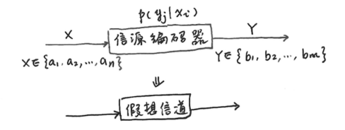
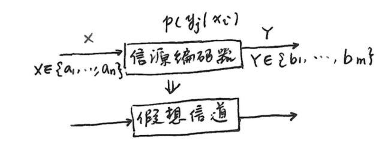
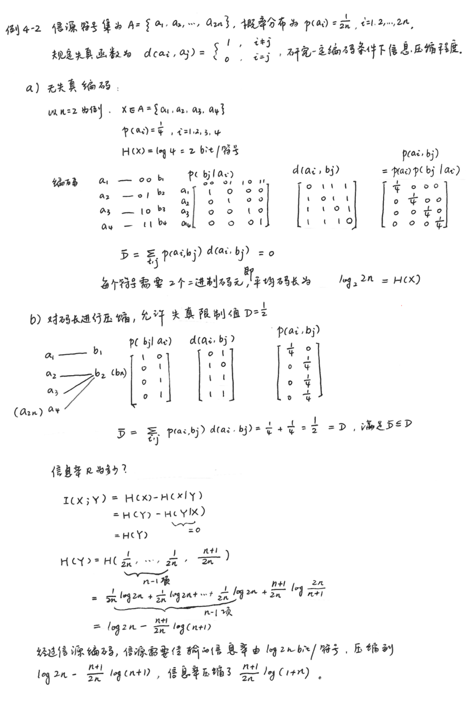
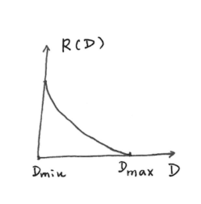
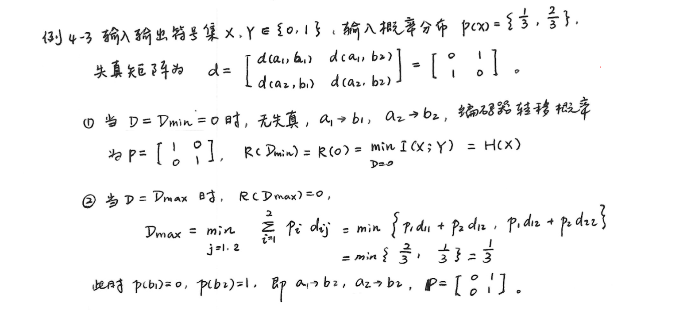
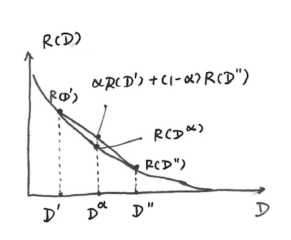
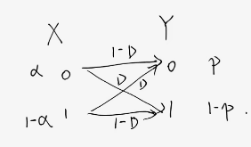
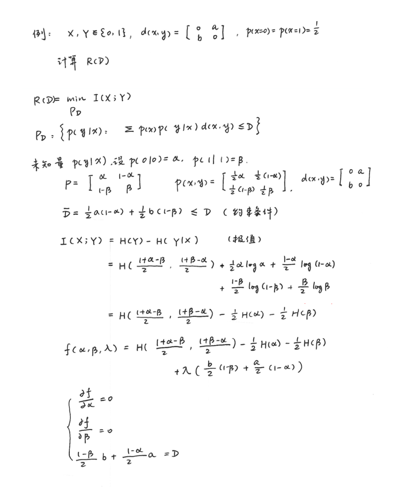

# 第四章 信息率失真函数

---
- [第四章 信息率失真函数](#第四章-信息率失真函数)
    - [4.1 信息率失真函数的概念和性质](#41-信息率失真函数的概念和性质)
        - [失真函数](#失真函数)
        - [平均失真](#平均失真)
        - [信息率失真函数 (R(D))](#信息率失真函数-rd)
        - [信息率失真函数的性质](#信息率失真函数的性质)
            - [(R(D))函数的定义域](#rd函数的定义域)
            - [(R(D))函数的下凸性和连续性](#rd函数的下凸性和连续性)
            - [(R(D))函数的单调递减性](#rd函数的单调递减性)
            - [信息率失真函数与信道容量](#信息率失真函数与信道容量)
    - [4.2 信息率失真函数(R(D))的计算（参量表示法）](#42-信息率失真函数rd的计算参量表示法)
        - [例题](#例题)
        - [参量表示法](#参量表示法)

---

## 4.1 信息率失真函数的概念和性质
### 失真函数
- **信源编码器模型**：
    - 
    - 信源 \(X \in \{a_1,a_2,\cdots,a_n\}\)
    - 经信源编码器输出 \(Y \in \{b_1,b_2,\cdots,b_m\}\)
- **失真函数** \(d(x_i,y_j)\) 定义为：
    \[d(x_i,y_j)=\begin{cases}0, & x_i = y_j \\ \alpha, & \alpha>0, x_i\neq y_j\end{cases}\]
- **失真矩阵** \(d\) 定义为：
    \[d = [d(x_i,y_j)]_{n×m} = \begin{bmatrix}d(a_1,b_1)&d(a_1,b_2)&\cdots&d(a_1,b_m)\\\cdots\\d(a_n,b_1)&d(a_n,b_2)&\cdots&d(a_n,b_m)\end{bmatrix}\]

- \(d(x_i,y_j)\) 的函数形式可任意选择，常用的有：
    - **均方失真**：\(d(x_i,y_j)=(x_i - y_j)^2\) （连续信源）
    - **绝对失真**：\(d(x_i,y_j)=\vert x_i - y_j\vert\) （连续信源）
    - **相对失真**：\(d(x_i,y_j)=\vert x_i - y_j\vert/\vert x_i\vert\) （连续信源）
    - **误码失真**：\(d(x_i,y_j)=\delta(x_i,y_j)=\begin{cases}0, & x_i = y_j \\ 1, & 其他\end{cases}\) （离散信源）
- 例题：

### 平均失真
- 对于离散随机变量，**平均失真** \(\overline{D}\) 的计算公式为：
    \[
    \begin{aligned}
    \overline{D} = E(d(x_i,y_j)) &= \sum_{i = 1}^{n}\sum_{j = 1}^{m}p(a_i,b_j)d(a_i,b_j) \\
    &= \sum_{i = 1}^{n}\sum_{j = 1}^{m}p(a_i)p(b_j|a_i)d(a_i,b_j)
    \end{aligned}
    \]

    其中:
    - \(p(a_i)\) 是信源符号分布
    - \(p(b_j|a_i)\) 是有失真编码器转移概率分布
    - \(d(a_i,b_j)\) 是离散随机变量失真函数

### 信息率失真函数 \(R(D)\)
- 将信源编码器看作信道：
- 编码的目的：
    - 使传输率 \(R\) 尽量小
    - 但是\(R\) 越小，\(\overline{D}\) 越大
    - 在满足 \(\overline{D} \leq D\) 条件下，选择一种编码方法使 \(R\) 尽量小
- **信息传输率** \(R= I(X;Y)\)，计算公式为：
    \[
    \begin{aligned}
    R = I(X;Y) & =\sum_{i,j}p(x_i,y_j)\log\frac{p(y_j|x_i)}{p(y_j)} \\
    & =\sum_{i,j}p(x_i)p(y_j|x_i)\log\frac{p(y_j|x_i)}{\sum_{i}p(x_i)p(y_j|x_i)}
    \end{aligned}
    \]

- 对于某特定信源，\(p(x_i)\) 确定，\(I(X;Y)\) 是关于 \(p(y_j|x_i)\) 的凸函数（\(\cup\)型下凸函数），可以从信道集合 \(P_D\) 中找到一种信道 \(p(y_j|x_i)\)，使 \(I(X;Y)\) 最小。
    - **信道集合** \(P_D\)（\(D\)允许试验信道）定义为：
        \[P_D = \{p(b_j|a_i) \quad|\quad \overline{D} \leq D, i = 1,2,\cdots,n;j = 1,2,\cdots,m\}\]
    - **信息率失真函数** \(R(D)\) 为：
        \[R(D)=\min_{P_D}I(X;Y)\]
    - 对于**离散无记忆信道**，\(R(D)\) 可写成：
        \[R(D)=\min_{P_{ij}\in P_D}\sum_{i = 1}^{n}\sum_{j = 1}^{m}p(a_i)p(b_j|a_i)\log\frac{p(b_j|a_i)}{p(b_j)}\]

- 例题：

### 信息率失真函数的性质
#### \(R(D)\)函数的定义域
1. **\(D_{min}\)和\(R(D_{min})\)**
    - 平均失真\(D\)是失真函数\(d(x,y)\)的数学期望，因此\(D\)也是非负实数，所以\(D_{min} = 0\)。
    - \[R(D_{min}) = R(0)=H(X)\] 等式成立的条件：
        - \(D_{min} = 0\)：失真矩阵中每行至少有一个零，令条件概率在该行该处为1
        - \(R(0) = H(X)\)：每一列最多只有一个零，否则多个\(X\)对应一个\(Y\)，\(R(0) = H(Y) < H(X)\)。
    - 对于连续信源，\(R(D_{min}) = R(0)=H_c(X)=\infty\)。

2. **\(D_{max}\)和\(R(D_{max})\)**
    - \[D_{max}=\min_{R(D)=0} D\] \[R(D_{max})=0\]

    - 当\(R(D)=0\)，即\(I(X;Y)=0\)，\(X\)、\(Y\)互相独立，\(p(y_j|x_i)=p(y_j)=p_j\)

    - \[\overline{D}=\sum_{i = 1}^{n}\sum_{j = 1}^{m}p_ip_jd_{ij}\] 其中\(p_i\)、\(d_{ij}\)已知，\(D_{max}\)为满足\(\sum_{j}p_j = 1\)条件下\(\overline{D}\)的最小值。

    - \[
    \begin{align*}
    D_{max} & =\min\sum_{j = 1}^{m}p_j\sum_{i = 1}^{n}p_id_{ij} \\
    &=\min_{j = 1,2,\cdots,m}\sum_{i = 1}^{n}p_id_{ij}
    \end{align*}
    \] 即在\(j = 1, 2, \cdots,m\)中，找到\(\sum_{i = 1}^{n}p_id_{ij}\)值最小的一列\(j\)，此时取\(p_j = 1\)，其余置\(0\)

3. **\(R(D)\)函数的定义域和值域**
    - \(R(D)\)函数的最大定义域为\[[0\quad, \min_{j = 1,2,\cdots,m}\sum_{i = 1}^{n}p_id_{ij}]\]
    - \(R(D)\)函数的最大值域为\[[0, H(X)]\]
    - 

- 例题：
    - 
    - 

#### \(R(D)\)函数的下凸性和连续性
- 
- **下凸性**：
    \[D^{\alpha}=\alpha D'+(1 - \alpha)D'' \quad 0\leq\alpha\leq1\]

    有 \[R(D^{\alpha})\leq\alpha R(D')+(1 - \alpha)R(D'')\]
- **连续性**：
    设 \(D' = D+\delta\)，当 \(\delta\to0\) 时，\(P_{D'}\to P_{D}\) ，\(R(D')\to R(D)\) 。

#### \(R(D)\)函数的单调递减性
- 允许的失真度越大，所要求的信息率就越小。
- 规定了允许失真 \(D\)，及失真函数 \(d(i,j)\)，可以找到 \(R(D)\)，作为衡量信源编码压缩难度的一把尺子。

#### 信息率失真函数与信道容量
| | 信道容量 \(C\) | 信息率失真函数 \(R(D)\) |
| :--- | :--- | :--- |
| 研究对象 | 信道 | 信源 |
| 给定条件 | \(p(y_j\|x_i)\) | \(p(x_i)\) |
| 选择参数 | \(p(x_i)\) | \(p(y_j\|x_i)\) |
| 结论 | \(C = \max_{p(x)}I(X;Y)\) | \(R(D)=\min_{P_D}I(X;Y)\) |
| \(H(X\|Y)=H(X)-I(X;Y)\) | 噪声干扰丢失的信息量 | 编码压缩损失的信息量 |

## 4.2 信息率失真函数\(R(D)\)的计算（参量表示法）
### 例题
1. **例题1**：
    已知\(X,Y\in\{0,1\}\)，\(p(X) =\begin{cases}p, &X=0 \\ 1-p, &X=1 \end{cases}\)，\(0 < p\leq\frac{1}{2}\)，\(d(x,y)=\begin{cases}1, & x\neq y \\ 0, & x = y\end{cases}\)
    **证明**：\(R(D)=\begin{cases}H_b(p)-H_b(D), & 0\leq D\leq p \\ 0, & D > p\end{cases}\)，其中\(H_b(p)=H(p,1 - p)\)，\(H_b(D)=H(D,1 - D)\)
    - 由\(R(D)\)性质可得**定义域**：
        失真矩阵 \(d=\begin{bmatrix}0&1\\1&0\end{bmatrix}\)，令转移概率矩阵 \(P=\begin{bmatrix}1&0\\0&1\end{bmatrix}\)
        \(D_{min} = 0\)，\(R(0)=H(X)=H_b(p)\)
        \(D_{max}=\min[p,1 - p]\) = p
    - **求\(R(D)\)**：
        \(R(D)=\min I(X;Y)\)，限制条件\(P_D = \{p(y|x) | \overline{D}=E(d(X,Y))\leq D\leq D_{max} = p\}\)
        令 \(Z = d(X,Y) = \begin{cases}1, & x\neq y \\ 0, & x = y\end{cases}\)
        \(p(x|y) = p(z|y)\)，\(H(X|Y) = H(Z|Y)\)
        又\(p(z=1) = p_r(x \neq y)=E(d(X,Y))\leq D\leq p\leq \frac{1}{2}\)
        且\(H_b(x)\)函数关于\(\frac{1}{2}\)对称，在\(0\leq x \leq\frac{1}{2}\)范围内，\(H_b(x)\)函数单调递增。
        则\(H(Z) = H_b(p_r(x \neq y)) \leq H_b(D)\)
        \[
        \begin{align*}
        I(X;Y)&=H(X)-H(X|Y)\\
        &=H_b(p)-H(X|Y)\\
        &=H_b(p)-H(Z|Y)（令z=d(x,y)）\\
        &\geq H_b(p)-H(Z) （H(Z|Y)\leq H(Z)）\\
        &\geq H_b(p)-H_b(D) （H(Z) \leq H_b(D)）
        \end{align*}
        \] 所以\(R(D) \geq H_b(p)-H_b(D)\)
    - **证明下界可达**：
        构造反向BSC信道如图：
        令\(X,Y\in\{0,1\}\)，\(p(Y) =\begin{cases}p, &Y=0 \\ 1-p, &Y=1 \end{cases}\)，\(d(x,y)=\begin{cases}1, & x\neq y \\ 0, & x = y\end{cases}\)
        转移概率矩阵 \(P=\begin{bmatrix}1-D & D\\D & 1-D \end{bmatrix}\)
        则\(R = I(X;Y) = H(Y)-H(Y|X) =H_b(p)-H_b(D)\)，达到下界
        只需证明存在\(\alpha\)满足\(0\leq\alpha\leq1\)，使得\(p(X) =\begin{cases}\alpha, &X=0 \\ 1-\alpha, &X=1 \end{cases}\)
        易知\(p = \alpha(1 - D)+D(1 - \alpha)\)，即\(\alpha=\frac{p - D}{1 - 2D}\)
        因为\(0 \leq D \leq p \leq \frac{1}{2}\)，\(p+D\leq1\)
        由此可得\(0\leq\alpha=\frac{p - D}{1 - 2D}\leq1\)，即存在\(\alpha\)满足条件
2. **例题2**：
3. **结论**：**二元信源失真函数\(R(D)=\begin{cases}H_b(p)-H_b(D), & 0\leq D\leq p \\ 0, & D > p\end{cases}\)**

### 参量表示法
1. **条件与记号**
    设离散信源的输入序列为
    \[
    \begin{bmatrix} X \\ P \end{bmatrix} =
    \begin{bmatrix} x_1 & x_2 & \cdots & x_n \\ p(x_1) & p(x_2) & \cdots & p(x_n) \end{bmatrix}
    \]

    输出序列为
    \[
    \begin{bmatrix} Y \\ P \end{bmatrix} =
    \begin{bmatrix} y_1 & y_2 & \cdots & y_m \\ p(y_1) & p(y_2) & \cdots & p(y_m) \end{bmatrix}
    \]

    字符传输的失真函数为 \(d(x_i,y_j)\) ， \(i = 1,2,\cdots,n\) ； \(j = 1,2,\cdots,m\) 。
    为了书写方便，引入记号：
    \[
    d_{ij} = d(x_i,y_j), \quad p_{ij} = p(y_j\mid x_i)\\
    p_i = p(x_i), \quad q_j = p(y_j)
    \]

    式中
    \[p(y_j)=\sum_{i = 1}^{n}p(x_i)p(y_j\mid x_i)=\sum_{i = 1}^{n}p_ip_{ij}\]

2. **问题转换**
    信息率失真函数 \(R(D)\) 的计算为在约束条件
    \[
    \begin{cases}
    \sum_{i = 1}^{n}\sum_{j = 1}^{m}p_ip_{ij}d_{ij} = D \\
    \sum_{j = 1}^{m}p_{ij} = 1 \quad i = 1,2,\cdots,n
    \end{cases} \quad ①
    \]

    下，求下式极小值问题。
    \[
    I(X;Y)=\sum_{i = 1}^{n}\sum_{j = 1}^{m}p_ip_{ij}\ln\frac{p_{ij}}{q_j} \quad ②
    \]

    应用拉格朗日乘法，引入乘子 \(s\) 和 \(\mu_i\) ， \(i = 1,2,\cdots,n\) 将上述条件极值问题化成无条件极值问题：
    \[
    \frac{\partial}{\partial p_{ij}}\left[I(X;Y)-sD - \mu_i\sum_{j = 1}^{m}p_{ij}\right]=0\quad i = 1,2,\cdots,n \quad ③
    \]

3. **求解**
    由上式 ③ 解出 \(p_{ij}\) ，代入式 ② 中得到在约束条件式 ① 下的 \(I(X;Y)\) 极小值，即 \(R(D)\) 。

    \[
    \begin{align*}
    \frac{\partial I(X;Y)}{\partial p_{ij}}&=\frac{\partial}{\partial p_{ij}}\left[\sum_{i = 1}^{n}\sum_{j = 1}^{m}p_ip_{ij}\ln\frac{p_{ij}}{q_j}\right]\\
    &=\frac{\partial}{\partial p_{ij}}\left[\sum_{i = 1}^{n}\sum_{j = 1}^{m}p_ip_{ij}\ln p_{ij}-\sum_{i = 1}^{n}\left(\sum_{j = 1}^{m}p_ip_{ij}\right)\ln q_j\right]\\
    &=\frac{\partial}{\partial p_{ij}}\left[\sum_{i = 1}^{n}\sum_{j = 1}^{m}p_ip_{ij}\ln p_{ij}-\sum_{j = 1}^{m}q_j\ln q_j\right]\\
    &=\left[p_ip_{ij}\frac{1}{p_{ij}} + p_i\ln p_{ij}\right]-\left[q_j\frac{1}{q_j}\frac{\partial q_j}{\partial p_{ij}}+\frac{\partial q_j}{\partial p_{ij}}\ln q_j\right]\\
    &=\left[p_i + p_i\ln p_{ij}\right]-\left[p_i + p_i\ln q_j\right]\\
    &=p_i\ln\frac{p_{ij}}{q_j}\\
        \frac{\partial [sD]}{\partial p_{ij}}&=\frac{\partial}{\partial p_{ij}}\left[s\sum_{i = 1}^{n}\sum_{j = 1}^{m}p_ip_{ij}d_{ij}\right]=sp_id_{ij}\\
    \frac{\partial}{\partial p_{ij}}&\left[\mu_i\sum_{j = 1}^{m}p_{ij}\right]=\mu_i
    \end{align*}
    \]

    所以式 ③ 化为：
    \[
    p_i\ln\frac{p_{ij}}{q_j}-sp_id_{ij}-\mu_i = 0\quad     i = 1,2,\cdots,n;j = 1,2,\cdots,m \quad ④
    \]

    由式 ④ 解出 \(p_{ij}\) ：
    \[
    p_{ij} = q_j\exp\{sd_{ij}\}\exp\left\{\frac{\mu_i}{p_i}\right\} \quad i = 1,2,\cdots,n;j = 1,2,\cdots,m \quad ⑤
    \]

    令 \(\lambda_i=\exp\left\{\frac{\mu_i}{p_i}\right\}\) ，代入式 ⑤ 中得到：
    \[
    p_{ij} = \lambda_iq_j\exp\{sd_{ij}\} \quad i = 1,2,\cdots,n;j = 1,2,\cdots,m \quad ⑥
    \]

    由 \(\sum_{j = 1}^{m}p_{ij} = 1\) ，将式 ⑥ 对 \(j\) 求和可得到
    \[
    1=\sum_{j = 1}^{m}\lambda_iq_j\exp\{sd_{ij}\} \quad i = 1,2,\cdots,n \quad ⑦
    \]

    由式 ⑦ 可解出 \(\lambda_i\) 的值
    \[
    \lambda_i=\frac{1}{\sum_{j = 1}^{m}q_j\exp\{sd_{ij}\}} \quad ⑧
    \]

    由 \(q_j=\sum_{i = 1}^{n}p_ip_{ij}\) ，将式 ⑥ 两边同乘 \(p_i\) ，并对 \(i\) 求和可得到
    \[
    q_j=\sum_{i = 1}^{n}p_ip_{ij}=\sum_{i = 1}^{n}\lambda_ip_iq_j\exp\{sd_{ij}\} \quad j = 1,2,\cdots,m \quad
    \]

    即
    \[
    \sum_{i = 1}^{n}\lambda_ip_i\exp\{sd_{ij}\}=1 \quad j = 1,2,\cdots,m \quad ⑨
    \]

    将式 ⑧ 代入式 ⑨ 中，可得到关于 \(q_j\) 的 \(m\) 个方程
    \[
    \sum_{i = 1}^{n}\frac{p_i\exp\{sd_{ij}\}}{\sum_{l = 1}^{m}q_l\exp\{sd_{il}\}} = 1 \quad j = 1,2,\cdots,m \quad ⑩
    \]

    由式 ⑩ 中可以解出以 \(s\) 为参量的 \(m\) 个 \(q_j\) 值，将这 \(m\) 个 \(q_j\) 值代入式 ⑧ 中可以解出以 \(s\) 为参量的 \(n\) 个 \(\lambda_i\) 值，再将解得的 \(m\) 个 \(q_j\) 值和 \(n\) 个 \(\lambda_i\) 值代入式 ⑥ 中，可以解出以 \(s\) 为参量的 \(mn\) 个 \(p_{ij}\) 值。

    将解出的 \(mn\) 个 \(p_{ij}\) 值代入定义式中求出以 \(s\) 为参量的平均失真度 \(D(s)\) 
    \[
    D(s)=\sum_{i = 1}^{n}\sum_{j = 1}^{m}\lambda_ip_iq_jd_{ij}\exp\{sd_{ij}\} \quad ⑪
    \]

    其中， \(\lambda_i\) 和 \(q_j\) 由式 ⑦ 和 ⑩ 求得。

    将解出的 \(mn\) 个 \(p_{ij}\) 值代入式 ② 中得到在约束条件 ① 下的 \(I(X,Y)\) 的极小值，即以 \(s\) 为参量的信息率失真函数 \(R(s)\) 
    \[
    \begin{align*}
    R(s)&=\sum_{i = 1}^{n}\sum_{j = 1}^{m}\lambda_ip_iq_j\exp\{sd_{ij}\}\ln\frac{\lambda_iq_j\exp\{sd_{ij}\}}{q_j}\\
    &=\sum_{i = 1}^{n}\sum_{j = 1}^{m}\lambda_ip_iq_j\exp\{sd_{ij}\}(\ln\lambda_i + sd_{ij})\\
    &=\sum_{i = 1}^{n}p_i\ln\lambda_i\left[\sum_{j = 1}^{m}\lambda_iq_j\exp\{sd_{ij}\}\right]+s\sum_{i = 1}^{n}\sum_{j = 1}^{m}\lambda_ip_iq_jd_{ij}\exp\{sd_{ij}\}\\
    &=\sum_{i = 1}^{n}p_i\ln\lambda_i\left(\sum_{j = 1}^{m}p_{ij}\right)+sD(s)\\
    &=\sum_{i = 1}^{n}p_i\ln\lambda_i + sD(s) \quad ⑫
    \end{align*}
    \]

    一般情况下，参量 \(s\) 无法消去，因此得不到 \(R(D)\) 的闭式解，只有在某些特定的简单问题中才能消去参量 \(s\) ，得到 \(R(D)\) 的闭式解。若无法消去参量 \(s\) ，就需要进行逐点计算。下面分析一下参量 \(s\) 的意义。

    将 \(R(D)\) 看成 \(D(s)\) 和 \(s\) 的隐函数，而 \(\lambda_i\) 又是 \(s\) 的函数，利用全微分公式对 \(R(D)\) 求导，可得
    \[
    \begin{align*}
    \frac{\mathrm{d}R(D)}{\mathrm{d}D}&=\frac{\partial R(s)}{\partial D(s)}+\frac{\partial R(s)}{\partial s}\left(\frac{\mathrm{d}s}{\mathrm{d}D}\right)+\sum_{i = 1}^{n}\frac{\partial R(s)}{\partial \lambda_i}\left(\frac{\mathrm{d}\lambda_i}{\mathrm{d}D}\right)\\
    &=s + D(s)\frac{\mathrm{d}s}{\mathrm{d}D}+\sum_{i = 1}^{n}\frac{p_i}{\lambda_i}\cdot\frac{\mathrm{d}\lambda_i}{\mathrm{d}D}\\
    &=s+\left[D(s)+\sum_{i = 1}^{n}\frac{p_i}{\lambda_i}\cdot\frac{\mathrm{d}\lambda_i}{\mathrm{d}s}\right]\frac{\mathrm{d}s}{\mathrm{d}D} \quad ⑬
    \end{align*}
    \]

    为求出 \(\frac{\mathrm{d}\lambda_i}{\mathrm{d}s}\) ，将式  ⑦ 对 \(s\) 求导，得到
    \[
    \sum_{i = 1}^{n}\left[p_i\exp\{sd_{ij}\}\frac{\mathrm{d}\lambda_i}{\mathrm{d}s}+\lambda_ip_id_{ij}\exp\{sd_{ij}\}\right]=0
    \]

    将上式两边同乘以 \(q_j\) ，并对 \(j\) 求和，可得
    \[
    \sum_{j = 1}^{m}q_j\sum_{i = 1}^{n}\left[p_i\exp\{sd_{ij}\}\frac{\mathrm{d}\lambda_i}{\mathrm{d}s}+\lambda_ip_id_{ij}\exp\{sd_{ij}\}\right]=0
    \]

    即
    \[
    \sum_{i = 1}^{n}p_i\left[\sum_{j = 1}^{m}q_j\exp\{sd_{ij}\}\right]\frac{\mathrm{d}\lambda_i}{\mathrm{d}s}+\sum_{i = 1}^{n}\sum_{j = 1}^{m}\lambda_ip_iq_jd_{ij}\exp\{sd_{ij}\}=0
    \]

    将式  ⑧ 和 ⑫ 代入上式，可得
    \[
    \sum_{i = 1}^{n}p_i\frac{1}{\lambda_i}\frac{\mathrm{d}\lambda_i}{\mathrm{d}s}+D(s)=0 \quad ⑭
    \]

    将式 ⑭ 代入式 ⑬ 中，可得
    \[
    \frac{\mathrm{d}R(D)}{\mathrm{d}D}=s \quad ⑮
    \]

    式 ⑮ 表明，参量 \(s\) 是信息率失真函数 \(R(D)\) 的斜率。由 \(R(D)\) 在 \(0 < D < D_{max}\) 之间是严格单调减函数可知， \(s\) 是负值，且是 \(D\) 的递增函数，即 \(s\) 将随 \(D\) 的增加而增加。
    由 \(R(D)\) 的性质可知，在 \(D = 0\) 处， \(R(D)\) 的斜率有可能为 \(-\infty\) ；当 \(D > D_{max}\) 时， \(R(D)=0\) ，其斜率为零。所以参量 \(s\) 的取值为 \((-\infty,0)\) 。
    进一步还可以证明：信息率失真函数 \(R(D)\) 是参量 \(s\) 的连续函数； \(R(D)\) 的斜率，即参量 \(s\) 是失真度 \(D\) 的连续函数，在 \(D = D_{max}\) 处， \(R(D)\) 的斜率可能是不连续的。
