# 第六章 信道编码

---
- [第六章 信道编码](#第六章-信道编码)
    - [6.1 6.2 信道编码概念和理论](#61-62-信道编码概念和理论)
        - [差错和差错控制系统分类](#差错和差错控制系统分类)
        - [矢量空间与码空间](#矢量空间与码空间)
            - [矢量空间](#矢量空间)
            - [码空间](#码空间)
        - [译码方法](#译码方法)
        - [信道编码定理](#信道编码定理)
            - [随机编码](#随机编码)
            - [信道编码定理](#信道编码定理-1)
            - [联合信源信道编码定理](#联合信源信道编码定理)
        - [纠错编码的基本思路](#纠错编码的基本思路)
    - [6.3 线性分组码](#63-线性分组码)
        - [线性分组码的形成](#线性分组码的形成)
            - [基本概念](#基本概念)
            - [系统形式的生成矩阵与校验矩阵](#系统形式的生成矩阵与校验矩阵)
        - [伴随式与标准阵列译码](#伴随式与标准阵列译码)
            - [基本概念](#基本概念-1)
            - [编译码过程](#编译码过程)
        - [码距、纠错能力、MDC码及重量谱](#码距纠错能力mdc码及重量谱)
        - [完备码（Perfect code）](#完备码perfect-code)
            - [完备码定义与性质](#完备码定义与性质)
            - [汉明码（Hamming Code）](#汉明码hamming-code)
            - [高莱（Golay）码](#高莱golay码)
        - [循环码](#循环码)
            - [基本概念与多项式描述](#基本概念与多项式描述)
            - [基本定理与矩阵描述](#基本定理与矩阵描述)
            - [编译码方法及其实现电路](#编译码方法及其实现电路)
            - [高莱（Golay）码](#高莱golay码-1)
            - [循环冗余校验（Cyclic Redundancy Check，CRC）](#循环冗余校验cyclic-redundancy-checkcrc)

---

- 信道传输会使接收信号出现差错，信道编码旨在提升传输可靠性，主要涉及两个层面的问题：
    - 如何准确接收承载信息的信号：线路编码（通信原理）
    - 怎样避免少量错误信号对信息内容产生影响：纠错编码

## 6.1 6.2 信道编码概念和理论
### 差错和差错控制系统分类
- **差错类型**
    - **符号差错**：由符号发生差错引起，也叫信号差错，信号差错概率用符号差错概率表示。
    - **差错比特**：由信息比特发生差错引起，也叫信息差错，信息差错概率用误比特率表示。
    - 对于二进制传输系统，符号差错等效于比特差错。
    - 对于多进制系统，一个符号差错到底对应多少比特差错难以确定，因为一个符号由多个比特组成。

- 两种八电平线路编码方法比较
    |量级|自然二进码|反射二进码(格雷码)|
    | ---- | ---- | ---- |
    |0|000|000|
    |1|001|001|
    |2|010|011|
    |3|011|010|
    |4|100|110|
    |5|101|111|
    |6|110|101|
    |7|111|100|
    - 格雷码可以通过普通二进制码转换得到。
    - 以下是生成格雷码的常见方法：
        1. 最高位保留：格雷码的最高位（最左边） 与二进制码的最高位相同。
        2. 逐位异或：格雷码的每一位是二进制码当前位与上一位的异或结果。

- **差错图样**（error pattern）
    - **定义**：
        - **差错图样 \(E =\) 发码 \(C -\) 收码 \(R\) \((\mod q)\)**
        - **示例**：8进制(\(q = 8\))码，若发码 \(C = (0,2,5,4,7,5,2)\) ，收码变为 \(R = (0,1,5,4,7,5,4)\) ，差错图样 \(E = C - R = (0,1,0,0,0,0,6)\)（模8）。
    - 二进制码：\(E = C \oplus R\) 或 \(C = R \oplus E\)，差错图样中的“1”既是符号差错也是比特差错。
    - **汉明距离**：两码字之间不同的位数叫它们之间的汉明距离，记作\(d(c_i,c_j)\)，即\[d(c_i,c_j) = \sum_{k=1}^{N}c_{ik}\oplus c_{jk}\]
    - **差错图样类型**
        - **随机差错**：若差错图样上各码位的取值既与前后位置无关又与时间无关，即差错始终以相等的概率独立发生于各码字、各码元、各比特
        - **突发差错**：前后相关、成堆出现。突发差错总是以差错码元开头、以差错码元结尾，头尾之间并不是每个码元都错，而是码元差错概率超过了某个额定值

- **纠错码分类**
    - **从功能角度**：检错码 、纠错码
    - **对信息序列的处理方法**：分组码、卷积码
    - **码元与原始信息位的关系**：线性码、非线性码
    - **差错类型**：纠随机差错码、纠突发差错码、介于中间的纠随机/突发差错码
    - **构码理论**：代数码、几何码、算术码、组合码等

- **差错控制系统分类**
    - **前向纠错（FEC）**：发端信息经纠错编码后传送，收端通过纠错译码自动纠正传递过程中的差错
    - **反馈重发（ARQ）**：收端通过检测接收码是否符合编码规律来判断，如判定码组有错，则通过反向信道通知发端重发该码组
    - **混合纠错（HEC）**：前向纠错和反馈重发的结合，发端发送的码兼有检错和纠错两种能力

### 矢量空间与码空间
#### 矢量空间

- **矢量\线性空间定义**
    - \(F\)表示码元所在的**数域**，对于二进制码，\(F\)代表二元域\(\{0,1\}\)。
    - 设\(n\)重有序元素（\(n\)重矢量）的集合\(V=\{v_i\}\)
        \[v_i = (v_{i0},v_{i1},\cdots,v_{ij},\cdots,v_{i(n - 1)})\quad v_{ji}\in F\]
    - 若满足条件：
        1. \(V\)中矢量元素在**矢量加运算**下构成加群。
        2. \(V\)中矢量元素与数域\(F\)元素的**标乘**封闭在\(V\)中。
        3. 分配律、结合律成立。

        则称集合\(V\)是数域\(F\)上的一个\(n\)**重矢量空间**，或称\(n\)重线性空间，\(n\)重矢量又称\(n\)重(\(n\)-tuples)。
    - 码字又叫码矢、\(n\)重(矢量) 。
    - **示例**：\(n\)维实数域矢量空间\(\mathbb{R}^n\)，\(n\)维复数域矢量空间\(\mathbb{C}^n\)，\(n\)维有限域矢量空间\(GF(q)^n\)等。

- **码矢的运算法则**
    - 码矢的运算法则遵从矢量的运算法则，对于矢量\(v_i = (v_{i0},v_{i1},\cdots,v_{i(n - 1)})\)，\(v_j = (v_{j0},v_{j1},\cdots,v_{j(n - 1)})\)，及标量\(\alpha\in F\)（数域），定义：
        - **矢量加**：\(v_i + v_j = (v_{i0} + v_{j0},v_{i1} + v_{j1},\cdots,v_{i(n - 1)} + v_{j(n - 1)})\)，所得结果仍是矢量。
        - **标乘（标量乘矢量）**：\(\alpha v_i = (\alpha v_{i0},\alpha v_{i1},\cdots,\alpha v_{i(n - 1)})\)，所得结果是矢量 。
        - **点积或内积（矢量乘矢量）**：\(v_i\cdot v_j = v_{i0}\cdot v_{j0} + v_{i1}\cdot v_{j1} + \cdots + v_{i(n - 1)}\cdot v_{j(n - 1)}\)，所得结果是标量。

- **矢量空间中各元素间的关系**
    - **线性组合**：若\(v_k = a_1v_1 + a_2v_2 + \cdots + a_lv_l\) (\(a_i\in F\))，则称\(v_k\)是\(v_1,v_2,\cdots,v_l\)的线性组合。
    - **线性相关**：若满足\(a_1v_1 + a_2v_2 + \cdots + a_lv_l = 0\)，(\(a_i\in F\)且不全为\(0\))，则称\(v_1,v_2,\cdots,v_l\)线性相关。其中任一矢量可表示为其它矢量的线性组合。
    - **线性无关或线性独立**：一组矢量中的任意一个都不可能用其它矢量的线性组合来代替。

- **矢量空间与基底**
    - 如果存在一组线性无关的矢量\(v_1,v_2,\cdots,v_k\)，这些矢量**线性组合的集合**就构成了一个\(k\)**维矢量空间**\(V\)，这组矢量就是这个矢量空间的**基底**。
    - **性质**：
        - **\(k\)维矢量空间应包含\(k\)个基底**，可以说：\(k\)个基底“张成”\(k\)维矢量空间。
        - **基底不是唯一的**。
            - 示例：线性无关的两个矢量\((1,0)\)和\((0,1)\)以及\((-1,0)\)和\((0,-1)\)都可张成同一个2维实数域空间(\(x,y\)) 。
    - **自然基底**：矢量元素中包含一个\(1\)而其余为\(0\)的那组基底

- **子空间**
    - 若矢量空间\(V\)的一个子集\(V_s\)也能构成一个矢量空间，则称\(V_s\)是\(V\)的子空间 。
    - **示例**：
        - 二元域\(GF(2)\)上三维三重矢量空间\(V\)的三个自然基底是\((100)\)，\((010)\) ，\((001)\) 。
        - 以\((100)\)为基底可张成一维三重子空间\(V_{s1}\)，含\(2^1 = 2\)个元素，即 \(V_{s1} = \{(000),(100)\}\) 。
        - 以\((010),(001)\)为基底可张成二维三重子空间\(V_{s2}\)，含\(2^2 = 4\)个元素，即 \(V_{s2} = \{(000),(001),(010),(011)\}\) 。
        - \(V_{s1}\)和\(V_{s2}\)都是\(V\)的子空间。

- **矢量空间构成**
    - 每个矢量空间或子空间中必然包含**零矢量**。
    - **构成矢量的有序元素的个数称为“重”数，张成矢量空间的基底的个数称为“维”数**。
    - 一般情况下，由\(n\)个\(n\)重的基底张成\(n\)维矢量空间\(V_n\)，维数和重数一致。
    - 子空间的引入使维数和重数可以不一样。
    - **维数不可能大于重数**，而当维数小于重数时就说明这是一个子空间。

- **正交与对偶空间**
    - 若两个矢量点积为\(0\)，即\(v_1 \cdot v_2 = 0\)，则称\(v_1\)和\(v_2\)**矢量正交**。
    - 若某矢量空间中的任意元素与另一矢量空间中的任意元素正交，则称这两个**矢量空间正交**。
        - 若两个矢量空间的基底正交，则这两个矢量空间一定正交。
    - 正交的两个子空间\(V_1\)、\(V_2\)互为**对偶空间**（Dual Space），其中一个空间是另一个空间的**零空间**（null space，也称零化空间）。

#### 码空间
- **码空间**
    - 
    1. 码字\(c_i\)是\(n\)个码元的有序排列，是\(n\)维\(n\)重矢量空间\(V_n\)的元素之一。
    2. 然而，矢量空间\(V_n\)的元素不一定是码字。
    3. 将码字\(c_i\)写作\((c_{i0}, c_{i1}, \cdots, c_{i(n - 1)})\)，将码字的集合写成\(C\)，称为码集。
    4. 码集不一定能构成\(V_n\)的一个子空间，但对线性分组码而言，码集\(C\)一定是\(V_n\)的一个子空间。

- **分组编码的任务**
    - 通常\(q^n >> q^k\)，分组编码的任务是要在\(n\)维\(n\)重矢量空间的\(q^n\)种可能组合中选择其中的\(q^k\)个构成一个码空间，其元素就是许用码的码集。
    - 因此分组编码的任务就是：
        1. 选择一个\(k\)维\(n\)重子空间作为码空间。
        2. 确定由\(k\)维\(k\)重信息空间到\(k\)维\(n\)重码空间的映射方法。
    - 码空间的不同选择方法，以及信息组与码组的不同映射算法，就构成了不同的分组码。

### 译码方法
- **译码的任务**
    - 译码器的任务是从受损的信息序列中尽可能正确地恢复出原信息。
    - 译码算法的已知条件是：
        - 实际接收到的码字序列\(\{r\}\)，\(r = (r_1, r_2, \cdots, r_N)\)。
        - 发端所采用的编码算法和该算法产生的码集\(X^N\)，满足\(c_i = (c_{i1}, c_{i2}, \cdots, c_{iN}) \in X^N\) 。
        - 信道模型及信道参数。

- **信道模型**：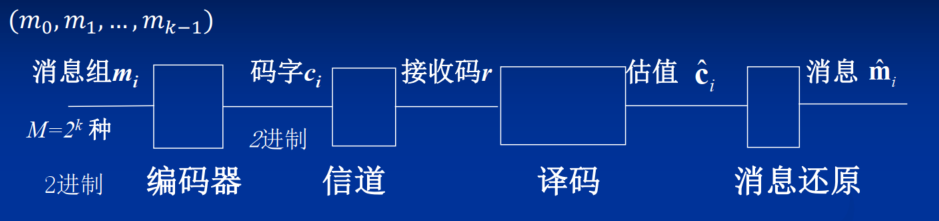

- **译码规则**：见[译码规则](./Ch6sup_信道编码定理.md/#译码规则)

- **[最大后验概率译码](./Ch6sup_信道编码定理.md/#最大后验概率译码)**
    - **最佳译码**，也叫**最大后验概率译码(MAP)**：\[\hat{c}_i=\arg\max_{1\leq i\leq M}P(c_i|r)\]

- **[最大联合概率译码](./Ch6sup_信道编码定理.md/#最大联合概率译码)**
    \[P(c_i/r)=\frac{P(c_i)P(r/c_i)}{P(r)}\quad i = 1, 2, \cdots, 2^K\] 
    - \(P(c_i/r)\)最大等效于\(P(c_i)P(r/c_i)\)最大。
    - **最大联合概率译码**：\[\hat{c}_i=\arg\max_{1\leq i\leq M}P(c_i)P(r|c_i)\]

- **[最大似然译码](./Ch6sup_信道编码定理.md/#最大似然译码)**        
     - 如果 构成码集的\(2^K\)个码字以相同概率发送，满足\(P(c_i)=1/2^K\)，\(i = 1, 2, \cdots, 2^K\) ，在此前提下最佳译码等效于如下最大似然译码。
    - **最大似然译码**(MLD)：码字等概率发送时：\[\hat{c}_i=\arg\max_{1\leq i\leq M}P(r|c_i)\]

- **[最小汉明距离译码](./Ch6sup_信道编码定理.md/#最小汉明距离译码)**
    - 对于无记忆信道：\[\max P(r/c_i)=\max \prod_{j = 1}^{N}P(r_j/c_{ij})\]
    - 对BSC信道：
        \[P(r_j|c_{ij}) = 
        \begin{cases}
        p, & c_{ij} \neq r_j \\
        1 - p, & c_{ij} = r_j
        \end{cases}\]

        \[P(r|c_i)=\prod_{j = 1}^{N}P(r_j|c_{ij}) = p^d(1 - p)^{N - d}=(\frac{p}{1 - p})^d(1 - p)^N\] 其中\(d\)为\(r\)与\(c_i\)的汉明距离，可见，**\(d\)越小，\(P(r|c_i)\)越大**。
    - BSC信道的最大似然译码可以简化为最小汉明距离译码。
        \[\hat{c}_i = \arg \min_{1 \leq i \leq M} d(r, c_i)\]
        - 只要在接收端将收码\(r\)与发码\(c_i\)的各码元逐一比较，选择其中汉明距离最小的码字作为译码估值\(\hat{c}_i\)。
        - 由于BSC信道是对称的，只要发送的码字独立、等概，汉明距离译码也就是最佳译码。

### 信道编码定理
- 信道编码定理研究的问题：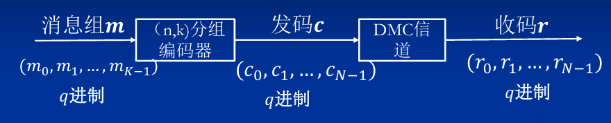
#### 随机编码
- 所有可能的编码：平均错误概率\(\overline{P}_e\)
    - 若\(\overline{P}_e \to 0\)，必存在一种编码\(P_e \to 0\) 。
    - 用这种方法不能得知最优码是如何具体编出来的；却能得知最优码可以好到什么程度，并进而推导出有扰离散信道的编码定理，对指导编码技术具有特别重要的理论价值。
- 在\((N,K)\)分组编码器中随机选定的码集有\(q^{NM}\)种。第\(m\)个码集(记作\(\{c\}_m\))被随机选中的概率是\[P(\{c\}_m)=q^{-(NM)}\]
    - 设与这种选择相对应的条件差错概率是\(P_e(\{c\}_m)\) 。
    - 全部码集的平均差错概率是\[\overline{P}_e = \sum_{m = 1}^{q^{NM}} P(\{c\}_m)P_e(\{c\}_m)=q^{-NM}\sum_{m = 1}^{q^{NM}} P_e(\{c\}_m)\]
    - 必定存在某些码集\(P_e(\{c\}_m)>\overline{P}_e\)，某些码集\(P_e(\{c\}_m)<\overline{P}_e\) 。
    - 若\(\overline{P}_e \to 0\)，就必然存在一批码集\(P_e(\{c\}_{m}) \to 0\)，即差错概率趋于零的好码一定存在 。
- 码集点数\(M = q^K\)占\(N\)维矢量空间总点数\(q^N\)的比例是\(F = q^K/q^N = q^{-(N - K)}\)
    - 当\(K\)和\(N\)的差值拉大即冗余的空间点数增加时，平均而言码字的分布将变得稀疏，码字间的平均距离将变大，平均差错概率将变小。
    - 当\(F \to 0\)即\((N - K)\to\infty\)时，能否让平均差错概率\(\overline{P}_e \to 0\) ？
        - Gallager在1965年推导了\(\overline{P}_e\)的上边界，并证明这个上边界是按指数规律收敛的。

#### 信道编码定理
- \(\overline{P}_e < e^{-NE(R)}\) 
    - \(E(R)\)为可靠性函数，也叫误差指数 。
    - **码率**：\(R = \frac{\log M}{N}=\frac{\log q^K}{N}\) 。
    - \(M\)是可能的信息组合数，\(M = q^K\) ；\(N\)是每码字的码元数；\(R\)表示每码元携带的信息量（bit /码元）。
- \(E(R)\)可靠性函数 
    - \(R\)在\([0,R_0]\)区间时，\(E(R) - R\)曲线是斜率为\(-1\)（\(-45^{\circ}\)）的直线，\(E(R)\)反比于\(R\)
    - \(R_0 < C\)，临界速率
    - 而当\(R = C\)时\(E(R)=0\)即可靠性为零。
    - 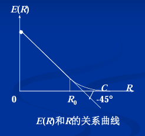
- **噪声信道的信道编码定理**
    - **[正定理](./Ch6sup_信道编码定理.md#信道编码正定理)**：只要传输率 \(R\) 小于信道容量 \(C\) ，总存在一种信道码（及解码器），在码长 \(N\) 足够长的情况下，能够以所要求的任意小的差错概率实现可靠的通信。
    - **[逆定理](./Ch6sup_信道编码定理.md#信道编码逆定理)**：信道容量 \(C\) 是可靠通信系统传输率 \(R\) 的上边界，如果 \(R > C\) ，就不可能有任何一种编码能使差错概率任意小。

#### 联合信源信道编码定理
- **两步编码处理方法**：
    - **信源编码**：针对各自信源的不同特点，进行不同的数据压缩，用最有效的二元码来表达这些不同的信源。
    - **信道编码**：对于共同传输的数字信道而言，输入端只看成是一系列二元码。信道编码只针对信道特性来进行，不考虑不同信源的不同特性。
    - 信源压缩编码只考虑信源的统计特性；信道编码只考虑信道的统计特性。
- **特点**：
    - **优点**：设计简单、通用性好，可以分别形成标准。
    - **缺点**：没有充分利用各自的优势，因而不是最佳的。
- **信源－信道编码定理内容**：
    - 若信源 \(S\) 极限熵 \(H_{\infty}\) 小于信道容量 \(C\) ，则存在信源信道编码，使得 \(P_{e}\to0\)
    - 反之，对于任意平稳随机序列，若极限熵 \(H_{\infty}>C\) ，则错误概率远离零，即不可能在信道中以任意小的错误概率发送这随机序列
- **总结**：
    - 当且仅当信源极限熵小于信道容量，在信道上能够无错误地传输平稳遍历信源。**\(H < C\) 是信源通过信道有效和可靠传输的充要条件**。
    - 如果信道的容量 \(C > R(D)\) ，则在信源和信道处用足够复杂的处理后，总能以失真度 \(D+\varepsilon\) 再现信源的消息。

### 纠错编码的基本思路
- **思路一**：\[\overline{P}_e < e^{-NE(R)}\]
    - 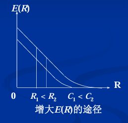
    - **\(R\)不变**，信道容量大者其可靠性函数\(E(R)\)也大
        - **增大信道容量\(C\)的方法**：
            - 扩展带宽。
            - 加大功率。
            - 降低噪声。
    - **\(C\)不变**，码率减小时其可靠性函数\(E(R)\)增大
        - **减小码率\(R\)的方法**：
            - \(Q\)、\(N\)不变而减小\(K\)。
            - \(Q\)、\(K\)不变而增大\(N\)。
            - \(N\)、\(K\)不变而减小\(Q\)。
    - **增大码长\(N\)**

- **思路二：纠错能力的获取途径**：
    - **利用冗余度**：时间、频带、功率、设备复杂度。
    - **噪声均化(随机化、概率化)**：增加码长、卷积、交错。

## 6.3 线性分组码
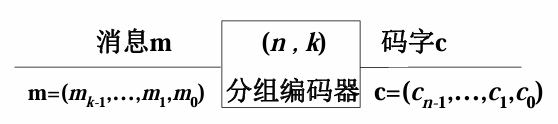
- 构造一个\(k\)维\(n\)重子空间（码空间），使\(q^k\)个信息元组一一对应映射到码空间。
- **码率(编码效率)**：\(R_c = k/n\)

### 线性分组码的形成
#### 基本概念
- **码空间**
    - **码空间**：所有元素（即码字）都可以写成\(k\)个基底的线性组合，表达式为\[\mathbf{c} = m_{k - 1}\mathbf{g}_{k - 1}+\cdots + m_{1}\mathbf{g}_{1}+m_{0}\mathbf{g}_{0}\]
    - \(\mathbf{m}=(m_{k - 1},\cdots,m_{1},m_{0})\)是\(k\)维\(k\)重信息组
    - \(\mathbf{c}=(c_{n - 1},\cdots,c_{1},c_{0})\)是码字。
    - \(\mathbf{g}=(\mathbf{g}_{k - 1},\cdots,\mathbf{g}_{1},\mathbf{g}_{0})\)是在\(n\)维\(n\)重空间\(V\)中，从\(n\)个基底中选取出来的\(k\)个矢量作为码空间的**基底** 
    - 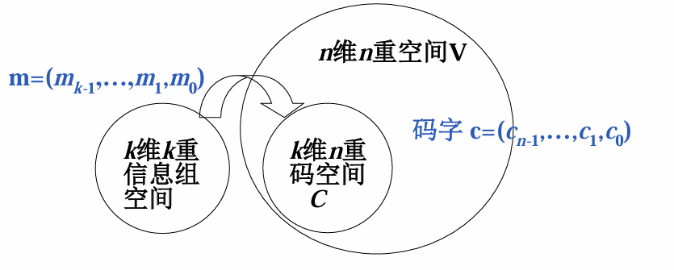
- **映射规律**：信息元作为基底线性组合的系数。
- **生成矩阵**：
    - **生成矩阵**\(\mathbf{G}_{k\times n}=\begin{bmatrix}\mathbf{g}_{k - 1}\\\vdots\\\mathbf{g}_{1}\\\mathbf{g}_{0}\end{bmatrix}=\begin{bmatrix}g_{(k - 1)(n - 1)}&\cdots&g_{(k - 1)1}&g_{(k - 1)0}\\\vdots&\ddots&\vdots&\vdots\\g_{1(n - 1)}&\cdots&g_{11}&g_{10}\\g_{0(n - 1)}&\cdots&g_{01}&g_{00}\end{bmatrix}\)
    - 码字\(\mathbf{c}\)、消息\(\mathbf{m}\)与生成矩阵\(\mathbf{G}\)的关系为：\[\mathbf{c_{1\times n}}=\mathbf{m_{1\times k}}\mathbf{G_{k\times n}}\] 
        - 其中\(\mathbf{c_{1\times n}}\)是\(n\)维码字，\(\mathbf{m_{1\times k}}\)是\(k\)维信息组，\(\mathbf{G_{k\times n}}\)是\(k\times n\)生成矩阵。
        - 因为\(k\)个基底即\(\mathbf{G}\)的\(k\)个行矢量线性无关，矩阵\(\mathbf{G}\)的秩一定等于\(k\)。
        - 当信息元确定后，码字仅由\(\mathbf{G}\)矩阵决定，所以称这\(k\times n\)矩阵\(\mathbf{G}\)为该\((n,k)\)线性分组码的生成矩阵。
    - **特点**:
        - 想要保证\((n,k)\)线性分组码能够构成\(k\)维\(n\)重子空间，\(G\)的\(k\)个行矢量\(g_{k - 1},\cdots, g_{1}, g_{0}\)必须是线性无关的，只有这样才符合作为基底的条件。
        - 由于基底不是唯一的，所以\(G\)也就不是唯一的。
        - 不同的基底有可能生成同一码集，但因编码涉及码集和映射两个因素，码集一样而映射方法不同也不能说是同样的码。

- **基底的选择**：构造\((3,2)\)线性分组码示例
    - 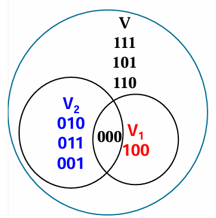
    - 需要构造\(2\)维\(3\)重码空间。
    - \(3\)维\(3\)重空间的\(3\)个自然基底为\(100\)，\(010\)，\(001\) 。
    - 选择其中\(2\)个基底\(010\)，\(001\)构成码空间，对应码集为\((000, 010, 001, 011)\)
    - \(2\)个基底的线性组合\(010\)，\(011\)也可以张成码空间 ，对应码集为\((000, 010, 011, 001)\) 。
    - 码集一样，对应关系不一样

- **示例**：
    - 对于\((6, 3)\)线性分组码，\(k = 3\)，\(2^k = 8\)（消息数量）
        - 基底\(\mathbf{g}_{2}=111010\)，\(\mathbf{g}_{1}=110001\)，\(\mathbf{g}_{0}=011101\)。
        - 则\(\mathbf{G}=\begin{bmatrix}\mathbf{g}_{2}\\\mathbf{g}_{1}\\\mathbf{g}_{0}\end{bmatrix}=\begin{bmatrix}111010\\110001\\011101\end{bmatrix}\) 。
            \(
            \begin{aligned} 
            \mathbf{c}&=m_{k - 1}\mathbf{g}_{k - 1}+\cdots + m_{1}\mathbf{g}_{1}+m_{0}\mathbf{g}_{0}\\
            &=(m_{k - 1} \cdots m_{0})_{1\times k}\times\begin{bmatrix}\mathbf{g}_{k - 1}\\\vdots\\\mathbf{g}_{0}\end{bmatrix}_{k\times n}\\
            &=\mathbf{m}_{1\times k}\mathbf{G}_{k\times n}
            \end{aligned}
            \)
        - |信息\(\mathbf{u}=m_2m_1m_0\)|码字\(\mathbf{c}=c_5c_4c_3c_2c_1c_0\)|
            | ---- | ---- |
            |000|000000|
            |001|011101|
            |010|110001|
            |011|101100|
            |100|111010|
            |101|100111|
            |110|001011|
            |111|010110|

#### 系统形式的生成矩阵与校验矩阵
- **系统形式的生成矩阵**
    - \((n,k)\)码的任何生成矩阵都可以通过行运算（以及列置换）简化成“系统形式”
        \[\mathbf{G_S} = [I_k | P]=\begin{bmatrix}1&0&\cdots&0&p_{(k - 1)(n - k - 1)}&\cdots&p_{(k - 1)1}&p_{(k - 1)0}\\0&1&\vdots&0&p_{(k - 2)(n - k - 1)}&\cdots&p_{(k - 2)1}&p_{(k - 2)0}\\\vdots&\vdots&\ddots&\vdots&\vdots&\ddots&\vdots&\vdots\\0&0&0&1&p_{0(n - k - 1)}&\cdots&p_{01}&p_{00}\end{bmatrix}\]

        其中\(I_k\)是\(k×k\)单位矩阵，\(P\)是\(k×(n - k)\)矩阵。

- **系统码**
    - **码字结构**：码字\(c\)包含信息位（\(k\)位）和校验位（\(n - k\)位）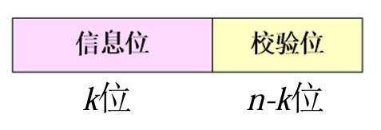
    - **特点**：
        - 前\(k\)位由单位矩阵\(I_k\)决定，等于把信息组\(m\)原封不动搬到码字的前\(k\)位
        - 其余的\(n - k\)位叫**冗余位**或**一致校验位**，是前\(k\)个信息位的线性组合。
    - **定义**：具备以上系统形式的\((n,k)\)码叫做**系统码**。若生成矩阵\(G\)不具备系统形式，则生成的码叫做非系统码。
    - 系统化不改变码集，只是改变了映射规则。
    - **性质**：
        - **等效矩阵**：若通过行运算和列置换能将两个生成矩阵\(G\)互等，则称这两个\(G\)等效。
        - **形式转换**：非系统码的\(G\)可通过运算转变为系统码的\(G\)。
        - **等效码**：等效的两个\(G\)生成的两个\((n,k)\)线性码也是等效的。
        - 因此，**每个\((n,k)\)线性码都可以和一个系统的\((n,k)\)线性码等效**

- **线性分组码空间构成**
    - \(n\)维\(n\)重空间\(V_n\)有相互正交的\(n\)个基底。
    - 选择\(k\)个基底构成码空间\(G\) 。
    - 选择另外的\((n - k)\)个基底构成空间\(H\) 。
    - \(G\)和\(H\)是对偶的，满足\(GH^T = 0\)，\(HG^T = 0\) 。 
    - 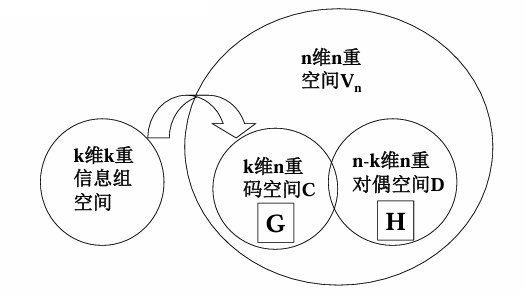

- **码空间与对偶空间**
    - 将\(H\)空间的\(n - k\)个基底排列起来可构成一个\((n - k)\times n\)矩阵，称为**校验矩阵\(H\)** ，用于校验接收到的码字是否正确。
    - \(G\)是\((n,k)\)码的生成矩阵，\(H\)是其校验矩阵。
    - \(H\)是\((n,n - k)\)对偶码的生成矩阵，它的每一行是一个基底，\(G\)则是其校验矩阵。
    - 满足\(GH^T = 0\) ，且\(H = [ - P^T | I_{n - k}]\)，在二进制情况下，负号可省略。

- **生成矩阵与校验矩阵的关系**
    - 对于任何一个码字\(\mathbf{c}\)，有\[\mathbf{c}_{1\times n}\mathbf{H}_{n\times(n - k)}^T = \mathbf{0}_{1\times(n - k)}\]
    - 因为生成矩阵的每个行矢量是一个码字，所以必有\[\mathbf{G}_{k\times n}\mathbf{H^T}_{n\times(n - k)} = \mathbf{0}_{k\times(n - k)}\]
    - 对于系统码的生成矩阵\(\mathbf{G_S}_{k \times n} = [\mathbf{I}_k | \mathbf{P}_{k \times (n-k)}]\)，有：
    \[
    \begin{align*}
    \mathbf{G_S}_{k\times n}[-\mathbf{P}_{(n - k)\times k}^T | \mathbf{I}_{n - k}]^T&=[\mathbf{I}_k | \mathbf{P}_{k\times(n - k)}][-\mathbf{P}_{(n - k)\times k}^T | \mathbf{I}_{n - k}]^T\\
    &=[-\mathbf{I}_k\mathbf{P}_{k\times(n - k)}]+[\mathbf{P}_{k\times(n - k)}\mathbf{I}_{n - k}]\\
    &=[-\mathbf{P}]+[\mathbf{P}]\\
    &=\mathbf{0}_{k\times(n - k)}
    \end{align*}
    \]
    - 由此可得\(\mathbf{H} = [-\mathbf{P}^T | \mathbf{I}_{n - k}] = [\mathbf{P}^T | \mathbf{I}_{n - k}]\) ，二进制码省略负号

- **示例**：
    - 同上例：\(G = \begin{bmatrix}111010&①\\110001&②\\011101&③\end{bmatrix}\Rightarrow G_s = \begin{bmatrix}100111&① + ③\\010110&① + ②+ ③\\001011&① + ②\end{bmatrix}\)
    - |信息|码字|系统码字|
        | ---- | ---- | ---- |
        |000|000000|**000000**|
        |001|011101|**001011**|
        |010|110001|**010110**|
        |011|101100|**011101**|
        |100|111010|**100111**|
        |101|100111|**101100**|
        |110|001011|**110001**|
        |111|010110|**111010**|
    - **一致校验位** 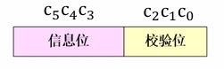
        - \(\mathbf{c} = (c_5c_4c_3c_2c_1c_0)=(m_2m_1m_0) G_S=(m_2m_1m_0)\begin{bmatrix}100111\\010110\\001011\end{bmatrix}\) ，可得：\(
            \begin{cases}
            c_5 = m_2\\
            c_4 = m_1\\
            c_3 = m_0
            \end{cases}
            \)
            因此，校验位可按下面方程组计算：
            \(
            \begin{cases}
            c_2 = m_2 + m_1 = c_5 + c_4\\
            c_1 = m_2 + m_1 + m_0 = c_5 + c_4 + c_3\\
            c_0 = m_2 + m_0 = c_5 + c_3
            \end{cases}
            \)

            由于校验位和信息元之间是线性运算关系，所以叫**线性分组码**。
        - 编码器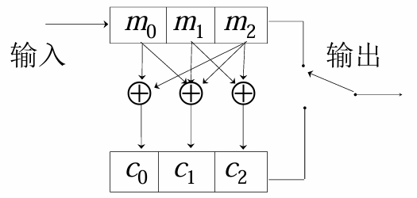
    - **校验矩阵**
        - 由\(
        \begin{cases}
        c_2 = c_5 + c_4\\
        c_1 = c_5 + c_4 + c_3\\
        c_0 = c_5 + c_3
        \end{cases}
        \)在模2加法下可转化为\(
        \begin{cases}
        c_5 + c_4 + 0 + c_2 + 0 + 0 = 0\\
        c_5 + c_4 + c_3 + 0 + c_1 + 0 = 0\\
        c_5 + 0 + c_3 + 0 + 0 + c_0 = 0
        \end{cases}
        \)
        - 令\(\mathbf{c}_{1\times n}=(c_5c_4c_3c_2c_1c_0)\) ，\(\mathbf{0}_{1\times(n - k)}=(000)\) ，有\((c_5c_4c_3c_2c_1c_0)\begin{bmatrix}111\\110\\011\\100\\010\\001\end{bmatrix}=[000]\) ，校验矩阵\(\mathbf{H} = \begin{bmatrix}110100\\111010\\101001\end{bmatrix}_{(n - k)\times n}\)
        - 满足\(\mathbf{c}_{1\times n}\mathbf{H}_{n\times(n - k)}^T = \mathbf{0}_{1\times(n - k)}\) ，\(\mathbf{H}\)为校验矩阵，**上式用来验证一个\(n\)重矢量是否为码字**。
    - **综上**：对于\((6, 3)\)线性分组码，其中\(k = 3\)，\(2^k = 8\)（消息数量） ：
        - 原始生成矩阵\(G = \begin{bmatrix}111010\\110001\\011101\end{bmatrix}\)
        - 系统形式的生成矩阵\(G_s = \begin{bmatrix}100111\\010110\\001011\end{bmatrix} = [I_{k} | P]\)
        - 校验矩阵\(H = [P^T | I_{n - k}] = \begin{bmatrix}110100\\111010\\101001\end{bmatrix}\)

### 伴随式与标准阵列译码
#### 基本概念
- 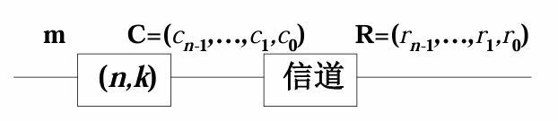
- **定义差错图案\(E\)**
    \[\mathbf{E}=(e_{n - 1},\cdots,e_{1},e_{0})=\mathbf{R}-\mathbf{C}=(r_{n - 1}-c_{n - 1},\cdots,r_{1}-c_{1},r_{0}-c_{0})\]
    - 在二进制码中，模2加与模2减等同，因此有\[\mathbf{E}=\mathbf{R}+\mathbf{C} \quad \mathbf{R}=\mathbf{C}+\mathbf{E}\]
- **定义伴随式\(S\)**
    \[\mathbf{S}=(s_{n - k - 1},\cdots,s_{1},s_{0})=\mathbf{R}\mathbf{H}^T=\mathbf{E}\mathbf{H}^T\]
    - 因为\(\mathbf{C}\mathbf{H}^T = 0\) ，所以\(\mathbf{R}\mathbf{H}^T=(\mathbf{C}+\mathbf{E})\mathbf{H}^T=\mathbf{C}\mathbf{H}^T+\mathbf{E}\mathbf{H}^T=\mathbf{E}\mathbf{H}^T\)
        - 若收码无误：则\(\mathbf{R}=\mathbf{C}\)即\(\mathbf{E}=0\) ，此时\(\mathbf{C}\mathbf{H}^T =\mathbf{E}\mathbf{H}^T = \mathbf{R}\mathbf{H}^T = 0\)
        - 若收码有误：即\(\mathbf{E}\neq0\) ，则\(\mathbf{R}\mathbf{H}^T=\mathbf{E}\mathbf{H}^T\neq0\)
    - 在\(\mathbf{H}^T\)固定的前提下，\(\mathbf{R}\mathbf{H}^T\)仅与差错图案\(\mathbf{E}\)有关，而与发送码\(\mathbf{C}\)无关。

#### 编译码过程
- **编译码过程**
    - 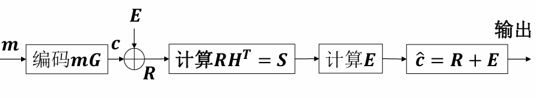
    - 差错图案\(\mathbf{E}\)是\(n\)重矢量，共有\(2^n\)个可能的组合，而伴随式\(\mathbf{S}\)是\((n - k)\)重矢量，只有\(2^{n - k}\)个可能的组合，因此不同的差错图案可能有相同的伴随式。

- **差错图案E的求解**
    - 可以通过解线性方程求解\(\mathbf{E}\)：
        \[
        \begin{align*}
        \mathbf{S}&=(s_{n - k - 1},\cdots,s_{1},s_{0})=\mathbf{E}\mathbf{H}^T\\
        &=(e_{n - 1},\cdots,e_{1},e_{0})\begin{bmatrix}h_{(n - k - 1)(n - 1)}&\cdots&h_{(n - k - 1)1}&h_{(n - k - 1)0}\\\vdots&\ddots&\vdots&\vdots\\h_{1(n - 1)}&\cdots&h_{11}&h_{10}\\h_{0(n - 1)}&\cdots&h_{01}&h_{00}\end{bmatrix}^T
        \end{align*}
        \]

        得到线性方程组：
        \[
        \begin{cases}
        s_{n - k - 1}=e_{n - 1}h_{(n - k - 1)(n - 1)}+\cdots+e_{1}h_{(n - k - 1)1}+e_{0}h_{(n - k - 1)0}\\
        \vdots\\
        s_{1}=e_{n - 1}h_{1(n - 1)}+\cdots+e_{1}h_{11}+e_{0}h_{10}\\
        s_{0}=e_{n - 1}h_{0(n - 1)}+\cdots+e_{1}h_{01}+e_{0}h_{00}
        \end{cases}
        \]

        上述方程组中有\(n\)个未知数\(e_{n - 1},\cdots,e_{1},e_{0}\)，却只有\(n - k\)个方程，可知方程组有多解。
        在有理数或实数域中，少一个方程就可能导致无限多个解，而在二元域中，少一个方程导致两个解，少两个方程四个解，以此类推，少\(n - (n - k)=k\)个方程导致每个未知数有\(2^k\)个解。
        因此，由上述方程组解出的\(\mathbf{E}\)可以有\(2^k\)个解。到底取哪一个作为附加在收码\(\mathbf{R}\)上的差错图案\(\mathbf{E}\)的估值呢？
        **概率译码**：把所有\(2^k\)个解的重量(差错图案\(\mathbf{E}\)中\(1\)的个数)作比较，选择其中最轻（\(1\)的个数最少）者作为\(\mathbf{E}\)的估值。

-  **标准阵列译码表**: 列出伴随式对应的所有差错图案
    - **标准阵列构造方法**
        1. 先将\(2^k\)个码字排成一行，作为标准阵列的第一行，并将全\(0\)码字\(\mathbf{C}_1 = (00\ldots0)\)放在最左面的位置上。
        2. 然后在剩下的\((2^n - 2^k)\)个\(n\)重中选取一个重量最轻的\(n\)重\(\mathbf{E}_2\)放在全\(0\)码字\(\mathbf{C}_1\)下面，再将\(\mathbf{E}_2\)分别和码字\(\mathbf{C}_2,\mathbf{C}_3,\cdots,\mathbf{C}_{2^k}\)相加，放在对应码字下面构成阵列第二行。
        3. 在第二次剩下的\(n\)重中，选取重量最轻的\(n\)重\(\mathbf{E}_3\)，放在\(\mathbf{E}_2\)下面，并将\(\mathbf{E}_3\)分别加到第一行各码字上，得到第三行。
        4.  继续这样做下去，直到全部\(n\)重用完为止，得到给定\((n,k)\)线性码的标准阵列。

        - **在标准阵列的同一行中没有相同的矢量，而且\(2^n\)个\(n\)重中任一个\(n\)重在阵列中出现一次且仅出现一次**

    - 标准阵列译码表：**标准阵列可能不唯一**
        |  |伴随式|陪集首|  |  |  |
        | ---- | ---- | ---- | ---- | ---- | ---- | 
        |子集头| \(S_1\) | \(\mathbf{C}_1=\mathbf{E}_1=0\) | \(\mathbf{C}_2\) | \(\cdots\) | \(\mathbf{C}_{2^k}\) |
        | | \(S_2\) | \(\mathbf{E}_2\) | \(\mathbf{C}_2+\mathbf{E}_2\) |  \(\cdots\) | \(\mathbf{C}_{2^k}+\mathbf{E}_2\) |
        | | \(S_3\) | \(\mathbf{E}_3\) | \(\mathbf{C}_2+\mathbf{E}_3\) | \(\cdots\) | \(\mathbf{C}_{2^k}+\mathbf{E}_3\) |
        | | \(\vdots\) | \(\vdots\) | \(\vdots\) | \(\vdots\) | \(\vdots\) |
        | | \(S_{2^{n - k}}\) | \(\mathbf{E}_{2^{n - k}}\) | \(\mathbf{C}_2+\mathbf{E}_{2^{n - k}}\) | \(\cdots\) | \(\mathbf{C}_{2^k}+\mathbf{E}_{2^{n - k}}\) |

    - **陪集和子集**
        - **陪集**：译码表中有\(2^{n - k}\)行，每行是一个陪集，每陪集的第一个元素(位于第一列)叫**陪集首**。同一陪集（同一行）中的所有元素对应共同的一个伴随式。第一行陪集的陪集首是全零伴随式\(\mathbf{S}_0\)所对应的全零差错图案\(\mathbf{E}_0\) (无差错)，而第\(j\)行陪集的陪集首是伴随式\(\mathbf{S}_j\)所对应的重量最小的差错图案\(\mathbf{E}_j\) (\(\mathbf{C}_0 = 0,\mathbf{R}_j=\mathbf{E}_j\)) 。
        - **子集**：译码表中有\(2^k\)列，每列是一个子集，每子集的第一个元素(位于第一行)叫**子集头**。同一子集（同一列）中的所有元素对应同一个码字，第一列子集的子集头是全零码字\(\mathbf{C}_0\)，而第\(i\)列子集的子集头是码字\(\mathbf{C}_i\) (\(\mathbf{E}_0 = 0,\mathbf{R}_i=\mathbf{C}_i\)) 。
    - **检错纠错能力**：根据\(\mathbf{E}\)在标准阵列中的位置
        - 第一行：不可检错
        - 第一列：可检错可纠错
        - 剩余部分：可检错不可纠错

- **具体译码过程**：
    1. 求生成矩阵\(\mathbf{G}\)和校验矩阵\(\mathbf{H}\)。
    2. 通过信息组\(\mathbf{m}\)和生成矩阵\(\mathbf{G}\)求出各子集头码字\(\mathbf{C}\)。
    3. 构造标准阵列译码表。
    4. 根据标准阵列译码表，对收到的码字\(\mathbf{R}\)进行译码。译码方法：
        - 直接搜索码表，查得\(\mathbf{R}\)所在列的子集头\(\mathbf{C}\)，因此译码输出取为\(\mathbf{C}\)
        - 先求伴随式\(\mathbf{S} = \mathbf{R}\mathbf{H^T} \)，确定\(\mathbf{S}\)所在行，再沿着行对码表作一维搜索找到\(\mathbf{R}\)，最后顺着所在列向上找出码字\(\mathbf{C}\)
        - 先求出伴随式\(\mathbf{S} = \mathbf{R}\mathbf{H^T} \)并确定\(\mathbf{S}\)所对应的陪集首（差错图案）\(\mathbf{E}\)，再将陪集首与收码相加得到码字\(\mathbf{C}= \mathbf{R}+ \mathbf{E}\)

        上述三种方法由上而下，查表的时间下降而所需计算量增大，实际使用时可针对不同情况选用。

- **示例**： 一个\((5,2)\)系统线性码的生成矩阵是\(G = \begin{bmatrix}10111\\01101\end{bmatrix}\) ，设收码\(\mathbf{R} = (10101)\)，构造标准阵列译码表，译出发码的估值。
    - 求出校验矩阵：\(H = [P^T | I_3]=\begin{bmatrix}11100\\10010\\11001\end{bmatrix}\)
    - 分别以信息组\(\mathbf{m}= (00)\)、\((01)\)、\((10)\)、\((11)\)及已知的\(G\)求得\(4\)个许用码字为\(\mathbf{C}_0 = (00000)\)、\(\mathbf{C}_1 = (10111)\) 、\(\mathbf{C}_2 = (01101)\)、\(\mathbf{C}_3 = (11010)\)
    - 构造标准阵列译码表
        |伴随式|陪集首|  |  |  |
        | ---- | ---- | ---- | ---- | ---- |
        | \(S_0 = 000\) | \(E_0 + C_0 = 00000\) | \(C_1 = 10111\) | \(C_2 = 01101\) | \(C_3 = 11010\) |
        | \(S_1 = 111\) | \(E_1 = 10000\) | \(00111\) | \(11101\) | \(01010\) |
        | \(S_2 = 101\) | \(E_2 = 01000\) | \(11111\) | \(00101\) | \(10010\) |
        | \(S_3 = 100\) | \(E_3 = 00100\) | \(10011\) | \(01001\) | \(11110\) |
        | \(S_4 = 010\) | \(E_4 = 00010\) | \(10101\) | \(01111\) | \(11000\) |
        | \(S_5 = 001\) | \(E_5 = 00001\) | \(10110\) | \(01100\) | \(11011\) |
        | \(S_6 = 011\) | \(E_6 = 00011\) | \(10100\) | \(01110\) | \(11001\) |
        | \(S_7 = 110\) | \(E_7 = 00110\) | \(10001\) | \(01011\) | \(11100\) |
    - 将接收码\(\mathbf{R}=10101\)译码，可选以下三种方法之一译码：
        1. 直接搜索码表，查得\((10101)\)所在列的子集头是\((10111)\)，因此译码输出取为\((10111)\)。
        2. 先求伴随式\(\mathbf{R}H^T = (10101)\cdot H^T = (010) = S_4\)，确定\(S_4\)所在行，再沿着行对码表作一维搜索找到\((10101)\)，最后顺着所在列向上找出码字\((10111)\)。
        3. 先求出伴随式\(\mathbf{R}H^T = (010) = S_4\)并确定\(S_4\)所对应的陪集首（差错图案）\(E_4=(00010)\)，再将陪集首与收码相加得到码字\(\mathbf{C}= \mathbf{R}+ E_4=(10101)+(00010)=(10111)\)。

### 码距、纠错能力、MDC码及重量谱
- **汉明距离**：两个码字\(c_i, c_j\)之间对应码元位上符号取值不同的个数，称为码字\(c_i, c_j\)之间的汉明距离 \[d(c_i, c_j)=\sum_{k = 0}^{n - 1}(c_{ik}\oplus c_{jk})\]
- **最小距离**：在\((n,k)\)线性码中，码字之间的最小汉明距离 \[d_{min}=min(d(c_i, c_j)),c_i, c_j\in C\]

- **定理6.1**：任何最小距离\(d_{min}\)的线性分组码，其检错能力为\((d_{min}-1)\)，纠错能力\(t\)为\[t = \left\lfloor\frac{d_{min}-1}{2}\right\rfloor\]
    - 纠错能力\(t\)是指在接收码中，最多允许有\(t\)个差错图案而不致于误译的能力。（只要不到另一个点，你就能知道出错了）
    - 检错能力是指在接收码中，最多允许有\(d_{min}-1\)个差错图案而不致于误译的能力。（只要离原来的点比任何一个点都近，你就能知道原来的点）
- **纠错能力示意图**：码集各码字间的距离是不同的，码距最小者决定码的特性，称之为最小距离\(d_{min}\)
    - 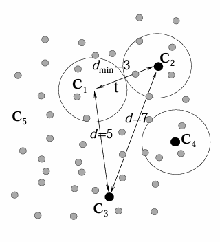
    - 如图中\(d_{min}=3\)，纠错能力是\(1\)，检错能力是\(2\)

- **最小距离计算**：
    - **汉明重量**：码字中非\(0\)码元符号的个数，称为该码字的汉明重量。**在二元线性码中，码字重量就是码字中含“\(1\)”的个数** \[w(c)=\sum_{i = 0}^{n - 1}c_i\]
    - **定理6.2**：线性分组码的最小距离等于码集中非零码字的最小重量 \[d_{min}=min\{w(C_i)\}\quad C_i\in C及C_i\neq0\]\[d(c_i, c_j)=w(c_i\oplus c_j)=w(c_k)\quad c_i, c_j, c_k\in C\]
    - **定理6.3**：\((n,k)\)线性分组码最小距离等于\(d_{min}\)的**必要**条件是：校验矩阵\(H\)中任意\((d_{min}-1)\)列线性无关。
        - 将\(H\)写成\(H = [h_{n - 1},\cdots, h_1, h_0]\)，其中\(h_{n - 1},\cdots, h_1, h_0\)为列矢量 
            \[
            \begin{align*}
            cH^T &= [c_{n - 1},\cdots, c_1, c_0]\begin{bmatrix}h_{n - 1}^T\\\vdots\\h_1^T\\h_0^T\end{bmatrix}\\
            &=c_{n - 1}h_{n - 1}^T+\cdots + c_1h_1^T + c_0h_0^T = 0
            \end{align*}
            \]
        - 若存在一个重量为\(d_{min}\)的码字，则必有\(d_{min}\)列线性相关
    - **定理6.4**：\((n,k)\)线性分组码的最小距离必定小于等于\((n - k + 1)\)  \[d_{min}\leq(n - k + 1)\]
        - 计算校验矩阵的秩，则\(H\)的秩加\(1\)就是最小距离\(d_{min}\)的上限 。

- **示例**：对于\((7, 4)\)线性码，\(H = \begin{bmatrix}1110100\\0111010\\1101001\end{bmatrix}\)
    - 各列都不相同，任意\(2\)列之和不等于\(0\)，任何\(2\)列线性无关；
    - 存在\(2\)列之和等于矩阵中某一列，即存在\(3\)列线性相关
    - 存在重量为\(3\)的码字
    - 能找到的最小线性相关的列数为\(3\)
    - 所以该码的最小距离为\(d_{min} = 3\)，小于\(n - k + 1 = 4\) 。
    - 该码的纠错能力为\(t = \left\lfloor\frac{d_{min}-1}{2}\right\rfloor = 1\)，检错能力为\(d_{min}-1=2\)。

- **极大最小距离码 (MDC)**：
    - **定义**：\(d_{min}=n - k + 1\)的\((n,k)\)线性码称为极大最小距离码 (MDC - Maximized minimum Distance Code)。
    - 总体的、平均的纠错能力不但与最小距离有关，而且与其余码距或者说与码字的重量分布特性有关。

### 完备码（Perfect code）
#### 完备码定义与性质
- **汉明限**：任何一个二元\((n,k)\)线性分组码都有\(2^{n - k}\)个伴随式，若该码的纠错能力是\(t\)，则对于任何一个重量小于等于\(t\)的差错图案，都应有一个伴随式与之对应，即伴随式的数目满足条件\[2^{n - k}\geq\binom{n}{0}+\binom{n}{1}+\binom{n}{2}+\cdots+\binom{n}{t}\] 此式称作**汉明限**，任何一个纠错码都应满足该条件。
- **完备码定义**：满足以下等式的二元\((n,k)\)线性分组码 \[2^{n - k}=\binom{n}{0}+\binom{n}{1}+\binom{n}{2}+\cdots+\binom{n}{t}\]
- **完备码性质**：
    1. 即该码的伴随式数目恰好和不大于\(t\)个差错的图案数目相等。
    2. 相当于在标准译码阵列中能将所有重量不大于\(t\)的差错图案选作陪集首，且没有一个陪集首的重量大于\(t\)，此时校验位得到最充分的利用。
    3. 这样的二元\((n,k)\)线性分组码称为**完备码**。

#### 汉明码（Hamming Code）
- **定义**：汉明码是纠错能力\(t = 1\)的一类码的统称。
- **性质**：
    - 汉明码既有二进制的，也有非二进制的。
    - 二进制时，汉明码码长\(n\)和信息位\(k\)服从规律\[(n,k)=(2^m - 1,2^m - 1 - m)\] 其中\(m = n - k\)，是正整数。
        | 正整数\(m=n-k\) | 码长 \(n = 2^m - 1\) | 信息位 \(k = 2^m - 1 - m\) | 汉明码\((n,k)\) |
        | ---- | ---- | ---- | ---- |
        | 3 | \(2^3 - 1 = 7\) | \(2^3 - 1 - 3 = 4\) | \((7,4)\) |
        | 4 | \(2^4 - 1 = 15\) | \(2^4 - 1 - 4 = 11\) | \((15,11)\) |
        | 5 | \(2^5 - 1 = 31\) | \(2^5 - 1 - 5 = 26\) | \((31,26)\) |
        | 6 | \(2^6 - 1 = 63\) | \(2^6 - 1 - 6 = 57\) | \((63,57)\) |
        | 7 | \(2^7 - 1 = 127\) | \(2^7 - 1 - 7 = 120\) | \((127,120)\) |
        | 8 | \(2^8 - 1 = 255\) | \(2^8 - 1 - 8 = 247\) | \((255,247)\) |
        |\(\cdots\) |\(\cdots\) |\(\cdots\) |\(\cdots\) |
    - 汉明码是完备码，因为满足等式\[\binom{n}{0}+\binom{n}{1}=1 + n=1 + 2^m - 1=2^m=2^{n - k}\]
- **校验矩阵构成**：汉明码的校验矩阵\(H\)具有特殊性质，可简化构造方法。
    - 一个\((n,k)\)码的校验矩阵有\(n - k\)行和\(n\)列，二进制时\(n - k\)个码元所能组成的列矢量总数是\(2^{n - k}\)，除去全\(0\)矢量后为\(2^{n - k} - 1 = 2^m - 1 = n\)，恰好和校验矩阵的列数\(n\)相等。
    - 只要排列所有列，通过列置换将矩阵\(H\)转换成系统形式，就可以进一步得到相应的生成矩阵\(G\)。
- **示例**：构造一个\(m = 3\)的二元\((7, 4)\)汉明码。
    - 先利用汉明码的特性构造一个\((7, 4)\)汉明码的校验矩阵\(H\)，再通过列置换将它变为系统形式：
    - 校验矩阵\(H=\begin{bmatrix}0001111\\0110011\\1010101\end{bmatrix}\)，经列置换得到\(\begin{bmatrix}1110100\\0111010\\1101001\end{bmatrix}=[P^T | I_3]\)，再得生成矩阵\(G = [I_4 | P]=\begin{bmatrix}1000101\\0100111\\0010110\\0001011\end{bmatrix}\)
#### 高莱（Golay）码
- 是二进制\((23, 12)\)线性码
- 最小距离\(d_{min}=7\)
- 纠错能力\(t = 3\)
- 高莱码是完备码，因为满足等式\[2^{23 - 12}=2048=1+\binom{23}{1}+\binom{23}{2}+\binom{23}{3}\]
- 在\((23,12)\)码上添加一位奇偶位即得二进制线性\((24, 12)\)扩展高莱码，其最小距离\(d_{min}=8\)。
- 编码步骤见[高莱码编码步骤](#高莱golay码-1)

### 循环码
#### 基本概念与多项式描述
- **循环码的定义**：设一个\((n,k)\)线性分组码\(C\)，如果它的任一码字的每一次循环移位都还是\(C\)的一个码字，则称\(C\)是**循环码**。
    \[
    \begin{align*}
    \forall: &\boldsymbol{c}=(c_{n - 1},c_{n - 2},\cdots,c_{0})\in C\\
    &\boldsymbol{c}_1=(c_{n - 2},c_{n - 3},\cdots,c_{0},c_{n - 1})\in C\\
    &\boldsymbol{c}_2=(c_{n - 3},c_{n - 4},\cdots,c_{0},c_{n - 1},c_{n - 2})\in C\\
    &\vdots\\
    &\boldsymbol{c}_{n - 1}=(c_{0},c_{n - 1},\cdots,c_{2},c_{1})\in C
    \end{align*}
    \]

- **循环码的数学描述**：
    - **循环码的特点**：
        - 它是线性分组码，其数学模型应具有线性特性。
        - 具有循环特性。
        - 码字的全体**构成了\(n\)维矢量空间中具有循环特性的\(k\)维子空间**。
    - **线性分组码的多项式描述**：
        - 码字\[\boldsymbol{c}=(c_{n - 1},c_{n - 2},\cdots,c_{0})\] 
        - 码多项式\[c(x)=c_{n - 1}x^{n - 1}+c_{n - 2}x^{n - 2}+\cdots + c_1x + c_0\]
        - 对于线性分组码\(C\)，可以表示成码多项式构成的集合：
            \[
            \begin{align*}
            &C\leftrightarrow C(x)\\
            &=\{c_{n - 1}x^{n - 1}+c_{n - 2}x^{n - 2}+\cdots + c_1x + c_0\mid(c_{n - 1},c_{n - 2},\cdots,c_{0})\in C\}
            \end{align*}
            \]
- **示例**：\((7, 3)\)线性分组码
    - 校验矩阵\(H=\begin{bmatrix}1&0&1&1&0&0&0\\1&1&1&0&1&0&0\\1&1&0&0&0&1&0\\0&1&1&0&0&0&1\end{bmatrix}\)
        生成矩阵\(G=\begin{bmatrix}1&0&0&1&1&1&0\\0&1&0&0&1&1&1\\0&0&1&1&1&0&1\end{bmatrix}\)
    由\(\boldsymbol{c}=\boldsymbol{m}G\)得码集（由两组码字循环构成的循环码）：
    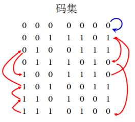
    - 任取一码字
        - 设\(\boldsymbol{c}=0011101\) ，则\(c(x)=x^4 + x^3 + x^2 + 1\) 。
        - 移一位，\(\boldsymbol{c}_1 = 0111010\) ，\(c_1(x)=x^5 + x^4 + x^3 + x = xc(x)\) 。
        - 移两位，\(\boldsymbol{c}_2 = 1110100\) ，\(c_2(x)=x^6 + x^5 + x^4 + x^2 = x^2c(x)\) 。
        - 移三位，\(\boldsymbol{c}_3 = 1101001\) ，\(c_3(x)=x^6 + x^5 + x^3 + 1 = x^3c(x)\pmod{(x^7 + 1)}\) 。
        - \(\vdots\)

- **结论**：如果将一个循环码的某一非零码字用码多项式表示出来，那么其他的非零码字多项式就可以用这个码字多项式（或码字多项式的和）乘上\(x\)的一个幂，再求\((x^n + 1)\)的余得到。

- **说明**：一个码字的移位最多能得到\(n\)个码字，因此“循环码字的循环仍是码字”并不意味着循环码集可以从一个码字循环而得，还应包含码字的一些线性组合。

#### 基本定理与矩阵描述
- **循环码的生成多项式**:
    - **定义**：若\(g(x)\)是一个\((n - k)\)次多项式，且是\((x^n + 1)\)的因式，则由\(g(x)\)可以生成一个\((n,k)\)循环码，\(g(x)\)称为该循环码的**生成多项式**。
    - **结论**：
        1. **结论1**：\(GF(2)\)上的\((n,k)\)循环码中，存在着一个次数为\((n - k)\)的**首一码多项式** \(g(x)\)（首一：多项式最高幂次项系数\(g_{n - k}=1\) ）
            \[g(x)=x^{n - k}+g_{n - k - 1}x^{n - k - 1}+\cdots + g_2x^2 + g_1x + 1\]

            使得所有码多项式都是\(g(x)\)的倍式，即
            \[c(x)=m(x)\cdot g(x)\] 

            其中\[m(x)=m_{k - 1}x^{k - 1}+\cdots + m_1x + m_0\]

            且所有小于\(n\)次的\(g(x)\)的倍式都是码多项式。
            **故循环码完全由它的生成多项式确定**。
        2. **结论2**：\((n,k)\)循环码的生成多项式\(g(x)\)一定是\((x^n + 1)\)的因子，即\[g(x)\mid(x^n + 1)\quad或写成\quad x^n + 1 = g(x)h(x)\] 
            相反，如果\(g(x)\)是\(x^n + 1\)的\((n - k)\)次因子，则\(g(x)\)一定是\((n,k)\)循环码的生成多项式。
            **生成多项式不唯一**。
        3. **结论3**：任何码字的循环移位仍是码字，但并非由一个码字循环移位可以得到所有码字。
        4. **结论4**：当一个循环码给定其生成多项式\(g(x)\)后，根据生成多项式就可以进行编码，但编出的码不一定为系统码。
    - **\((n,k)\)循环码的构造**：
        1. 对\(x^n + 1\)做因式分解，找出\((n - k)\)次因式。
        2. 以该\((n - k)\)次因式为生成多项式\(g(x)\)与不高于\((k - 1)\)次信息多项式\(m(x)\)相乘，即得到对应消息序列的码多项式。 

- **循环码的生成矩阵**:
    - \((n,k)\)循环码是\(n\)维线性空间中具有循环特性的\(k\)维子空间，其生成矩阵可由码空间中任一组\(k\)个线性无关的码字构成，这\(k\)个线性无关的码字组成\((n,k)\)循环码的基底，且基底不唯一。
    - **获得\(k\)个线性无关码字的方法**
        **当循环码的生成多项式\(g(x)\)确定后，可取\(g(x)\)本身加上移位\(k - 1\)次所得到的\(k - 1\)个码字，与\(g(x)\)一起作为\(k\)个基底**，即：
        \[
        \begin{align*}
        G&=\begin{bmatrix}x^{k - 1}g(x)\\x^{k - 2}g(x)\\\vdots\\xg(x)\\g(x)\end{bmatrix}\\
        &=\begin{bmatrix}g_{n - k}&g_{n - k - 1}&\cdots&g_0&0&0&\cdots&0\\0&g_{n - k}&g_{n - k - 1}&\cdots&g_0&0&\cdots&0\\\vdots&&&\ddots&&&\vdots\\0&\cdots&0&0&g_{n - k}&g_{n - k - 1}&\cdots&g_0\end{bmatrix}
        \end{align*}
        \]

        这\(k\)个矢量线性无关，且由\(g(x)\)循环移位得到，所以都是码字，它们构成一个\(k\times n\)的矩阵，即循环码的生成矩阵。

- **循环码的系统码**
    - **系统循环码的编码**：
        - 码多项式\[c(x)=x^{n - k}m(x)+r(x)\] 其中\(r(x)\)是与码字中\((n - k)\)个校验元相对应的\((n - k - 1)\)次多项式。
        对等式两边取\(\bmod g(x)\)：
        - 等式左边：\(c(x)=m(x)g(x)\)，所以\(c(x)\bmod g(x)=0\) 。
        - 等式右边：必有\([x^{n - k}m(x)+r(x)]\bmod g(x)=0\) ，由于\(r(x)\)的幂次\((n - k - 1)\)低于\(g(x)\)的幂次\((n - k)\) ，要使等式右边为\(0\)，必有\[x^{n - k}m(x)\bmod g(x)=r(x)\]
    - **系统码的编码步骤**：
        1. 将信息多项式\(m(x)\)乘以\(x^{n - k}\) ，即左移\((n - k)\)位
        2. 将\(x^{n - k}m(x)\)除以\(g(x)\) ，得到余式\(r(x)\) 
        3. 得到系统循环码的码多项式：\(c(x)=x^{n - k}m(x)+r(x)\)
        4. 将码多项式转换为码字。 

    - **系统码的生成矩阵**
        - 系统形式的生成矩阵 \(G = [I | P]\) 
        - \[G(x)=\begin{bmatrix}x^{n-1} + p_{n-k}(x)\\x^{n-2} + p_{n-k-1}(x)\\\vdots\\x^{n-k+1} + p_1(x)\\x^{n-k}  + p_0(x)\end{bmatrix}_{k \times n}\] 其中\[p_{i}(x)=x^{i+(n-k)}\bmod(g(x))\]

- **示例**：一个长度\(n = 7\)的循环码的构造方法
    1. **求一种\((7, 4)\)循环码**
        1. 对\(x^7 + 1\)作因式分解：
        \(x^7 + 1=(x + 1)(x^3 + x^2 + 1)(x^3 + x + 1)\) ，故\(x^7 + 1\)有如下因式：
            - 一次因式：\(x + 1\)（一个）
            - 三次因式：\(x^3 + x + 1\)，\(x^3 + x^2 + 1\)（两个）
            - 四次因式：\((x + 1)(x^3 + x^2 + 1)=x^4 + x^2 + x + 1\) ，\((x + 1)(x^3 + x + 1)=x^4 + x^3 + x^2 + 1\)（两个）
            - 六次因式：\((x^3 + x^2 + 1)(x^3 + x + 1)=x^6 + x^5 + x^4 + x^3 + x^2 + x + 1\)（一个）
        2. 以\((n - k)\)次因式作为生成多项式：
            - \(n - k = 1\)，\(k = 6\)，生成一种\((7, 6)\)循环码；
            - \(n - k = 3\)，\(k = 4\)，生成两种\((7, 4)\)循环码；
            - \(n - k = 4\)，\(k = 3\)，生成两种\((7, 3)\)循环码；
            - \(n - k = 6\)，\(k = 1\)，生成一种\((7, 1)\)循环码。

        - 求一种\((7, 4)\)循环码，可选\(n - k = 3\)次多项式\(x^3 + x^2 + 1\)或\(x^3 + x + 1\)为生成多项式。以选择\(g(x)=x^3 + x^2 + 1\)为例，\(n - k = 3\)，\(k = 4\)（信息位为\(4\) ）。
            设信息多项式为\[m(x)=m_3x^3 + m_2x^2 + m_1x + m_0\]

            则循环码编码后的码多项式为\[c(x)=m(x)g(x)=(m_3x^3 + m_2x^2 + m_1x + m_0)(x^3 + x^2 + 1)\]

            | \(m\) | \(m(x)\) | \(c(x)\) | \(c\) |
            | ---- | ---- | ---- | ---- |
            | \(0000\) | \(0\) | \(0\) | \(0000000\) |
            | \(0001\) | \(1\) | \(x^3 + x^2 + 1\) | \(0001101\) |
            | \(0010\) | \(x\) | \(x^4 + x^3 + x\) | \(0011010\) |
            | \(0011\) | \(x + 1\) | \(x^4 + x^2 + x + 1\) | \(0010111\) |
            | \(0100\) | \(x^2\) | \(x^5 + x^4 + x^2\) | \(0101100\) |
            | \(\cdots\) | \(\cdots\) | \(\cdots\) | \(\cdots\) |
            
            最终得：
            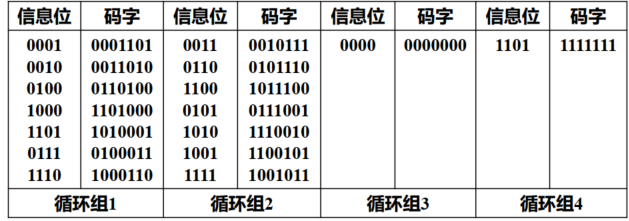
    2. **求\(g(x)=x^3 + x^2 + 1\)，\(k = 4\)的循环码的生成矩阵**：
        \[
        \begin{cases}
        x^3g(x)\leftrightarrow1101000\\
        x^2g(x)\leftrightarrow0110100\\
        xg(x)\leftrightarrow0011010\\
        g(x)\leftrightarrow0001101
        \end{cases}
        \Rightarrow G=\begin{bmatrix}1101000\\0110100\\0011010\\0001101\end{bmatrix}
        \] 

        当循环码的生成矩阵确定后，编码规则为\[\boldsymbol{c}=\boldsymbol{m}G\]
        
        例如，当\(\boldsymbol{m}=(1001)\)时，\(\boldsymbol{c}=(1001)G = 1100101\) 。
        这与通过生成多项式计算结果相同：\(m(x)g(x)=(x^3 + 1)(x^3 + x^2 + 1)=x^6 + x^5 + x^2 + 1\)，对应码字也是\(1100101\) 。 
    3. **求\(g(x)=x^3 + x^2 + 1\)，\(m = (1001)\)的系统码字。**
        1. 计算\(x^{n - k}m(x)\)：
            - 因为\(n = 7\)，\(k = 4\)，\(m(x)=x^3 + 1\)，所以\(x^{n - k}m(x)=x^3(x^3 + 1)=x^6 + x^3\) 。
        2. 计算\(x^{n - k}m(x)\)除以\(g(x)\)的余式\(r(x)\)：
            用\(x^6 + x^3\)除以\(x^3 + x^2 + 1\) ，通过长除法：
            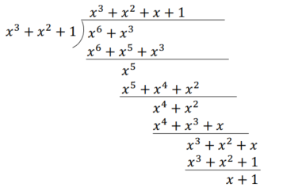
            得到\(r(x)=x + 1\) 。
        3. 得到系统循环码的码多项式\(c(x)\)并转换为码字：
            - \(c(x)=x^{n - k}m(x)+r(x)=x^6 + x^3 + x + 1\) ，转换为码字\(c=(1001011)\) 。

    4. **求\((7, 4)\)循环码\(g(x)=x^3 + x^2 + 1\)系统形式的生成矩阵**：
        设\(G=\begin{bmatrix}g_3\\g_2\\g_1\\g_0\end{bmatrix}=\begin{bmatrix}1000p_{32}p_{31}p_{30}\\0100p_{22}p_{21}p_{20}\\0010p_{12}p_{11}p_{10}\\0001p_{02}p_{01}p_{00}\end{bmatrix}\) ，\(G(x)=\begin{bmatrix}x^6 + p_3(x)\\x^5 + p_2(x)\\x^4 + p_1(x)\\x^3 + p_0(x)\end{bmatrix}\)
        分别计算：
        - \(p_3(x)=x^6\bmod g(x)=x^2 + x\)
        - \(p_2(x)=x^5\bmod g(x)=x + 1\)
        - \(p_1(x)=x^4\bmod g(x)=x^2 + x + 1\)
        - \(p_0(x)=x^3\bmod g(x)=x^2 + 1\)
        
        最终得到\(G=\begin{bmatrix}1000110\\0100011\\0010111\\0001101\end{bmatrix}\) 

#### 编译码方法及其实现电路
- **循环码的编码**
    - **编码步骤**：
        1. 将信息多项式\(m(x)\)乘以\(x^{n - k}\) ，即左移\((n - k)\)位。
        2. 将\(x^{n - k}m(x)\)除以\(g(x)\) ，得到余式\(r(x)\)
        3. 得到系统循环码的码多项式\(c(x)=x^{n - k}m(x)+r(x)\)
        4. 将码多项式转换为码字。
    - **用除法器实现\((7,3)\)循环编码器**：
        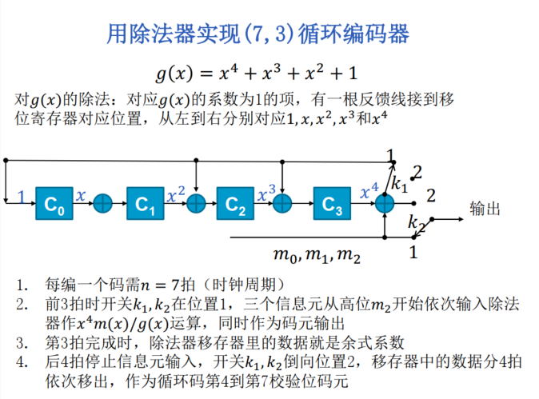
    - **除法器编码示例**：
        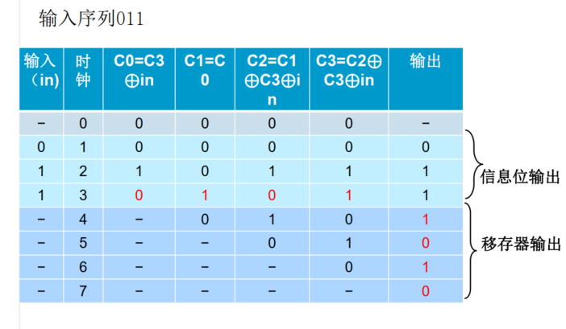

- **循环码的译码**
    - **译码步骤**：
        1. 计算接收多项式\(R(x)\)的伴随多项式\(S(x)\) ，伴随式为\(0\)则认为无差错
        2. 根据\(S(x)\)找出相应错误图样多项式\(e(x)\) 
        3. 将\(e(x)\)和\(R(x)\)模\(2\)加，得到译码输出\(\hat{c}(x)\) 。
    - **伴随式计算及错误检测**：
        - 设接收多项式为\(R(x)\) ，码多项式为\(c(x)\) ，错误图样多项式为\(e(x)\) ，则\[R(x)=c(x)+e(x)\]  用生成多项式\(g(x)\)除\(R(x)\)得伴随式\[s(x)=R(x)\bmod g(x)=e(x)\bmod g(x)\] **可通过译码电路高效实现**

#### 高莱（Golay）码
- **二进制高莱码（Golay (23,12)码）的编码**
    - 二进制高莱码是一种循环码，其生成多项式为：
        \[g(x)=x^{11}+x^{9}+x^{7}+x^{6}+x^{5}+x + 1\]
    - **编码步骤**：
        1. **信息位准备**：假设有12位的信息位，记为\(m(x)\)。
        2. **生成多项式**：使用生成多项式\(g(x)\)。
        3. **计算校验位**：
            - 将信息位\(m(x)\)左移11位（即乘以\(x^{11}\) ），得到\(x^{11}m(x)\)。
            - 计算\(x^{11}m(x)\)除以\(g(x)\)的余数\(r(x)\)。 
            - 将余数\(r(x)\)添加到\(x^{11}m(x)\)的末尾，得到编码后的码字\(c(x)=x^{11}m(x)+r(x)\)。 
- **扩展高莱码（Golay (24,12)码）的编码**
    - 扩展高莱码是在二进制高莱码的基础上增加一个奇偶校验位。
    - **编码步骤**：
        1. **二进制高莱码编码**：首先使用二进制高莱码的编码方法，生成23位的码字\(c(x)\) 。
        2. **计算奇偶校验位**：
            - 计算23位码字中1的个数。
            - 如果1的个数为奇数，则添加1作为奇偶校验位；如果为偶数，则添加0 。
        3. **生成扩展码字**：将奇偶校验位添加到23位码字的末尾，得到24位的扩展高莱码。 

#### 循环冗余校验（Cyclic Redundancy Check，CRC）
- **原理**：
    - 把数据视作二进制数\(D\) 
    - 确定校验序列长度\(r\) 
    - 选择长度为\(r + 1\)的生成序列\(G\) 
    - \(D\)后面添加\(r\)个\(0\)后除以\(G\) ，余数为校验序列\(R\) 
    - 将\(R\)附加在\(D\)后面作为实际传输数据。
    - **检错**：接收方将接收到的数据除以\(G\) ，若余数为\(0\) ，则认为无出错，否则认为传输出错
- **特点**：可检测长度小于\(r + 1\) bits的所有突发错误。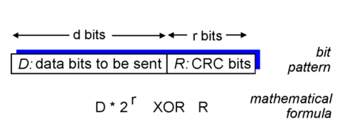
- **CRC示例**：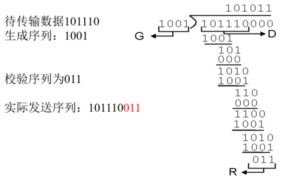
- **常用CRC版本**：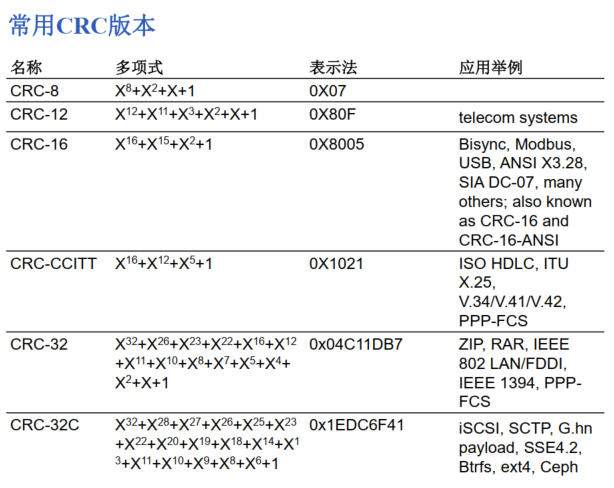
- **CRC有效性**：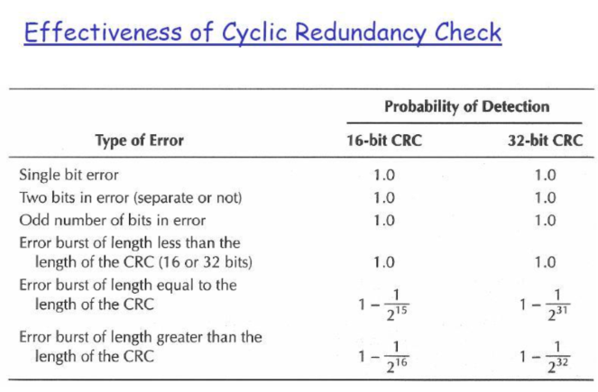