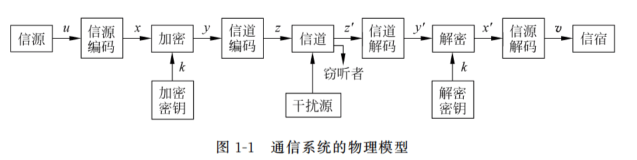

# 第一章 绪论

## 信息理论研究内容
- 狭义信息论：香农信息论
- 一般信息论：香农+维纳
- 广义信息论

## 信息、消息、信号
- **信息**：指各个事物运动的状态及状态变化的方式。信息是抽象的意识或知识，它是看不见、摸不到的。当由人脑的思维活动产生的一种想法仍被存储在脑子里时，它就是一种信息。
    - 特征：
        1. 接收者在收到信息之前，对其内容是未知的，所以信息是新知识、新内容；
        2. 信息是能使认识主体对某一事物的未知性或不确定性减少的有用知识；
        3. 信息可以产生，也可以消失，同时信息可以被携带、存储及处理；
        4. 信息是可以量度的，信息量有多少的差别。
- **消息**：指包含信息的语言、文字和图像等。在通信中，消息是指担负着传送信息任务的单个符号或符号序列。这些符号包括字母、文字、数字和语言等。
- **信号**：消息的物理体现，为了在信道上传输消息，就必须把消息加载（调制）到具有某种物理特征的信号上去。信号是信息的载荷子或载体，是物理性的，如电信号、光信号等。

## 通信系统模型
