# 第三章 信道与信道容量

---
- [第三章 信道与信道容量](#第三章-信道与信道容量)
    - [3.1 信道的数学模型](#31-信道的数学模型)
        - [基本数学模型](#基本数学模型)
        - [无干扰信道（无噪声）](#无干扰信道无噪声)
        - [有干扰无记忆信道](#有干扰无记忆信道)
            - [二进制离散对称信道（Binary Symmetric Channel，BSC）](#二进制离散对称信道binary-symmetric-channelbsc)
            - [离散无记忆信道（Discrete Memoryless Channel，DMC）](#离散无记忆信道discrete-memoryless-channeldmc)
            - [离散输入、连续输出信道](#离散输入连续输出信道)
            - [波形信道](#波形信道)
            - [因此无记忆时重点讨论单符号信道！](#因此无记忆时重点讨论单符号信道)
        - [有干扰有记忆信道](#有干扰有记忆信道)
        - [信道容量的定义](#信道容量的定义)
    - [3.2 离散单个符号信道及其容量](#32-离散单个符号信道及其容量)
        - [无干扰离散信道](#无干扰离散信道)
            - [无噪无损信道：n = m，X、Y一一对应](#无噪无损信道n--mxy一一对应)
            - [无噪有损信道：n \> m，多个X对应一个Y](#无噪有损信道n--m多个x对应一个y)
            - [有噪无损信道：n \< m，一个X对应多个Y](#有噪无损信道n--m一个x对应多个y)
        - [对称离散无记忆信道](#对称离散无记忆信道)
        - [准对称离散无记忆信道](#准对称离散无记忆信道)
        - [矩阵分解法](#矩阵分解法)
        - [一般离散无记忆信道](#一般离散无记忆信道)
    - [3.3 离散序列信道及其容量](#33-离散序列信道及其容量)
        - [信道模型与符号定义](#信道模型与符号定义)
        - [无记忆离散序列信道](#无记忆离散序列信道)
        - [独立并联信道](#独立并联信道)
        - [有记忆离散序列信道](#有记忆离散序列信道)
    - [3.4 连续信道及其容量](#34-连续信道及其容量)
        - [连续单符号加性信道](#连续单符号加性信道)
            - [加性高斯信道](#加性高斯信道)
            - [加性非高斯信道](#加性非高斯信道)
        - [多维无记忆加性连续信道](#多维无记忆加性连续信道)
        - [限时限频限功率加性高斯白噪声信道](#限时限频限功率加性高斯白噪声信道)
            - [波形信道，限时 (t\_B)，限频 (W)](#波形信道限时-t_b限频-w)
            - [加性高斯白噪声](#加性高斯白噪声)
            - [低频带宽受限通信系统](#低频带宽受限通信系统)
    - [3.5 多输入多输出信道及其容量](#35-多输入多输出信道及其容量)
    - [3.6 信源与信道的匹配](#36-信源与信道的匹配)

---

## 3.1 信道的数学模型
### 基本数学模型
- 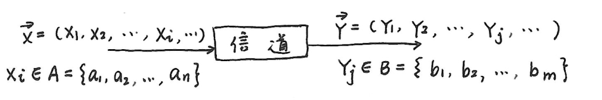
- \(\vec{X}=(X_1, X_2, \cdots, X_i, \cdots)\)，\(X_i \in A = \{a_1, a_2, \cdots, a_n\}\)为输入；
- \(\vec{Y}=(Y_1, Y_2, \cdots, Y_j, \cdots)\)，\(Y_j \in B = \{b_1, b_2, \cdots, b_m\}\)为输出。
- 用条件概率（转移概率）\(p(\vec{Y}|\vec{X})\)来描述输入、输出之间的依赖关系。

### 无干扰信道（无噪声）
- \(\vec{Y} = f(\vec{X})\)，已知\(\vec{X}\)就能确知\(\vec{Y}\)
    \[
    p(\vec{Y}|\vec{X}) = 
    \begin{cases}
    1, &\vec{Y} = f(\vec{X}) \\
    0, &\vec{Y} \neq f(\vec{X})
    \end{cases}
    \]
- 例子：
    - 当输入\(a_1\)对应输出\(b_1\)，输入\(a_2\)对应输出\(b_2\)时，转移概率矩阵\(P = \begin{bmatrix} 1 & 0 \\ 0 & 1 \end{bmatrix}\)
    - 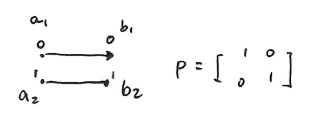

### 有干扰无记忆信道
- 无记忆：\[p(\vec{Y}|\vec{X}) = p(y_1|x_1)p(y_2|x_2)\cdots p(y_l|x_l)\]
- 只需分析单个符号的转移概率\(p(y_j|x_i)\)

#### 二进制离散对称信道（Binary Symmetric Channel，BSC）
- 输入\(X \in A = \{0, 1\}\)
- 输出\(Y \in B = \{0, 1\}\)
- \(
BSC\begin{cases}
p(Y = 0|X = 1) = p(Y = 1|X = 0) = p \\
p(Y = 1|X = 1) = p(Y = 0|X = 0) = 1 - p
\end{cases}
\)
- 其中\(p\)为错误概率，其转移关系和转移概率矩阵如下：
- 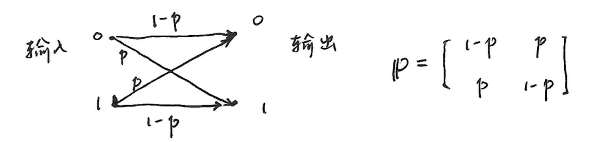

#### 离散无记忆信道（Discrete Memoryless Channel，DMC）
- 输入\(X \in \{a_1, a_2, \cdots, a_n\}\)
- 输出\(Y \in \{b_1, b_2, \cdots, b_m\}\)
- 转移概率矩阵\(P = [p(b_j|a_i)] = [p_{ij}]_{n \times m} =  \begin{bmatrix}
    p_{11} & p_{12} & \cdots & p_{1m} \\
    \vdots & & & \\
    p_{n1} & p_{n2} & \cdots & p_{nm}
    \end{bmatrix}_{n \times m}\)
- 并且满足\(\sum_{j = 1}^{m} p(b_j|a_i) = 1\)，\(i = 1, 2, \cdots, n\)
- 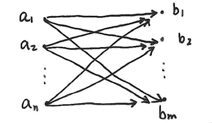
- 二进制离散对称信道（BSC）是离散无记忆信道（DMC）的特例

#### 离散输入、连续输出信道
- 输入\(X \in \{a_1, a_2, \cdots, a_n\}\)
- 输出\(Y \in \{-\infty, +\infty\}\)
- 信道模型为\(Y = X + G\)，其中\(G \in \{-\infty, +\infty\}\)，\(p_G(n) \sim N(0, \sigma^2)\)
- 条件概率密度\(p_Y(y|a_i) \sim N(a_i, \sigma^2)=\frac{1}{\sqrt{2 \pi \sigma^2}}e^{-\frac{(y - a_i)^2}{2\sigma^2}}\)
- 图例：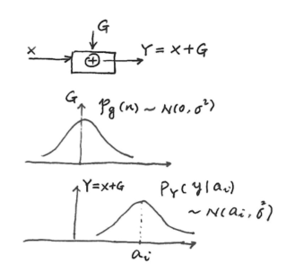

#### 波形信道
- 当 \(t_B\)、\(f_m\) 受限，\(L = 2t_Bf_m\) 时
- 输入 \(\vec{X} = (X_1, X_2, \cdots, X_L)\)
- 输出 \(\vec{Y} = (Y_1, Y_2, \cdots, Y_L)\)
- 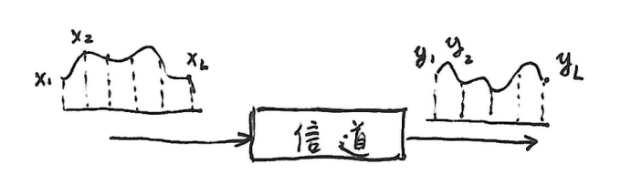
- **时间离散，取值连续的多维连续信道**，信道转移概率密度函数为：
    \[p_Y(\vec{y}|\vec{x}) = p_y (y_1,y_2,\cdots,y_L | x_1,x_2,\cdots,x_L)\]
- **连续无记忆信道**：
    \[p_Y(\vec{y}|\vec{x}) = p_y(y_1 | x_1)p_y(y_2 | x_2)\cdots p_y(y_L | x_L) = \prod_{l = 1}^{L} p_Y (y_l| x_l)\]

#### 因此无记忆时重点讨论单符号信道！
- 信道模型为 \(y(t)=x(t)+n(t)\)
- 其中 **\(n(t)\) 为加性噪声，与信号 \(x(t)\) 相互独立**
- 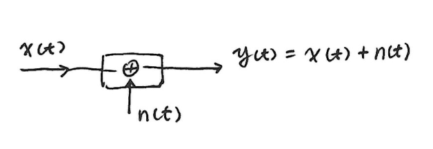
- 根据概率关系有：
    \[p_{X,Y}(x,y)=p_{X,n}(x,n)=p_X(x)p_n(n)\]

    \[p_Y(y|x)=\frac{p_{X,Y}(x,y)}{p_X(x)}=\frac{p_{X,n}(x,n)}{p_X(x)} = p_n(n)\]

- 进一步考虑条件熵：
    \[
    \begin{align*}
    H_c(Y|X)&=-\iint_{R}p_{X,Y}(x,y)\log p_Y(y|x)dxdy\\
    &=-\int_{R}p_X(x)dx\int_{R}p_Y(y|x)\log p_Y(y|x)dy\\
    &=-\int_{R}p_n(n)\log p_n(n)dn\\
    &=H_c(n)
    \end{align*}
    \]

    条件熵 \(H_c(Y|X)\) 称为**噪声熵**

- 在加性多维连续信道中
    - \[\vec{y}=\vec{x}+\vec{n}\]
    - 同理有 \(p_{\vec{Y}}(\vec{y}|\vec{x}) = p_n(\vec{n})\)，\(H_c(\vec{y}|\vec{x}) = H_c(\vec{n})\)

### 有干扰有记忆信道
        略

### 信道容量的定义
- 定义信道的**信息传输率 \(R\)** 为信道中平均每个符号所传输的信息量：
    \[
    \begin{align*}
    R=I(X;Y)&=H(X)-H(X|Y)\quad \text{bit}/\text{信道符号}\\
    &=H(Y)-H(Y|X)
    \end{align*}
    \]
- 设 \(T\) 为信道中符号的平均传输时间，定义**信息传输速率**：
    \[R_t = \frac{R}{T}=\frac{I(X;Y)}{T}\quad \text{bit}/\text{秒}\]
    - \(I(X;Y)\) 是输入符号分布概率 \(p(a_i)\) 和信道转移概率 \(p(b_j|a_i)\) 的函数，即 
        \[I(X;Y)=f(p(a_i),p(b_j|a_i))\]
- 对于某特定信道，\(p(b_j|a_i)\) 确定，则 \(I(X;Y)\) 是关于 \(p(a_i)\) 的凹函数（\(\cap\)型上凸函数），也即可以找到某种概率分布 \(p(a_i)\)，使 \(I(X;Y)\) 达到最大，该最大值为**信道容量**：
    \[C = \max_{p(a_i)} I(X;Y)\quad \text{bit}/\text{符号}\]
    - 若符号传送时间周期为 \(T\) 秒，则**单位时间信道容量**为：
        \[C_t = C/T\quad \text{bit}/\text{秒}\]
- 对于固定信道参数信道，信道容量是个定值。实际传输时能否提供最大传输能力，取决于输入端的概率分布，定义**信道绝对冗余度和相对冗余度**：
    \[信道绝对冗余度 =C - I(X;Y)\] \[信道相对冗余度 =1-\frac{I(X;Y)}{C}\]

## 3.2 离散单个符号信道及其容量
### 无干扰离散信道
- 信道输入\(X \in A=\{a_1,a_2,\cdots,a_n\}\)
- 输出\(Y \in B = \{b_1,b_2,\cdots,b_m\}\)

#### 无噪无损信道：n = m，X、Y一一对应
- 输入输出关系：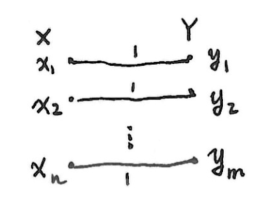
- 转移概率矩阵\(P = \{p(y_j|x_i)\} = 
    \begin{bmatrix}
    1 & 0 & \cdots \\
    0 & 1 & \cdots \\
    \vdots & \vdots & \ddots &
    \end{bmatrix}\)，\(p(x_i|y_j) \in \{0, 1\}\)。
- **噪声熵与疑义度**：
    \[H(Y|X)=H(X|Y)=0\]
- **互信息**：
    \[I(X;Y)=I(Y;X)=H(X)=H(Y)\] 当输入符号等概率分布时，\(I(X;Y)\)最大。
- **信道容量**:
    \[C = \max_{p(a_i)} I(X;Y)=\max_{p(a_i)} H(X)=\log n\]

#### 无噪有损信道：n > m，多个X对应一个Y
- 输入输出关系：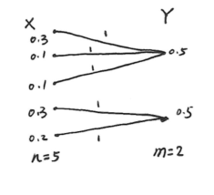
- 多个输入对应一个输出，即\(n > m\)
- **噪声熵**:
    \[H(Y|X)=\sum_{i,j}p(a_i,b_j)\log p(b_j|a_i)=0\]
- **疑义度**:
    \[H(X|Y)=\sum_{i,j}p(a_i,b_j)\log p(a_i|b_j)\neq0\]
- **互信息**:
    \[I(X;Y)=H(X)-H(X|Y)=H(Y)-H(Y|X)=H(Y)\neq0\] 其中\(H(Y|X) = 0\)，\(H(X|Y)\neq0\)
    由此可得\(H(X)=H(Y)+H(X|Y)\)，所以\(H(X)\geq H(Y)\) 。
- **信道容量**：
    \[C = \max_{p(a_i)} I(X;Y)=\max_{p(a_i)} H(Y) \overset{?}{=} \log m\]

#### 有噪无损信道：n < m，一个X对应多个Y
- 输入输出关系：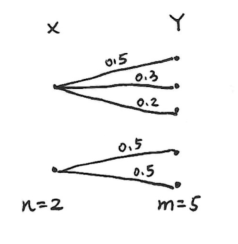
- 信道噪声使一个输入对应多个输出，\(n < m\)
- **噪声熵**：
    \[H(Y|X)=\sum_{i,j}p(a_i,b_j)\log p(b_j|a_i)\neq0\]
- **疑义度**：
    \[H(X|Y)=\sum_{i,j}p(a_i,b_j)\log p(a_i|b_j)=0\]
- **互信息**：
    \[I(X;Y)=H(X)-H(X|Y)=H(Y)-H(Y|X)=H(X)\neq0\] 其中\(H(X|Y) = 0\)，\(H(Y|X)\neq0\)
    由此可得\(H(Y)=H(X)+H(Y|X)\)，所以\(H(Y)\geq H(X)\) 。
- **信道容量**：
    \[C = \max_{p(a_i)} I(X;Y)=\max_{p(a_i)} H(X) = \log n\]

### 对称离散无记忆信道
- 以下是两个转移概率矩阵示例：
    \[
    \begin{bmatrix}
    \frac{1}{3} & \frac{1}{3} & \frac{1}{6} & \frac{1}{6} \\
    \frac{1}{6} & \frac{1}{6} & \frac{1}{3} & \frac{1}{3} 
    \end{bmatrix}_{2\times4}
    \quad
    \begin{bmatrix}
    \frac{1}{2} & \frac{1}{3} & \frac{1}{6} \\
    \frac{1}{6} & \frac{1}{2} & \frac{1}{3} \\
    \frac{1}{3} & \frac{1}{6} & \frac{1}{2} 
    \end{bmatrix}_{3\times3}
    \]

- **对称特性判断**：
    - 若每一行包含相同元素，称为输入对称
    - 若每一列包含相同元素，称为输出对称
    - 当行列都对称时，为**对称DMC（离散无记忆信道）**。

- **相关信息论公式**：
    - **互信息**:
        \[I(X;Y)=H(X)-H(X|Y)=H(Y)-H(Y|X)\]
    - **条件熵**:
        \[
        \begin{align*}
        H(Y|X)&=-\sum_{i,j} p(a_i, b_j)\log p(b_j|a_i)\\
        &=-\sum_{i,j} p(a_i) p(b_j|a_i)\log p(b_j|a_i)\\
        &=-\sum_{i} p(a_i) \sum_{j} p(b_j|a_i)\log p(b_j|a_i)\\
        &=\sum_{i} p(a_i) H(Y|a_i) （输入对称）\\
        &= H(Y|a_i)，i = 1, 2, \cdots, n
        \end{align*}
        \]
    - **信道容量**:
        \[C = \max_{p(a_i)} I(X;Y)=\max_{p(a_i)} H(Y)-H(Y|X)=\max_{p(a_i)} H(Y)-H(Y|a_i)\]
- 当**输入符号等概率分布**，即\(p(a_i)=\frac{1}{n}\)时，设\(m\)为输出符号数目，则有：
    - \(p(b_j)=\sum_{i} p(a_i)p(b_j|a_i)=\frac{1}{n}\sum_{i} p(b_j|a_i)=\frac{1}{n}\cdot \frac{n}{m}=\frac{1}{m}\)
    - \(H(Y)=-\sum_{j} p(b_j)\log p(b_j)=\sum_{j} \frac{1}{m}\log m=m\frac{1}{m}\log m=\log m\)
    - **信道容量**\[C = \log m - H(Y|a_i)\]
    - 其中\(m\)为输出符号\(Y\)数目，\(i = 1, \cdots, n\)

-  **一般离散无记忆模k加性噪声信道**
    - 信道模型: \(Y = X\oplus Z\bmod k\)，其中 \(X,Y,Z\in\{0,1,\cdots,k - 1\}\)
    - 图例: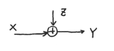
    - **加性噪声**，有 \(p(y|x)=p(z)\)
        - **条件熵**:
            \[
            \begin{align*}
            H(Y|X)&=-\sum_{x,y}p(x)p(y|x)\log p(y|x)\\
            &=-\sum_{x,z}p(x)p(z)\log p(z)\\
            &=-\sum_{x}p(x)\sum_{z}p(z)\log p(z)\\
            &=H(Z)
            \end{align*}
            \]
        - **信道容量**:
            \[
            \begin{align*}
            C&=\max_{p(x)}H(Y)-H(Y|X)\\
            &=\max_{p(x)}H(Y)-H(Z)\\
            &=\log k - H(Z) \quad (\text{对称性})
            \end{align*}
            \]
    - 例题：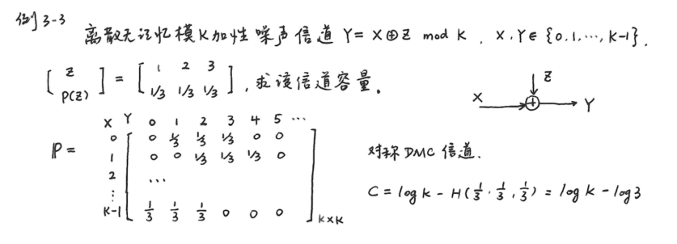

### 准对称离散无记忆信道
- 以下是两个转移概率矩阵示例：
\[P_1=\begin{bmatrix}\frac{1}{3}&\frac{1}{3}&\frac{1}{6}&\frac{1}{6}\\\frac{1}{6}&\frac{1}{3}&\frac{1}{6}&\frac{1}{3}\end{bmatrix}_{2\times 4} \quad P_2=\begin{bmatrix}0.7&0.1&0.2\\0.2&0.1&0.7\end{bmatrix}_{2\times 3}\]

- **信道特性**：
    - 矩阵中**各行元素相同，但各列元素不同**，这种信道称为**准对称DMC（离散无记忆信道）**。

- **相关信息论公式**：
    - 因为各行元素相同，所以 \(H(Y|X)=H(Y|a_i)\) ，其中 \(i = 1,2,\cdots,n\)
        - 这表明在给定不同输入符号 \(a_i\) 时，输出的条件熵是相同的
    - 由于各列元素不同，信道的输入和输出分布概率可以不同，并且 \(H(Y)\leq\log m\) （\(m\)为输出符号的数目）

    - **信道容量**：
        \[
        \begin{align*}
        C &= \max_{p(x)}[H(Y)-H(Y|X)] \\
        &\leq\log m - H(Y|a_i)\\
        &=\log m+\sum_{j = 1}^{m}p_{ij}\log p_{ij}
        \end{align*}
        \] 其中\(i = 1,2,\cdots,n\) ，\(p_{ij}\) 是转移概率矩阵中的元素
        - 这给出了准对称离散无记忆信道容量的一个**上限估计**
        - 求解：**矩阵分解法**

### 矩阵分解法
- **转移矩阵分解**：
    - 将**准对称**转移概率矩阵**按概率列**分成若干个互不相交的**对称的子集**。例如：
        - \[P_1 = \begin{bmatrix}\frac{1}{3}&\frac{1}{3}&\frac{1}{6}&\frac{1}{6}\\\frac{1}{6}&\frac{1}{3}&\frac{1}{6}&\frac{1}{3}\end{bmatrix}\] 可分解成\(\begin{bmatrix}\frac{1}{3}&\frac{1}{6}\\\frac{1}{6}&\frac{1}{3}\end{bmatrix}\)，\(\begin{bmatrix}\frac{1}{3}\\\frac{1}{3}\end{bmatrix}\)，\(\begin{bmatrix}\frac{1}{6}\\\frac{1}{6}\end{bmatrix}\)
        - \[P_2 = \begin{bmatrix}0.7&0.1&0.2\\0.2&0.1&0.7\end{bmatrix}\] 可分解成\(\begin{bmatrix}0.7&0.2\\0.2&0.7\end{bmatrix}\) ，\(\begin{bmatrix}0.1\\0.1\end{bmatrix}\) 。

- **信道容量**：
    - 可以证明，当**输入等概率分布**时，可达到信道容量。
        \[C=\log n - H(P_1',P_2',\cdots,P_m')-\sum_{k = 1}^{r}N_k\log M_k\]
    - 其中：
        - \(n\)为输入符号个数。
        - \(P_1',P_2',\cdots,P_m'\) 是原转移概率矩阵\(P\)中一行的元素。
        - \(N_k\)是第\(k\)个子矩阵中行元素之和。
        - \(M_k\)是第\(k\)个子矩阵中列元素之和。
        - \(r\)是子矩阵个数。

### 一般离散无记忆信道
- **转移概率\(p(y|x)\)固定**
- **信道容量**：
    \[C = \max_{p(x)}I(X;Y)=\max_{p(x)}I(p(x),p(y|x))\]

    即求互信息\(I(X;Y)\)关于输入概率分布\(p(x)\)的极大值。

- **互信息**：
    \[
    \begin{align*}
    I(X;Y)&=\sum_{i}p(a_i)I(a_i;Y)\\
    &=\sum_{i}p(a_i)\sum_{j}p(b_j|a_i)\log\frac{p(a_i|b_j)}{p(a_i)}
    \end{align*}
    \]
- 为使\(I(X;Y)\)达到最大，输入符号概率集\(\{p(a_i)\}\)必须满足的**充分和必要条件**是：
    - 对于所有\(p(a_i)>0\) 的符号\(a_i\) ，有\(I(a_i;Y)=C\)
    - 对于所有\(p(a_i)=0\) 的符号\(a_i\) ，有\(I(a_i;Y)\leq C\)
    - 这意味着除概率为0的符号\(a_i\)外，每个符号\(a_i\) 对\(Y\)提供相同的互信息
- 注意：**最佳输入分布不唯一！**
- 例题：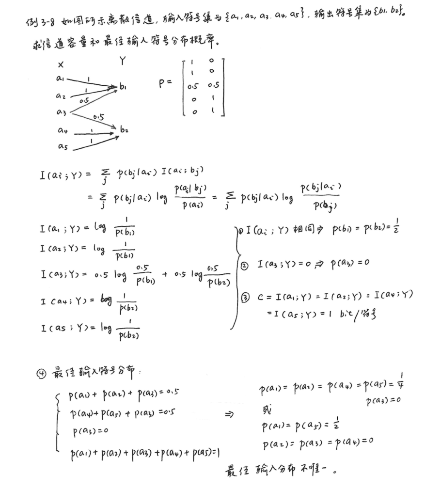

## 3.3 离散序列信道及其容量
### 信道模型与符号定义
- 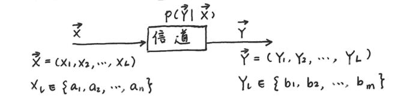
- 输入矢量为\(\vec{X}=(X_1,X_2,\cdots,X_L)\)，其中\(X_l\in\{a_1,a_2,\cdots,a_n\}\)
- 输出矢量为\(\vec{Y}=(Y_1,Y_2,\cdots,Y_L)\)，其中\(Y_l\in\{b_1,b_2,\cdots,b_m\}\)
- 条件概率表示为\(p(\vec{Y}|\vec{X})\) ，即给定输入\(\vec{X}\)时输出\(\vec{Y}\)的概率。

### 无记忆离散序列信道
- 对于无记忆离散序列信道：
    \[p(\vec{Y}|\vec{X}) = p(Y_1,\cdots,Y_L|X_1,\cdots,X_L)=\prod_{l = 1}^{L}p(Y_l|X_l)\]
    - 若信道是平稳的：
        \[p(\vec{Y}|\vec{X})=(p(y|x))^{L}=p^{L}(y|x)\]
- **互信息与信道容量**:
    \[
    \begin{align*}
    I(\vec{X};\vec{Y})&=H(\vec{X}) - H(\vec{X}|\vec{Y})=\sum p(\vec{X},\vec{Y})\log\frac{p(\vec{X}|\vec{Y})}{p(\vec{X})}\\
    &=H(\vec{Y}) - H(\vec{Y}|\vec{X})=\sum p(\vec{X},\vec{Y})\log\frac{p(\vec{Y}|\vec{X})}{p(\vec{Y})}
    \end{align*}
    \]
    - **信道无记忆时**：
        \[I(\vec{X};\vec{Y})\leq\sum_{l = 1}^{L}I(X_l;Y_l)\]
        - 由于变量之间可能存在的依赖关系等因素，整体的条件不确定性 \(H(\vec{Y}|\vec{X})\) 不会小于各个分量条件不确定性\(H(Y_l|X_l)\)之和，即 \(H(\vec{Y}|\vec{X}) \geq \sum_{l = 1}^{L}H(Y_l|X_l)\)，而\(H(\vec{Y}) = \sum_{l = 1}^{L}H(Y_l)\)， 所以\(I(\vec{X};\vec{Y})\leq\sum_{l = 1}^{L}I(X_l;Y_l)\)。
    - **输入矢量\(\vec{X}\)中各分量相互独立时**：
        \[I(\vec{X};\vec{Y})\geq\sum_{l = 1}^{L}I(X_l;Y_l)\]
        - 利用互信息的链式法则有：\(I(\vec{X};\vec{Y}) = I(X_{1},\cdots,X_{L};\vec{Y}) = I(X_{1};\vec{Y}) + I(X_{2};\vec{Y}|X_{1}) + \cdots + I(X_{L};\vec{Y}|X_{1},\cdots,X_{L - 1})\)，由于输入矢量\(\vec{X}\)中各分量相互独立，所以根据互信息和条件互信息的性质，有：\(I(X_{l};\vec{Y}|X_{1},\cdots,X_{l - 1}) \geq I(X_{l};Y_{l})\)，因此有：\(I(\vec{X};\vec{Y}) \geq \sum_{l = 1}^{L}I(X_l;Y_l)\)。
    - **当输入矢量\(\vec{X}\)独立且信道无记忆时**，上述两个性质统一取等号，此时**信道容量**：
        \[
        \begin{align*}
        C_L&=\max_{p(x)}I(\vec{X};\vec{Y})=\max_{p(x)}\sum_{l = 1}^{L}I(X_l;Y_l)\\
        &=\sum_{l = 1}^{L}\max_{p(x)}I(X_l;Y_l)=\sum_{l = 1}^{L}C_l
        \end{align*}
        \]
        - 当信道平稳时\(C_L = LC_1\)
        - 一般情况下，\(I(\vec{X};\vec{Y})\leq LC_1\) ，其中\(C_1\)是单个时刻的信道容量
- 输入矢量独立且信道无记忆时，相当于对单个信道进行\(L\)次扩展的信道，也相当于\(L\)个独立的信道并联在一起。

### 独立并联信道
- 图例: 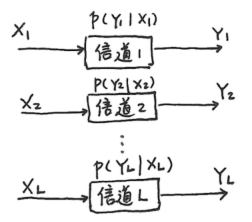
- 每个信道输出\(Y_l\)只与本信道的输入\(X_l\)有关，即：
    \[p(Y_1,Y_2,\cdots,Y_L|X_1,X_2,\cdots,X_L) = p(Y_1|X_1)p(Y_2|X_2)\cdots p(Y_L|X_L)\] **信道无记忆**, 并且有
    \[I(\vec{X};\vec{Y})\leq\sum_{l = 1}^{L}I(X_l;Y_l)\]
- 并联信道容量
    \[C_{12\cdots L}=\max I(\vec{X};\vec{Y})\leq\sum_{l = 1}^{L}C_l\]
- 当输入符号\(X_l\)相互独立，且\(p(X_1,X_2,\cdots,X_L)\)达到最佳分布时，容量最大，此时：
    \[C_{12\cdots L}=\sum_{l = 1}^{L}C_l\]

### 有记忆离散序列信道
        有记忆的离散序列信道复杂得多，不作介绍。

## 3.4 连续信道及其容量
### 连续单符号加性信道
#### 加性高斯信道
- **信道模型**：
    - 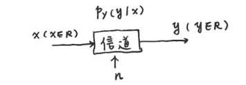
    - \( y = x + n \)
    - \( n \)：加性噪声，\( P_n(n) \sim N(0, \sigma^2) = \frac{1}{\sqrt{2\pi\sigma^2}} e^{-\frac{n^2}{2\sigma^2}} \)。
- **微分熵**：
    \[H_c(n) = -\int_{-\infty}^{+\infty} P_n(n) \log P_n(n) dn = \frac{1}{2} \log(2\pi e \sigma^2) \]
- **互信息**：
    \[
    \begin{align*}
    I(X;Y) &= H_c(X) - H_c(X|Y) \\
    &= H_c(Y) - H_c(Y|X) \\
    \end{align*}
    \]
- **信道容量**：
    \[
    \begin{align*}
    C = \max_{p(x)} I(X;Y) &= \max_{p(x)} [H_c(Y) - H_c(Y|X)] \\
    &= \max_{p(x)} H_c(Y) - \frac{1}{2} \log(2\pi e \sigma^2)
    \end{align*}
    \]

    其中 \( H_c(Y|X) \) 是噪声熵，由于\(x\)与\(n\)相独立，所以\(p(y|x) = p(x+n|x) = p(n)\)，所以\( H_c(Y|X) = H_n(n) = \frac{1}{2} \log(2\pi e \sigma^2) \)。

- **求 \( H_c(Y) \) 最大值**：
    \[
    \begin{align*}
    &y = x + n , y \in (-\infty, +\infty) ，y是功率受限信号\\
    &\Rightarrow Y 正态分布时熵最大\\
    &\Rightarrow Y 正态分布时信道容量最大\\
    \end{align*}
    \]
- \( y \) 的功率 \(P\)（其中\( S \)是输入信号 \( x \) 的平均功率，\( \sigma^2 \)是噪声功率） \[ P = S + \sigma^2 \]
    - 若 \( P_Y(y) \sim N(0, P) \)，\( P_n(n) \sim N(0, \sigma^2) \)，\( x = y - n \)，则 \( P_X(x) \sim N(0, S) \)。
    - 当输入 \( X \) 是均值为 0，方差为 \( S \) 的高斯分布时，**信息传输率**达最大，等于**信道容量**：
        \[
        \begin{align*}
        C &= \frac{1}{2} \log(2\pi e P) - \frac{1}{2} \log(2\pi e \sigma^2) \\
        &= \frac{1}{2} \log \frac{P}{\sigma^2} \\
        &= \frac{1}{2} \log \left(1 + \frac{S}{\sigma^2}\right)\\
        &= \frac{1}{2} \log(1 + SNR) \quad bit/符号
        \end{align*}
        \]

        其中 \( SNR = \frac{S}{\sigma^2} \)，\( SNR_{dB} = 10 \log_{10} SNR \)。

#### 加性非高斯信道
- 对于加性、均值为 0、平均功率为 \( \sigma^2 \) 的非高斯信道：
    \[
    C = \max (H_c(Y) - H_c(n))
    \]
- 高斯分布时：
    \[H_c(Y)_{max} = \frac{1}{2} \log(2\pi e P) \]

    \[H_c(n)_{max} = \frac{1}{2} \log(2\pi e \sigma^2) \]
- 满足：
    \[\frac{1}{2} \log(2\pi e P) - \frac{1}{2} \log(2\pi e \sigma^2) \leq C \leq \frac{1}{2} \log(2\pi e P) - H_c(n) \]

### 多维无记忆加性连续信道
- **信道模型**：
    - 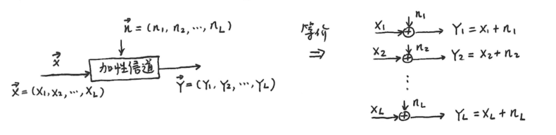
        - 输入\(X\)的总功率\(P = \sum_{l = 1}^{L}P_l\)，\(P_l\)是第\(l\)个输入信号的功率
        - \(\sigma_l^2\)是第\(l\)个噪声的功率
    - 信道无记忆
        \[
        p(\vec{y}|\vec{x}) = \prod_{l = 1}^{L} p(y_l|x_l)
        \]
    - 加性噪声各时刻独立
        \[
        p_n(\vec{n}) = p_y(\vec{y}|\vec{x}) = \prod_{l = 1}^{L} p_n(n_l) \quad n_l \sim N(0, \sigma_l^2)
        \]
- **互信息**：
    \[
    I(\vec{X}; \vec{Y}) \leq \sum_{l = 1}^{L} I(X_l; Y_l) \leq \sum_{l = 1}^{L} \frac{1}{2} \log(1 + \frac{P_l}{\sigma_l^2})
    \]
- **信道容量**：
    \[
    C = \max_{p(x)} I(\vec{X}; \vec{Y}) = \sum_{l = 1}^{L} \frac{1}{2} \log(1 + \frac{P_l}{\sigma_l^2}) \quad \text{bit}/L \text{ 序列}
    \]

    当且仅当输入随机变量 \(\vec{X}\) 中各分量统计独立，且均值为0，方差为 \(P_l\) 的高斯分布时，才能达到此容量。

1. **\(L\) 个高斯噪声每个单元时刻噪声功率相等**，\(\sigma_l^2 = \sigma^2\)，\(l \in \{1,2,\cdots,L\}\)，有
    \[
    C = \frac{L}{2} \log(1 + \frac{S}{\sigma^2}) \quad, \quad S = \frac{P}{L}
    \] \(\vec{X}\) 的各分量满足 \(N(0,S)\) 分布时，达到信道容量。

2. **\(L\) 个高斯噪声均值为0，方差不同且为 \(\sigma_l^2\) 时**，若输入信号的总平均功率受限，即
    \[
    E\left[\sum_{l = 1}^{L} x_l^2\right] = \sum_{l = 1}^{L} E[x_l^2] = \sum_{l = 1}^{L} P_l = P
    \]
    - 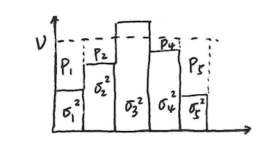
    - **怎样合理分配各单元时刻的信号平均功率，才能使信道传输率最大？**
        用拉格朗日乘数法，作辅助函数
        \[
        f(P_1, P_2, \cdots, P_L) = \sum_{l = 1}^{L} \frac{1}{2} \log(1 + \frac{P_l}{\sigma_l^2}) + \lambda \sum_{l = 1}^{L} P_l
        \]

        对第一项求最大，第二项为约束条件
        令 \(\frac{\partial f( )}{\partial P_l} = 0\)，\(l = 1,2,\cdots,L\)
        得
        \[
        \begin{align*}
        \frac{1}{2} \frac{1}{P_l + \sigma_l^2} + \lambda = 0 \quad, \quad l = 1,2,\cdots,L\\
        \Rightarrow P_l + \sigma_l^2 = -\frac{1}{2\lambda} \quad, \quad l = 1,2,\cdots,L
        \end{align*}
        \]

        令各时刻信道输出总功率（信号功率 \(P_l\) + 噪声功率 \(\sigma_l^2\)）相等，设为 \(V\)
        \[
        V = \frac{P + \sum_{l = 1}^{L} \sigma_l^2}{L}
        \]

        当 \(P_l = V - \sigma_l^2 = \frac{P + \sum_{l = 1}^{L} \sigma_l^2}{L} - \sigma_l^2\)，\(l = 1,2,\cdots,L\) 时，**信道传输率达到最大**
        \[
        \begin{align*}
        C &= \sum_{l = 1}^{L} \frac{1}{2} \log(1 + \frac{P_l}{\sigma_l^2})  = \frac{1}{2} \sum_{l = 1}^{L} \log \frac{P + \sum_{l = 1}^{L} \sigma_l^2}{L\sigma_l^2} \\
        &= \frac{1}{2} \sum_{l = 1}^{L} \log \frac{V}{\sigma_l^2}
        \end{align*}
        \]

        若 \(\sigma_l^2\) 太大，大于 \(V\)，则置 \(P_l = 0\)，然后重新调整功率分配，直到 \(P_l\) 不再出现负值。

### 限时限频限功率加性高斯白噪声信道
#### 波形信道，限时 \(t_B\)，限频 \(W\)
- **信道模型**：
    - 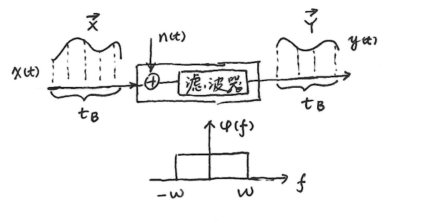
- **互信息**：
    \[
    \begin{align*}
    I(x(t); y(t)) &= \lim_{L \to \infty} I(\vec{X}; \vec{Y}) \\
    &= \lim_{L \to \infty} [H_c(\vec{X}) - H_c(\vec{X}|\vec{Y})] \\
    &= \lim_{L \to \infty} [H_c(\vec{Y}) - H_c(\vec{Y}|\vec{X})] \quad \text{bit/波形}
    \end{align*}
    \]
- **单位时间内的信息传输率** \(R_t\) 为：
    \[
    R_t=\lim_{t_B \to \infty}\frac{1}{t_B}I(\vec{X}; \vec{Y})\quad \text{ bit/秒} \quad (t_B：\text{秒/波形})
    \]
- **信道容量**:
    \[
    C_t=\max_{p(x)}[\lim_{t_B \to \infty}\frac{1}{t_B}I(\vec{X}; \vec{Y})]\quad \text{ bit/秒}
    \]
- 带宽受限加性高斯白噪声 \(n(t)\)，均值为0，功率谱密度 \(\frac{N_0}{2}\)

#### 加性高斯白噪声
- **模型**：
    - 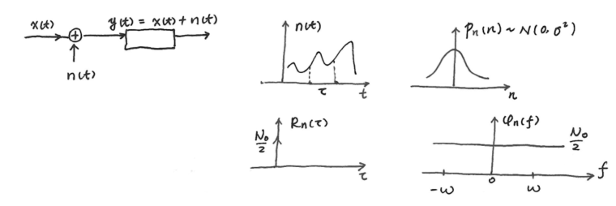
    - \(y(t)=x(t)+n(t)\)
    - 相关函数:
        - \(P_n(n)\sim N(0,\sigma^2)\)
        - \(R_n(\tau) = \frac{N_0}{2}\delta(\tau)\)
        - 功率谱密度 \(\Phi_n(f) = \frac{N_0}{2}\)
        - 总噪声功率 \(\sigma^2 = \frac{N_0}{2} \cdot 2W = N_0W\)
        - \(N_0 = kT\)
        - 波茨曼常数 \(k\)
        - 绝对温度 \(T\)

#### 低频带宽受限通信系统
- 在 \([0, t_B]\) 内，采样个数 \(L = 2Wt_B\)，各样本值彼此独立。
- 通信带宽为 \(2W\)，噪声功率为 \(2W\cdot\frac{N_0}{2}=N_0W\)
    \[
    \begin{align*}
    &C=\frac{1}{2}\sum_{l = 1}^{L}\log(1 + \frac{P_l}{\sigma_l^2})\\
    &\sigma_l^2 = P_n=\frac{\frac{N_0}{2}\cdot 2W\cdot t_B}{L}=\frac{\frac{N_0}{2}\cdot 2W\cdot t_B}{2W\cdot t_B}=\frac{N_0}{2}\\
    &P_l = \frac{P_s t_B}{2Wt_B}=\frac{P_s}{2W}
    \end{align*}
    \]

- 对于平稳系统
    \[
    \begin{align*}
    C&=\frac{L}{2}\log(1 + \frac{P_s}{2W}\cdot\frac{2}{N_0})\\
    &=\frac{L}{2}\log(1 + \frac{P_s}{N_0W})\\
    &=Wt_B\log(1 + \frac{P_s}{N_0W}) \quad \text{ bit}/L \text{维符号序列}
    \end{align*}
    \]

- 单位时间的信道容量
    \[
    \begin{align*}
    C_t&=\lim_{t_B \to \infty}\frac{C}{t_B}\\
    &=W\log(1 + \frac{P_s}{N_0W})\quad \text{ bit/秒}\\
    &=W\log(1 + SNR)\quad \text{ bit/秒}
    \end{align*}
    \]

    其中:
    - \(P_s\)：信号平均功率
    - \(N_0W\)：噪声在系统中的平均功率（\(\frac{N_0}{2}\cdot 2W = N_0W\)）
    - \(SNR_{dB}=10\log_{10}SNR\)

## 3.5 多输入多输出信道及其容量
        略

## 3.6 信源与信道的匹配
- **符号匹配**
    - 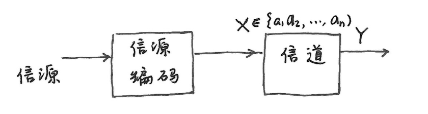
    - 信源编码：将信源符号转换为信道符号
- **信息匹配**
    - 信道绝对冗余度 \(R_a = C - I(X;Y)\)
    - 信道相对冗余度 \(R_r = 1 - \frac{I(X;Y)}{C}\)
    - 信道效率 \(E = \frac{I(X;Y)}{C}\)