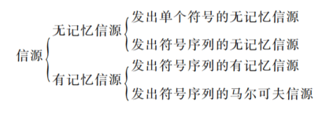
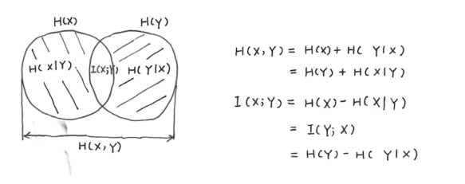

# 第二章 信源与信息熵

## 2.1 信源的分类及数学模型

### 无记忆的单符号
- **离散**
    - 信源输出单个符号的消息，出现的消息数是有限的，且只可能是符号集中的一种
    - 各符号出现的概率与信源相互确定
    - **数学表示**：
        \[
        \begin{bmatrix} X \\ P \end{bmatrix} = 
        \begin{bmatrix} a_1 & a_2 & \cdots & a_n \\ p(a_1) & p(a_2) & \cdots & p(a_n) \end{bmatrix}
        \]

        其中符号集 \(A = \{a_1, a_2, \cdots, a_n\}\)，\(X \in A\)。显然有 \(p(a_i) \geq 0\)，\(\sum_{i = 1}^{n} p(a_i) = 1\)。 
- **连续**
    - 信源输出单个符号的消息，出现的消息数是无限的
    - **数学表示**：
        \[
        \begin{bmatrix} X \\ P \end{bmatrix} = 
        \begin{bmatrix} (a,b) \\ p_X(x) \end{bmatrix}
        或
        \begin{bmatrix} R \\p_X(x) \end{bmatrix}
        \]

        显然应满足 \(p_X(x) \geq 0\)，\(\int_{a}^{b} p_X(x) \mathrm{d}x = 1\) 或 \(\int_{R} p_X(x) \mathrm{d}x = 1\)。

### 无记忆的符号序列
- 每次发出一组含2个以上符号的符号序列来代表一个消息
- 需要用随机序列（或随机矢量）\(\mathbf{X}=(X_1,X_2,\cdots,X_l,\cdots,X_L)\)来描述信源输出的消息，用联合概率分布来表示信源特性。
- 最简单的符号序列信源是\(L\)为2的情况，此时信源\(\mathbf{X}=(X_1,X_2)\)，其信源的概率空间为：
    \[
    \begin{bmatrix} \mathbf{X} \\ P \end{bmatrix} = 
    \begin{bmatrix} a_1,a_1 & a_1,a_2 & \cdots & a_n,a_n \\ p(a_1,a_1) & p(a_1,a_2) & \cdots & p(a_n,a_n) \end{bmatrix} \quad 
    \]

    显然有 \(p(a_i,a_j)\geq0\)，\(\sum_{i,j = 1}^{n} p(a_i,a_j) = 1\)。 

- ***无记忆***
    - 符号序列的各维相独立（**有放回取球**）
    - \(p(X_1,X_2,\cdots,X_l,\cdots,X_L) = p(X_1)p(X_2)\cdots p(X_l)\cdots p(X_L)\)

- ***平稳***
    - 信源发出的序列的统计性质与时间的推移无关，是平稳的随机序列。
    - 强：各维概率分布都不随时间推移而发生变化
    - 弱：序列均值与起始时刻无关、协方差函数也与起始时刻无关而仅与时间间隔有关

- ***独立同分布(i.i.d.)***
    - 离散、平稳、无记忆、具有相同概率空间
    - \(p(X_1)=p(X_2)=\cdots =p(X_l)=\cdots =p(X_L)\)
    - \(p(X_1,X_2,\cdots,X_L)=\prod_{l = 1}^{L}p(X_l)=[p(X)]^L\)
    -  其中 \(X \in A = \{a_1, a_2, \cdots, a_n\}\)，\(\mathbf{X}\)有\(n^L\)种可能性，\(\sum_{i = 1}^{n^L} p(\mathbf{X}=\mathbf{X_i}) = 1\)。 

### 有记忆的符号序列
- 信源在不同时刻发出的符号之间是相互依赖的。（**不放回取球**）
    \[
    \begin{align*}
    p(x_1,x_2,x_3,\cdots,x_L)&=p(x_L\mid x_1,x_2,x_3,\cdots,x_{L - 1})p(x_1,x_2,x_3,\cdots,x_{L - 1})\\
    &=\cdots\\
    &=p(x_1)p(x_2|x_1)p(x_3|x_2,x_1)\cdots p(x_L|x_{L-1},\cdots, x_1)
    \end{align*}
    \]
- 表述的复杂度将随着序列长度的增加而增加。

### 马尔可夫信源
- **m阶马尔可夫信源**
    - 当信源的记忆长度为m十1时，该时刻发出的符号与前m个符号有关联性，而与更前面的符号无关
    - \[
    \begin{align*}
    p(x_1,x_2,x_3,\cdots,x_L)&=p(x_L\mid x_1,x_2,x_3,\cdots,x_{L - 1})p(x_1,x_2,x_3,\cdots,x_{L - 1})\\
    &=p(x_L\mid x_{L - m},\cdots,x_{L - 1})p(x_1,x_2,x_3,\cdots,x_{L - 1})\\
    &=p(x_L\mid x_{L - m},\cdots,x_{L - 1})p(x_{L - 1}\mid x_{L - m - 1},\cdots,x_{L - 2})p(x_1,x_2,x_3,\cdots,x_{L - 2})\\
    &=\cdots
    \end{align*}
    \]
    - **齐次马尔可夫信源**：条件概率与时间起点无关

- **状态$S_i$**
    - 对于 \(m\) 阶马尔可夫信源，将该时刻以前出现的 \(m\) 个符号组成的序列定义为状态 \(s_i\)
    - \(s_i=(x_{i_1},x_{i_2},\cdots,x_{i_m})\quad x_{i_1},x_{i_2},\cdots,x_{i_m}\in A=(a_1,a_2,\cdots,a_n)\)
    - \(s_i\) 共有 \(Q = n^m\) 种可能取值，即状态集 \(S = \{s_1,s_2,\cdots,s_Q\}\)
    - 则上述条件概率 \(p(x_j\mid x_{j - m},\cdots,x_{j - 1})\) 中的条件 \(x_{j - m},\cdots,x_{j - 1}\) 就可以用状态 \(s_i\) 来代表，表示信源在某一时刻出现符号 \(x_j\) 的概率与信源此时所处的状态 \(s_i\) 有关
    - 用符号条件概率表示为 \(p(x_j\mid s_i)\)，\(i = 1,2,\cdots,Q\)；\(j = 1,2,\cdots,n\)

- **状态转移概率**
    - 在时刻 \(m\) 系统处于状态 \(s_i\)（即 \(S_m=s_i\)）的条件下，经 \(n - m\) 步后转移到状态 \(s_j\) （即 \(S_n=sj\)）的概率用状态转移概率 \(p_{ij}(m,n)\) 表示：
    - \[
    p_{ij}(m,n)=P\{S_n = s_j\mid S_m = s_i\}=P\{s_j\mid s_i\}\quad s_i,s_j\in S
    \]
    - 性质：
        1. \(p_{ij}(m,n)\geq0\)，\(i,j\in S\)
        2. \(\sum_{j\in S}p_{ij}(m,n)=1\)，\(i\in S\)

- **一步转移概率**
    - \(n - m = 1\)时，即 \(p_{ij}(t,t + 1)\),记为 \(p_{ij}(t)\)，\(t\geq0\)，并称为基本转移概率，也可称为一步转移概率。
    - \[
    p_{ij}(t)=p_{ij}(t,t + 1)=P\{S_{t + 1}=j\mid S_t = i\}\overset{齐次}{=}p_{ij}\quad i,j\in S
    \]
    - 性质：
        1. \(p_{ij}\geq0\)，\(i,j\in S\)
        2. \(\sum_{j\in S}p_{ij}=1\)，\(i\in S\)

- **k步转移概率**
    - \[
    p_{ij}^{(k)}(t)=p_{ij}(t,t + k)=P\{S_{t + k}=j\mid S_t = i\}=p_{ij}^{(k)}\quad i,j\in S
    \]
    - 切普曼 - 柯尔莫戈洛夫方程\(p_{ij}^{(k)}=\sum_{r}p_{ir}^{(l)}p_{rj}^{(k - l)}\)，特别地，当 $l = 1$ 时，有
        \[
        p_{ij}^{(k)}=\sum_{r}p_{ir}p_{rj}^{(k - 1)}=\sum_{r}p_{ir}^{k - 1}p_{rj}
        \]
    - 若用矩阵表示，则
        \[
        \mathbf{P}^{(k)}=\mathbf{P}\mathbf{P}^{(k - 1)}=\mathbf{P}\mathbf{P}\mathbf{P}^{(k - 2)}=\cdots=\mathbf{P}^{k}
        \]
    - 一步转移概率完全决定了k步转移概率，引入初始概率\(p_{0i}=P(S_{0}=s_{i})\)
        \[
        \begin{align*}
        P(S_{k}=s_{j})&=\sum_{i}P(S_{k}=s_{j},S_{0}=s_{i})\\
        &=\sum_{i}P(S_{0}=s_{i})P(S_{k}=s_{j}\mid S_{0}=s_{i})\\
        &=\sum_{i}p_{0i}p_{ij}^{(k)}
        \end{align*}
        \]

- **转移矩阵**
    - k步转移矩阵\(\mathbf{P}=\{p_{ij}^{(k)}(m),i,j\in S\}\)
    - 一步转移矩阵\(\mathbf{P}=\{p_{ij},i,j\in S\}\)
        \[
        \mathbf{P}=
        \begin{bmatrix}
        p_{11} & p_{12} & \cdots & p_{1Q} \\
        p_{21} & p_{22} & \cdots & p_{2Q} \\
        \vdots & \vdots & \ddots & \vdots \\
        p_{Q1} & p_{Q2} & \cdots & p_{QQ}
        \end{bmatrix}
        \]

- **马尔可夫链的稳定**
    - **定义**：\(\lim_{k \to \infty}p_{ij}^{(k)} = W_j = P(S_k=s_j)\)
    - **求取**：
        \[
        \left\{
        \begin{array}{l}
        \mathbb{W}\mathbf{P}=\mathbb{W}\\
        \sum_{i}W_j = 1
        \end{array}
        \right.
        \]

        其中\(\mathbb{W}=\begin{bmatrix} W_1 & W_2 & \cdots & W_Q \end{bmatrix}\)，\(W_j = \lim_{k \to \infty}p_{ij}^{(k)} = P(S_k=s_j)\)
    - **条件**
        - 必要不充分：上式有唯一解，则$\lim_{k \to \infty}p_{ij}^{(k)}$ 存在
        - **不可约性**
            - 对任意一对 \(i\) 和 \(j\)，都存在至少一个 \(k\)，使 \(p_{ij}^{(k)}>0\)，这就是说从 \(s_i\) 开始，总有可能到达 \(s_j\)
            - 反之若对所有 \(k\)，\(p_{ij}^{(k)} = 0\)，就意味着一旦出现 \(s_i\) 以后不可能到达 \(s_j\)，也就是不能各态遍历
                - 此时状态中把 \(s_j\) 取消就成为可约的了
        - **非周期性**
            - 在所有 \(p_{ii}^{(n)}>0\) 的 \(n\) 中没有比 1 大的公因子

### 状态图
- 状态转移图/马尔科夫状态图/香农线图
- 元素
    - 状态$S_i$ 
    - 箭头：转移
    - 箭头旁标数字：转移概率

## 2.2 离散信源熵和互信息
### 自信息量
- 信源 \(X\)，概率空间 
\[\begin{bmatrix} X \\ p \end{bmatrix}=
\begin{bmatrix} x_1 & x_2 & \cdots & x_n \\ p(x_1) & p(x_2) & \cdots & p(x_n) \end{bmatrix}\]
- 定义具有概率 \(p(x_i)\) 的符号 \(x_i\) 的自信息量为
\[I(x_i)=-\log p(x_i)=\log\frac{1}{p(x_i)}\]
    - 底数为 \(2\)，信息量单位比特（bit）
    - 底数为自然常数 \(e\)，单位为奈特（nat）
    - 底数为 \(10\)，单位为笛特（det）
        - \(1\text{nat}=\log_2 e\approx 1.433\text{bit}\)
        - \(1\text{det}=\log_2 10\approx 3.322\text{bit}\)

    - 性质：
        1. \(p(x_i)=1\)，\(I(x_i)=0\)
        2. \(p(x_i)=0\)，\(I(x_i)=\infty\)
        3. 非负性：\(I(x_i)\geq0\)
        4. 单调递减性：若 \(p(x_2)>p(x_1)\) 则 \(I(x_2)<I(x_1)\)
        5. 可加性
            - 两符号 \(x_i,y_j\) 同时出现，\(p(x_i,y_j)\)，\(I(x_i,y_j)=-\log p(x_i,y_j)\)
            - \(x_i,y_j\) 相互独立，\(p(x_i,y_j)=p(x_i)p(y_j)\)
            \(I(x_i,y_j)=-\log p(x_i)p(y_j)=I(x_i)+I(y_j)\)
            - \(x_i,y_j\) 不独立，定义**条件自信息量** \(I(x_i|y_j)=-\log p(x_i|y_j)\)
                - \(p(x_i,y_j)=p(x_i)p(y_j|x_i)=p(y_j)p(x_i|y_j)\)
                - \(I(x_i,y_j)=I(x_i)+I(y_j|x_i)=I(y_j)+I(x_i|y_j)\)
    - 单位：bit

- **自信息量与信源符号不确定度**
    - 自信息量：符号出现后，提供给收信者的信息量，**是接收者获得的**。
    - 信源符号不确定度：具有某种概率的信源符号在发出之前，存在不确定度，不确定度表征了该符号的特性，**是信源本身固有的**。
    - **二者在数量上相等**

### 离散信源熵 - 熵的定义
- 给定概率空间 
\(\begin{bmatrix} X \\ p \end{bmatrix}=
\begin{bmatrix} x_1 & x_2 & \cdots & x_n \\ p(x_1) & p(x_2) & \cdots & p(x_n) \end{bmatrix}\)，自信息量\(I(x_i)=-\log p(x_i)=\log\frac{1}{p(x_i)}\)

- **信源 \(X\) 的熵 \(H(X)\) 定义为**：
\[H(X)\overset{数量}{=}E[I(X)]=\sum_{i} p(x_i)I(x_i)=-\sum_{i} p(x_i)\log p(x_i)\] 信源 \(X\) 的熵也被称为平均自信息量、总体平均不确定度。
- 性质：
    - \(H(X)\) 非负，因为 \(0\leq p(x_i)\leq1\)，\(\log p(x_i)\leq0\)，所以 \(H(X)\geq0\)。
    - 若 \(p(x_i)=0\)，规定 \(p(x_i)\log p(x_i)\) 为 \(0\)。
    - 若 \(p(x_i)=1\)，\(H(X) = 0\)，即确定信源熵为 \(0\)。
- 单位：bit/符号

#### 二元信源
- 二元信源概率空间 \(\begin{bmatrix} X \\ p \end{bmatrix}=
\begin{bmatrix} 0 & 1 \\ p & q \end{bmatrix}\)，其中 \(p + q=1\)
- 则 \(H(X)= -p\log p - q\log q=-p\log p -(1 - p)\log(1 - p)=H_2(p)=H(p)\)
- 性质：
    - 当 \(p = 1\) 或 \(q = 1\)（\(p = 0\)）时，该信源不提供任何信息，即H(0)=0。
    - 当 \(p=q=\frac{1}{2}\) 时，符号等概率发生，熵最大，为 \(H(\frac{1}{2})=1\text{bit}/\text{符号}\)。

### 条件熵
- 给定 \(y_j\) 的条件下，\(x_i\) 的**条件自信息量**为 \(I(x_i|y_j)=-\log p(x_i|y_j)\)。
- **\(X\) 集合的条件熵 \(H(X|y_j)\)定义为**：
\[H(X|y_j)=\sum_{i}p(x_i|y_j)I(x_i|y_j)\]

- 给定 \(Y\)（即各个 \(y_j\)）条件下，**\(X\) 集合的条件熵 \(H(X|Y)\) 定义为**：
    \[H(X|Y)=-\sum_{ij}p(x_i,y_j)\log p(x_i|y_j)\] 即条件熵是联合符号集合 \((X,Y)\) 上的条件自信息量的**联合概率加权统计平均值**。条件熵 \(H(X|Y)\) 表示已知 \(Y\) 后，\(X\) 的不确定度。 
- 推导：
    \[
    \begin{align*}
    H(X|Y)&=\sum_{j}p(y_j)H(X|y_j)\\
    &=\sum_{j}p(y_j)\sum_{i}p(x_i|y_j)I(x_i|y_j)\\
    &=\sum_{i}\sum_{j}p(y_j)p(x_i|y_j)I(x_i|y_j)\\
    &=\sum_{i}\sum_{j}p(x_i,y_j)I(x_i|y_j)\\
    &=-\sum_{i}\sum_{j}p(x_i,y_j)\log p(x_i|y_j)
    \end{align*}
    \]
- **同理**，\(H(Y|X)=\sum_{i}\sum_{j}p(x_i,y_j)I(y_j|x_i)=-\sum_{i}\sum_{j}p(x_i,y_j)\log p(y_j|x_i)\)

### 联合熵
- 联合熵是联合符号集合 \((X,Y)\) 上的每个元素对 \((x_i,y_j)\) 的自信息量的**概率加权统计平均值**，定义为：

\[H(X,Y)=\sum_{i,j}p(x_i,y_j)I(x_i,y_j)=-\sum_{i,j}p(x_i,y_j)\log p(x_i,y_j) \]

- 联合熵 \(H(X,Y)\) 表示 \(X\) 和 \(Y\) 同时发生的不确定度。
- 联合熵 \(H(X,Y)\) 与熵 \(H(X)\) 及条件熵 \(H(Y|X)\) 之间存在下列**关系**：
\[H(X,Y)=H(X)+H(Y|X)=H(Y)+H(X|Y)\] 
    - 推导：
        \[
        \begin{align*}
        H(X,Y)&=-\sum_{i}\sum_{j}p(x_i,y_j)\log p(x_i,y_j)\\
        &=-\sum_{i}\sum_{j}p(x_i,y_j)\log [p(x_i)p(y_j|x_i)]\\
        &=-\sum_{i}\sum_{j}p(x_i,y_j)\log p(x_i)-\sum_{i}\sum_{j}p(x_i,y_j)\log p(y_j|x_i)\\
        &=-\sum_{i}p(x_i)\log p(x_i)+H(Y|X)\\
        &=H(X)+H(Y|X)
        \end{align*}
        \]
    - 同理可得 \(H(X,Y)=H(Y)+H(X|Y)\) 

### 互信息
- 未收到消息时，信源 \(X\) 的不确定度为 \(H(X)\)，收到消息 \(Y\) 后关于 \(x_i\) 的不确定度为 \(H(X|Y)\) 。
- **定义**：
    - \(X\) 和 \(Y\) 的互信息为接收者通过通信信道接收到的信源 \(X\) 的信息量
    - **平均互信息**：\(I(X;Y)=H(X)-H(X|Y)=\sum_{ij}p(x_i,y_j)\log\frac{p(x_i,y_j)}{p(x_i)p(y_j)}\)
- **平均互信息的推导**
    - **定义单符号之间的互信息**
        \[
        \begin{align*}
        I(x_i;y_j)&=I(x_i)-I(x_i|y_j)\\
        &=\log\frac{1}{p(x_i)}-\log\frac{1}{p(x_i|y_j)}\\
        &=\log\frac{p(x_i|y_j)}{p(x_i)}=\log\frac{\text{后验概率}}{\text{先验概率}}
        \end{align*}
        \]
    - 在 \(X\) 集合上**统计平均值**为
        \[
        I(X;y_j)=\sum_{i}p(x_i|y_j)I(x_i;y_j)=\sum_{i}p(x_i|y_j)\log\frac{p(x_i|y_j)}{p(x_i)}
        \]

    - \(I(X;y_j)\) 在 \(Y\) 集合的**概率加权统计平均值，即平均互信息**\(I(X;Y)\)为
        \[
        \begin{align*}
        I(X;Y)&=\sum_{j}p(y_j)I(X;y_j)=\sum_{j}p(y_j)\sum_{i}p(x_i|y_j)\log\frac{p(x_i|y_j)}{p(x_i)}\\
        &=\sum_{i}\sum_{j}p(x_i,y_j)\log\frac{p(x_i|y_j)}{p(x_i)}\\
        &=\sum_{i}\sum_{j}p(x_i,y_j)\log p(x_i|y_j)-\sum_{i}\sum_{j}p(x_i,y_j)\log p(x_i)\\
        &=H(X)-H(X|Y)
        \end{align*}
        \]    \[
        \begin{align*}
        I(X;Y)&=\sum_{i}\sum_{j}p(x_i,y_j)\log\frac{p(x_i|y_j)}{p(x_i)}\\
        &=\sum_{i}\sum_{j}p(x_i,y_j)\log\frac{p(x_i|y_j)p(y_j)}{p(x_i)p(y_j)}\\
        &=\sum_{i}\sum_{j}p(x_i,y_j)\log\frac{p(x_i,y_j)}{p(x_i)p(y_j)}=\sum_{i}\sum_{j}p(x_i,y_j)\log\frac{p(y_j|x_i)}{p(y_j)}\\
        \therefore I(X;Y)&=H(Y)-H(Y|X)=I(Y;X)=H(X)+H(Y)-H(X,Y)
        \end{align*}
        \] 

- 性质：
    - \(I(X;Y)=I(Y;X)=H(X)+H(Y)-H(X,Y)\)
        - 
    - \(0 \leq I(X;Y) \leq H(X)\)
    - **若\(X\)，\(Y\)相互独立时**
        - \(H(X|Y)=H(X)\)
        - \(I(X;Y)=H(X)-H(X|Y)=0\) ，对应**全损离散信道**
    - **若\(Y\)是由\(X\)确定的一一对应函数**，即\(p(y_j|x_i)= 0 \text{或} 1\)
        - \(H(X|Y)=H(Y|X)=0\)
        - \(I(X;Y)=H(X)=H(Y)\) ，对应**无损信道**
    - **一般情况下**，\(X\)与\(Y\)既非相互独立，也不是一一对应
        \[
        \begin{align*}
        I(X;Y)&=\sum_{i}\sum_{j}p(x_i,y_j)\log\frac{p(y_j|x_i)}{p(y_j)}\\
        &=\sum_{i}\sum_{j}p(x_i)p(y_j|x_i)\log\frac{p(y_j|x_i)}{p(y_j)}\\
        p(y_j)&=\sum_{i}p(x_i)p(y_j|x_i)\\
        I(X;Y)&=f\left[p(x_i),p(y_j|x_i)\right]
        \end{align*}
        \]
        - 结论：
            1. \(p(x_i)\) 一定时，\(I(X;Y)\)是 \(p(y_j|x_i)\) 的\(\cup\)型凸函数，存在极小值。
            2. \(p(y_j|x_i)\) 一定时，\(I(X;Y)\)是关于 \(p(x_i)\) 的\(\cap\)型凸函数，存在极大值。