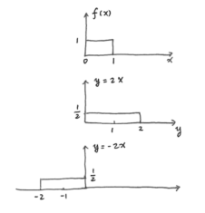

# 第二章补充 微分熵

---
- [第二章补充 微分熵](#第二章补充-微分熵)
    - [微分熵预备知识](#微分熵预备知识)
        - [定义](#定义)
        - [基本结论](#基本结论)
            - [定义](#定义-1)
            - [命题](#命题)
    - [微分熵](#微分熵)
        - [微分熵](#微分熵-1)
        - [联合微分熵，条件微分熵及互信息](#联合微分熵条件微分熵及互信息)

---

## 微分熵预备知识
### 定义

1. **随机变量 \(X\) 的均值 \(\mu\)**：
    - 定义为
        \[\mu = E(X)=\int xf(x)dx\] 其中 \(f(x)\) 为 \(X\) 的概率密度函数。

2. **随机变量 \(X\) 的方差**：
    - 定义为
        \[
        \begin{align*}
        Var(X)&=E(X - EX)^2 \\
        &= E(X - \mu)^2\\
        &=E(X^{2}-2X\mu+\mu^{2})\\
        &=E(X^{2})-\mu^{2}
        \end{align*}
        \]

3. **两个随机变量 \(X\) 和 \(Y\) 之间的协方差**：
    - 定义为
    \[Cov(X,Y)=E(X - EX)(Y - EY)=E(XY)-\mu_X\mu_Y\]

4. **对于随机变量 \(\vec{X}=[X_1,X_2,\cdots,X_n]^T\)（列向量）**：
    - 其**协方差矩阵**定义为
        \[K_{\vec{X}}=E(\vec{X}-E\vec{X})(\vec{X}-E\vec{X})^T = [Cov(X_i,X_j)]\]
    - 其**相关矩阵**定义为
        \[\widetilde{K}_{\vec{X}}=E(\vec{X}\vec{X}^T)=[E(X_iX_j)]\]
    - 若 \(E(\vec{X})=\vec{\mu}=\vec{0}\)，则 \(K_{\vec{X}}=\widetilde{K}_{\vec{X}}\)

5. **高斯分布**
- 令 \(N(\mu,\sigma^{2})\) 表示均值为 \(\mu\)，方差为 \(\sigma^{2}\) 的**高斯（正态）分布**，即它的概率密度函数为
    \[f(x)=\frac{1}{\sqrt{2\pi\sigma^{2}}}e^{-\frac{(x - \mu)^{2}}{2\sigma^{2}}}\]
- 令 \(N(\vec{\mu},K)\) 表示均值为 \(\vec{\mu}\)，协方差矩阵为 \(K\) 的**多元高斯分布**，即对所有的 \(\vec{x}\in R^n\)，其联合概率密度函数为
    \[f(\vec{x})=\frac{1}{(\sqrt{2\pi})^n|K|^{\frac{1}{2}}}e^{-\frac{1}{2}(\vec{x}-\vec{\mu})^TK^{-1}(\vec{x}-\vec{\mu})}\]

    其中 \(|K|\) 表示 \(K\) 的行列式值，\(K\) 是正定对称矩阵。

### 基本结论
- 以下是关于矩阵和随机变量的线性变换的基本结论。所有的量和相关矩阵都假定为实值

#### 定义
- **定义（对称矩阵）**：如果 \(K^T = K\)，则称矩阵 \(K\) 是对称的。
- **定义（正定矩阵）**：
    - 一个 \(n\times n\) 矩阵 \(K\)，如果对所有非零 \(n\) 维列向量 \(\vec{x}\)，\(\vec{x}^TK\vec{x}>0\) 成立，则称矩阵 \(K\) 为正定的；
    - 如果对所有 \(n\) 维列向量 \(\vec{x}\)，\(\vec{x}^TK\vec{x}\geq0\) 成立，则称矩阵 \(K\) 为半正定的。

#### 命题
1. **命题1**：
    - **协方差（相关）矩阵是对称且半正定的。**
    - 如果矩阵 \(K\) 是对称的，则它可以对角化为 \(K = Q\Lambda Q^T\)。
    其中，\(\Lambda\) 是对角矩阵，\(Q\) 和 \(Q^T\) 是正交矩阵，即 \(Q^{-1}=Q^T\)，\(\vert Q\vert=\vert Q^T\vert = 1\)，\(QQ^T = I\)。
    \[KQ=(Q\Lambda Q^T)Q = Q\Lambda(Q^TQ)=Q\Lambda\]
    令 \(\lambda_i\) 表示 \(\Lambda\) 的第 \(i\) 个对角元素，\(\vec{q}_i\) 表示 \(Q\) 的第 \(i\) 列，则：
    \[
    \begin{align*}
    &K[\vec{q}_1,\vec{q}_2,\cdots,\vec{q}_n]=[\vec{q}_1,\vec{q}_2,\cdots,\vec{q}_n]\begin{bmatrix}\lambda_1& & \\ &\ddots& \\ & &\lambda_n\end{bmatrix}\\
    &K\vec{q}_i=\lambda_i\vec{q}_i
    \end{align*}
    \]    即 \(\vec{q}_i\) 是矩阵 \(K\) 对应于特征值 \(\lambda_i\) 的特征向量。

2. **命题2**：
    - **半正定矩阵的特征值是非负的**。
    - **证明**：
        令 \(K\) 表示一个半正定矩阵，\(\vec{u}\) 是矩阵 \(K\) 对应于特征值 \(\lambda\) 的特征向量，即 \[K\vec{u}=\lambda\vec{u}\]

        由于 \(K\) 是半正定的，有 \[\vec{u}^TK\vec{u}=\vec{u}^T\lambda\vec{u}=\lambda\vec{u}^T\vec{u}\geq0\]

        又因为 \(\vec{u}^T\vec{u}>0\)，所以有 \(\lambda\geq0\)。

3. **命题3**：
    - 令 \(\vec{Y} = A\vec{X}\)，其中 \(\vec{X}\) 和 \(\vec{Y}\) 均为由几个随机变量构成的列向量，\(A\) 是 \(m\times n\) 矩阵，则 \[K_{\vec{Y}} = AK_{\vec{X}}A^T\] 且 \[\widetilde{K}_{\vec{Y}} = A\widetilde{K}_{\vec{X}}A^T\]
    - **证明**：
        \[
        \begin{align*}
        K_{\vec{Y}}&=E(\vec{Y}-E\vec{Y})(\vec{Y}-E\vec{Y})^T\\
        &=E[A(\vec{X}-E\vec{X})][A(\vec{X}-E\vec{X})]^T\\
        &=E[A(\vec{X}-E\vec{X})(\vec{X}-E\vec{X})^TA^T]\\
        &=A[E(\vec{X}-E\vec{X})(\vec{X}-E\vec{X})^T]A^T\\
        &=AK_{\vec{X}}A^T
        \end{align*}
        \]

4. **命题4**
    - 设\(\vec{X}\)和\(\vec{Y}\)均为由\(n\)个随机变量构成的列向量，且满足\[\vec{Y} = Q^T\vec{X}\] 其中\(Q\Lambda Q^T\)是\(K_{\vec{X}}\)（\(\vec{X}\)的协方差矩阵）的一个对角化。则有\[K_{\vec{Y}}=\Lambda\] 即\(\vec{Y}\)中的随机变量是不相关的，且\(Var(Y_i)=\lambda_i\)，\(\lambda_i\)是\(\Lambda\)的第\(i\)个对角元素。
    - **证明**：
        \[
        \begin{align*}
        K_{\vec{Y}}&=Q^TK_{\vec{X}}Q\\
        &=Q^T(Q\Lambda Q^T)Q\\
        &=(Q^TQ)\Lambda(Q^TQ)\\
        &=\Lambda
        \end{align*}
        \]

    - **推论**：设\(\vec{X}\)是由\(n\)个随机变量构成的列向量，且\(Q\Lambda Q^T\)是\(K_{\vec{X}}\)的一个对角化，则\[\vec{X}=Q\vec{Y}\] 其中\(\vec{Y}=Q^T\vec{X}\)是由\(n\)个不相关的随机变量构成的列向量。
        - 证明：
            \[\vec{X}=QQ^T\vec{X}=Q(Q^T\vec{X})=Q\vec{Y}\]

5. **命题5**
    - 设\(\vec{X}\)，\(\vec{Y}\)和\(\vec{Z}\)是由\(n\)个随机变量构成的列向量，\(\vec{X}\)和\(\vec{Z}\)相互独立，且\(\vec{Y}=\vec{X}+\vec{Z}\)，则\[K_{\vec{Y}} = K_{\vec{X}} + K_{\vec{Z}}\]

6. **命题6**
    - 设\(\vec{Y}=Q\vec{X}\)，其中\(\vec{X}\)和\(\vec{Y}\)是由\(n\)个随机变量构成的列向量，\(Q\)是一个正交矩阵，则\[E(\sum_{i = 1}^{n}Y_{i}^{2}) = E(\sum_{i = 1}^{n}X_{i}^{2})\] 即随机变量的总能量在正交变换下不变
    - **证明**：
        \[
        \begin{align*}
        \sum_{i = 1}^{n}Y_{i}^{2}&=\vec{Y}^T\vec{Y}\\
        &=(Q\vec{X})^T(Q\vec{X})\\
        &=\vec{X}^TQ^TQ\vec{X}\\
        &=\vec{X}^T\vec{X}\\
        &=\sum_{i = 1}^{n}X_{i}^{2}
        \end{align*}
        \] 上式两边取期望，得证。

## 微分熵
### 微分熵
1.  **定义**
    一个概率密度函数为 \(f(x)\) 的连续随机变量 \(X\) 的微分熵 \(h(X)\) 定义为
    \[h(X)=-\int_{S} f(x)\log f(x)dx=-E\log f(x)\] 

    其中 \(S\) 为 \(X\) 的支撑集，即（\(f(x)>0\)，\(x\in S\)）。

2. **均匀分布**
    设 \(X\sim U(0,a)\), 即\(X\) 服从 \([0,a]\) 上的均匀分布，则
    \[h(X)=-\int_{0}^{a}\frac{1}{a}\log\frac{1}{a}dx = \log a\]

    若 \(a < 1\)，则 \(h(X)<0\)，因此微分熵可以为负。

3. **正态分布/高斯分布**
    设 \(X\sim N(0,\sigma^{2})\)，\(f(x)=\frac{1}{\sqrt{2\pi\sigma^{2}}}e^{-\frac{x^{2}}{2\sigma^{2}}}\) 。
    \[
    \begin{align*}
    h(X)&=-\int f(x)\log f(x)dx\\
    &=-\int f(x)\left(-\log\sqrt{2\pi\sigma^{2}}-\frac{x^{2}}{2\sigma^{2}}\log e\right)dx\\
    &=\frac{1}{2}\log(2\pi\sigma^{2})\int f(x)dx+\frac{\log e}{2\sigma^{2}}\int x^{2}f(x)dx\\
    &=\frac{1}{2}\log(2\pi\sigma^{2})+\frac{1}{2}\log e\\
    &=\frac{1}{2}\log(2\pi e\sigma^{2})
    \end{align*}
    \]

    其中 
    \[
    \begin{align*}
    &\sigma^{2} = Var(X)=E(X - E(X))^{2} 且 E(X) = 0\\
    &\sigma^{2}=E(X^{2})=\int x^{2}f(x)dx
    \end{align*}
    \]

4. **平移性质**
    \[h(X + c)=h(X)\]
    - 
    - **证明**：
        令 \(Y = X + c\)，则 \(f_Y(y)=f_X(y - c)\) ，且 \(S_Y=\{x + c:x\in S_X\}\)
        将 \(x = y - c\) 代入下式：
        \[
        \begin{align*}
        h(X)&=-\int_{S_X}f_X(x)\log f_X(x)dx\\
        &=-\int_{S_Y}f_X(y - c)\log f_X(y - c)dy\\
        &=-\int_{S_Y}f_Y(y)\log f_Y(y)dy\\
        &=h(Y)\\
        &=h(X + c)
        \end{align*}
        \]

5. **缩放性质**
    \[对 a\neq0，有h(aX)=h(X)+\log|a|\]
    - 
    - **证明**：
        令 \(Y = aX\)，则 \(f_Y(y)=\frac{1}{|a|}f_X(\frac{y}{a})\)，且 \(S_Y = \{ax:x\in S_X\}\)。
        将 \(x = \frac{y}{a}\) 代入 \(h(X)\) 的表达式：
        \[
        \begin{align*}
        h(X)&=-\int_{S_X}f_X(x)\log f_X(x)dx\\
        &=-\int_{S_Y}f_X(\frac{y}{a})\log f_X(\frac{y}{a})\frac{dy}{|a|}\\
        &=-\int_{S_Y}|a|f_Y(y)\log (f_Y(y)|a|)\frac{1}{|a|}dy\\
        &=-\int_{S_Y}f_Y(y)(\log f_Y(y)+\log|a|)dy\\
        &=-\int_{S_Y}f_Y(y)\log f_Y(y)dy-\log|a|\int_{S_Y}f_Y(y)dy\\
        &=h(Y)-\log|a|\\
        &=h(aX)-\log|a|
        \end{align*}
        \] 移项可得 \(h(aX)=h(X)+\log|a|\)

### 联合微分熵，条件微分熵及互信息
1. **定义（联合微分熵）**
    联合概率密度函数为 \(f(\vec{x})\) 的随机向量 \(\vec{x}\) 的联合微分熵 \(h(\vec{x})\) 定义为
    \[h(\vec{x})=-\int_{S}f(\vec{x})\log f(\vec{x})d\vec{x}=-E\log f(\vec{x})\]

    如果 \(X_1,X_2,\cdots,X_n\) 相互独立，则有
    \[h(\vec{x})=\sum_{i = 1}^{n}h(X_i)\]

2. **平移**
    令 \(\vec{c}\) 是 \(\mathbb{R}^n\)（\(n\) 维实数空间）中的一个列向量，则
    \[h(\vec{x}+\vec{c}) = h(\vec{x})\]

3. **缩放**
    令 \(A\) 是一个 \(n\times n\) 的非奇异矩阵，则
    \[h(A\vec{x})=h(\vec{x})+\log|\det(A)|\]

4. **多元高斯分布**
    设 \(\vec{X} \sim N(\vec{\mu},K)\) 。
    令 \(N(\vec{\mu},K)\) 表示均值为 \(\vec{\mu}\)，协方差矩阵为 \(K\) 的多元高斯分布，即对于所有 \(\vec{x} \in \mathbb{R}^n\) ，其联合概率密度函数为：
    \[f(\vec{x}) = \frac{1}{(\sqrt{2\pi})^n|K|^{\frac{1}{2}}} e^{-\frac{1}{2}(\vec{x}-\vec{\mu})^T K^{-1}(\vec{x}-\vec{\mu})}\]

    其中 \(K\) 是正定对称矩阵，\(|K|\) 表示 \(K\) 的行列式值，\(\vec{x},\vec{\mu}\) 为列向量。

    其微分熵 \(h(\vec{X})\) 为：
    \[h(\vec{X}) = \frac{1}{2} \log[(2\pi e)^n|K|]\]

    这里 \(|K|\) 为 \(K\) 的行列式值。

    - **证明**：
        设 \(K\) 可以对角化为 \(Q\Lambda Q^T\) ，记 \(\vec{X} = Q\vec{Y}\) ，其中 \(\vec{Y}\) 中的随机变量不相关，且有 \(Var(Y_i)=\lambda_i\) ，为 \(\Lambda\) 中第 \(i\) 个对角元素。由于 \(\vec{X}\) 是高斯的，所以 \(\vec{Y}\) 也是高斯的。又由于 \(\vec{Y}\) 中的随机变量是不相关的，可知它们相互独立。
        \[
        \begin{align*}
        h(\vec{X})&=h(Q\vec{Y})\\
        &=h(\vec{Y})+\log|\det(Q)|\\
        &=h(\vec{Y}) + 0\\
        &=\sum_{i = 1}^{n}h(Y_i)\\
        &=\sum_{i = 1}^{n}\frac{1}{2}\log(2\pi e\lambda_i)\\
        &=\frac{1}{2}\log[(2\pi e)^n\prod_{i = 1}^{n}\lambda_i]\\
        &=\frac{1}{2}\log[(2\pi e)^n|\Lambda|]\\
        &=\frac{1}{2}\log[(2\pi e)^n|K|]
        \end{align*}
        \]

5. **定义（条件微分熵）**
    如果 \(X\)，\(Y\) 的联合密度函数为 \(f(x,y)\)，定义条件微分熵 \(h(X|Y)\) 为：
    \[h(X|Y)=-\int f(x,y)\log f(x|y)dxdy\]

    由于 \(f(x|y)=f(x,y)/f(y)\)，所以有：
    \[h(X|Y)=h(X,Y)-h(Y)\]

6. **定义（相对熵）**
    两个密度函数 \(f\) 和 \(g\) 之间的相对熵 \(D(f||g)\) 定义为：
    \[D(f||g)=\int f\log\frac{f}{g}\]

7. **定义（互信息）**
    联合概率密度函数为 \(f(x,y)\) 的两个随机变量间的互信息 \(I(X;Y)\) 定义为：
    \[I(X;Y)=\int f(x,y)\log\frac{f(x,y)}{f(x)f(y)}dxdy\]

    显然有：\[
    \begin{align*}
    I(X;Y)&=h(X)-h(X|Y)=h(Y)-h(Y|X)\\
    &=h(X)+h(Y)-h(X,Y)
    \end{align*}
    \]

    以及：\[I(X;Y)=D(f(x,y)||f(x)f(y))\]

8. **定理：相对熵的非负性**
    \[D(f||g) \geq 0\]
    - **证明**：
        设 \(f\) 的支撑集是 \(S\) 
        \[
        \begin{align*}
        -D(f||g)&=\int_{S} f \log\frac{g}{f}\\
        &\leq \log\int_{S} f\frac{g}{f} \quad (\text{Jensen 不等式})\\
        &=\log\int_{S} g\\
        &\leq \log 1 = 0
        \end{align*}
        \]
    - **推论**：
        - \(I(X;Y) \geq 0\) ，当且仅当 \(X\) 与 \(Y\) 相互独立等号成立。
        - \(h(X|Y) \leq h(X)\) 。

9. **定理**
    \[h(X_1,X_2,X_3,\cdots,X_n)=\sum_{i = 1}^{n}h(X_i|X_1,X_2,\cdots,X_{i - 1})\]
    - **推论**：
        - \(h(X_1,X_2,\cdots,X_n) \leq \sum_{i = 1}^{n}h(X_i)\)

10. **Hadamard 阿达玛不等式**
    设 \(\vec{X} \sim N(0,K)\) 是一个多元正态分布。
    则有
    \[
    \begin{align*}
    h(X_1,X_2,\cdots,X_n)&=\frac{1}{2}\log((2\pi e)^n|K|)\\
    &\leq \sum_{i = 1}^{n}\frac{1}{2}\log(2\pi e K_{ii})\\
    &=\frac{1}{2}\log((2\pi e K_{11} \times 2\pi e K_{22} \times \cdots \times 2\pi e K_{nn}))
    \end{align*}
    \]

    即 \(|K| \leq \prod_{i = 1}^{n}K_{ii}\)
    - 注意有关行列式的不等式可以由信息论中的不等式推导而得到。