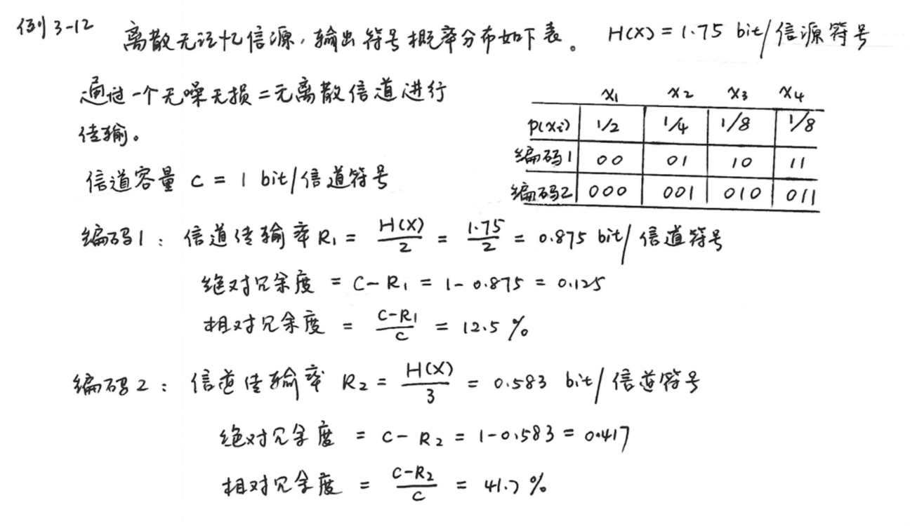
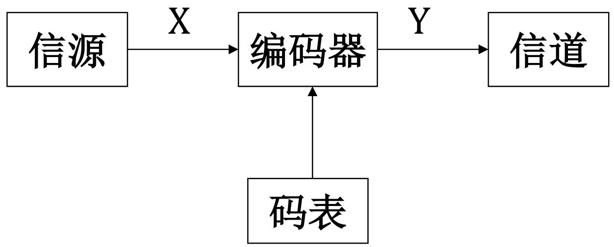
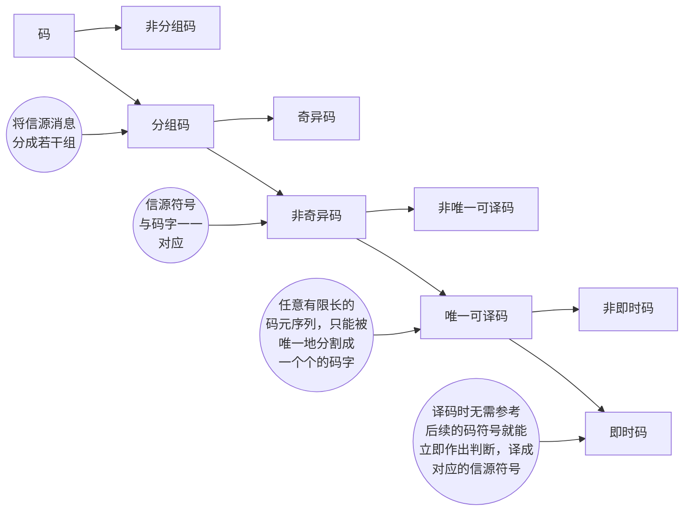
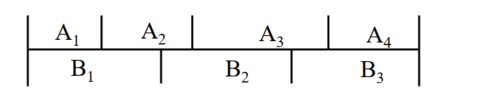
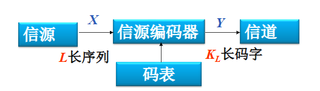
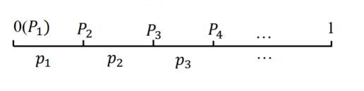

# 第5章 信源编码

---

---

## 信源编码与信道编码
- **信源编码**
    - **无失真信源编码——第一极限定理**：离散信源
    - **限失真信源编码——第三极限定理**：连续信源
    - 在不失真或允许一定失真条件下，如何用尽可能少的符号来传送信源信息，以便提高信息传输率。
- **信道编码**
    - **第二极限定理**：离散和连续信道
    - 在信道受干扰的情况下如何增加信号的抗干扰能力，同时又使得信息传输率最大。

- **信源编码的作用**
    1. **符号变换**：使信源的输出符号与信道的输入符号相匹配；
    2. **信息匹配**：使信息传输率达到信道容量；
    3. **冗余度压缩**：使编码效率等于或接近100%。
    例题

- **信源编码的基础**
    1. **无失真编码定理**：可精确复制信源输出的消息，只适用于离散信源
    2. **限失真编码定理**：对于连续信源，只能在失真受限制的情况下进行限失真编码

## 5.1 编码的概念
### 分组码
- **分组码(Block Codes)**：也叫块码
    - 将信源消息分成若干组，即符号序列 \(x_{i}\) ，
        \[\begin{align*}x_{i}&=(x_{i1}x_{i2} \cdots x_{il} \cdots x_{iL})\\x_{il}&\in A=\{a_{1}, a_{2}, \cdots, a_{i}, \cdots, a_{n}\}\end{align*}\]
    - 每个符号序列 \(x_{i}\) 依照**固定码表**映射成一个码字 \(y_{i}\) ，
        \[\begin{align*}y_{i}&=(y_{i1}y_{i2} \cdots y_{ik} \cdots y_{iK})\\y_{ik}&\in B=\{b_{1}, b_{2}, \cdots, b_{i}, \cdots, b_{m}\}\end{align*}\]
    - 只有分组码才有对应的码表，而非分组码中则不存在码表。
    - **模型**：
- **定长码与变长码**：码可分为两类：
    - **定长码**：码中所有码字的长度都相同，如码1就是定长码(Fixed Length Codes)。
    - **变长码**：码中的码字长短不一，如码2就是变长码(Variable Length Codes)。
    - |符号 \(a_{i}\)|信源符号出现概率 \(p(a_{i})\)|码1|码2|
        | --- | --- | --- | --- |
        | \(a_{1}\) | \(p(a_{1})\) | 00 | 0 |
        | \(a_{2}\) | \(p(a_{2})\) | 01 | 01 |
        | \(a_{3}\) | \(p(a_{3})\) | 10 | 001 |
        | \(a_{4}\) | \(p(a_{4})\) | 11 | 111 |

- **码的属性**：
    - **奇异码与非奇异码**：
        - 若信源符号和码字是一一对应的，则该码为**非奇异码**(Non-Singular Codes)；
        - 反之为**奇异码**(Singular Codes)
    - **唯一可译码(Uniquely Decodable Codes_)**：
        - 任意有限长的码元序列，只能被唯一地分割成一个个的码字，便称为唯一可译码。
        - 奇异码不是唯一可译码
        - 唯一可译码分为非即时码和即时码
            - **非即时码**指接收端收到一个完整的码字后不能立即译码，还需等下一个码字开始接收后才能判断是否可以译码
            - **即时码**只要收到符号就表示该码字已完整，可以立即译码 ，又称为**非延长码**(Undelayed Codes)，任意一个码字都不是其它码字的前缀部分，又称为**异前缀码**(Prefix Codes)。

### 码的分类

### 即时码及其树图构造法
- 即时码(非延长码或异前缀码)是唯一可译码的一类子码，可用树图来构造
- **构造的要点**：
    - 最上端为树根A，从根出发向下伸出树枝，树枝总数等于m(**进制数**)，树枝的尽头为节点。
    - 从每个节点再伸出m个树枝，当某个节点被安排为码字后，就不再伸枝，这节点为**终端节点**。能再伸枝的节点成为**中间节点**。一直继续下去，直至都不能伸枝为止。
    - 每个节点所伸出的树枝标上码符号，从根出发到终端点所走路径对应的码符号序列则为终端节点的码字。
- **用码树图构造码**
    - 在树的生长过程中，节点生出树枝，各树枝旁标出相应的码符，为了清晰起见相同码符的树枝方向相同，终端节点表示信源符号，从树根到终端节点所经过的树枝旁的码符按经过的顺序组成的序列构成码字。
- **用码树图判断即时码**
    - 如果表示信源符号的终端节点不再延伸，或到达任一 信源符号终端节点的路径不经过其它的终端节点，这样构 造的码满足即时码条件。
- **码树与码字对应关系**
    |树结构概念|编码概念|
    | ---- | ---- |
    |树根|码字的起点|
    |树枝数|码的进制数|
    |节点|码字或码字的一部分|
    |终端节点|码字|
    |节数|码长|
    |非满树|变长码（码字为叶节点）|
    |满树|等长码（码字为叶节点）|

### 克劳夫特不等式
- **唯一可译码存在**的充分必要条件是各码字的长度 \(K_{i}\) 应符合**克劳夫特不等式**(Kraft Inequality) 
    \[\sum_{i=1}^{n} m^{-K_{i}} \leq 1\]

    式中，m是编码进制数，n是信源符号数。
    - 必要性表现在如果码是唯一可译码，则必定满足该不等式
    - 充分性表现在如果满足该不等式，则这种码长的唯一可译码一定存在，但并不表示所有满足不等式的一定是唯一可译码。
    - 所以说，该不等式是唯一可译码存在的充要条件，而不是判别一个编码是否唯一可译码的充要条件

- **唯一可译码的判断方法**
    1. **基本判断**：
        1. 观察是否是非奇异码，若是奇异码则一定不是唯一可译码。
        2. 计算是否满足Kraft不等式，若不满足一定不是唯一可译码。
        3. 将码画成一棵树图，观察是否满足即时码的树图的构造，若满足则是唯一可译码。
    2. **尾随后缀法**：
        
        1. 考查 \(C\) 中所有的码字，若 \(W_{i}\) 是 \(W_{j}\) 的前缀，则将相应的后缀作为一个尾随后缀码放入集合 \(F_{0}\) 中
        2. 考查 \(C\) 和 \(F_{i}\) 两个集合, \(W_{i} \in C\) 是 \(W_{j} \in F_{i}\) 的前缀或 \(W_{i} \in F_{i}\) 是 \(W_{j} \in C\) 的前缀，则将相应的后缀作为尾随后缀码放入集合 \(F_{i+1}\) 中;
        3. \(F=\cup _{i} F_{i}\) 即为码 \(C\) 的尾随后缀集合;
        4. 构造尾随后缀集合F，若F中出现了\(C\)中的元素，则算法终止，返回假(\(C\)不是唯一可译码)；否则若F中没有出现新的元素，则返回真。

## 5.2 无失真信源编码定理
### 无失真信源编码
- **模型**：
    - 信源编码器输入的消息序列：
        \[\begin{align*}X=(X_{1}X_{2} \cdots X_{l} \cdots X_{L})\quad X_{l}\in\{a_{1}, \cdots a_{n}\}\end{align*}\]

        输入的消息总共有 \(n^{L}\) 种可能的组合
        输出的码字为：
        \[\begin{align*}Y=(Y_{1}Y_{2} \cdots Y_{k} \cdots Y_{K_{L}})\quad Y_{k}\in\{b_{1}, \cdots b_{m}\}\end{align*}\]

        输出的码字总共有 \(m^{K_{L}}\) 种可能的组合。
    - \(Y_{k}\)有\(m\)种可能取值，所以平均每个符号输出的最大信息量为\(\log m\)（等概分布）。
    - \(K_{L}\)长码字的最大信息量为\(K_{L}\log m\)，用该码字表示\(L\)长的信源序列。
    - 则传送一个信源符号需要的平均信息率为：
        \[\overline{K}=\frac{K_{L}}{L}\log m = \frac{1}{L}\log M \text{ bit/信源符号}\]

        其中，\(M = m^{K_{L}}\)是\(Y\)所能编成的码字的个数。

- **无失真信源编码**
    - **实现无失真的信源编码要求**：
        - 信源符号 \(X_{1}X_{2}\cdots X_{l} \cdots X_{L}\) 与码字 \(Y_{1}Y_{2}\cdots Y_{k}\cdots Y_{K_{L}}\) 是一一对应的；
        - 能够无失真或无差错地从Y恢复X，也就是能正确地进行反变换或译码 ；
        - 传送Y时所需要的信息率最小，信息率最小就是找到一种编码方式使\(\overline{K}  = \frac{K_L}{L} \log m =\frac{1}{L} \log M\)最小

    - **无失真信源编码定理研究内容**：
        - 最小信息率为多少时，才能得到无失真的译码？
        - 若小于这个信息率是否还能无失真地译码？

### 定长编码
#### 定长编码的基本概念
- 码长\(K\)是定值，且是唯一可译码。
- 由\(L\)个符号组成的、每个符号的熵为\(H_{L}(X)\)的无记忆平稳信源符号序列\(X_{1}X_{2}...X_{l}...X_{L}\)（每个符号\(n\)种可能值）
- 输入的消息总共有\(n^{L}\)种可能的组合。
- 可用\(K_{L}=K\)个符号\(Y_{1}\)，\(Y_{2}\)，...，\(Y_{k}\)，...（每个符号有\(m\)种可能值）进行定长编码
- 输出的码字总共有\(m^{K}\)种可能的组合
- **若要对信源进行定长编码且无失真**，必须满足：
\[n^{L} \leq m^{K} 或 \frac{K}{L} \geq \frac{\log n}{\log m}\]
    - 只有当\(K\)长的码符号序列数\(m^{K}\)大于或等于信源的符号数\(n^{L}\)时，才可能存在定长非奇异码。

#### 定长编码定理
- **定理**：对于由 \(L\) 个符号组成的，每个符号的熵为 \(H_L(\vec{X})\) 的无记忆平稳符号序列 \(X_1, X_2, \cdots, X_L\)，可用 \(K_L\) 个符号 \(Y_1, Y_2, \cdots, Y_{K_L}\)（每个符号有 \(m\) 种可能值）进行定长编码。对于任意 \(\varepsilon > 0\)，\(\delta > 0\)，只要
    \[\overline{K} = \frac{K_L}{L}\log m \geq H_L(\vec{X}) + \varepsilon\]

    则当 \(L\) 足够大时，必可使译码差错小于 \(\delta\)；
    反之，当
    \[\overline{K} = \frac{K_L}{L}\log m \leq H_L(\vec{X}) - 2\varepsilon\]

    时，译码差错一定是有限值，当 \(L \to \infty\) 时，译码几乎必定出错。
- **证明**：见[无失真信源编码定理](5.2无失真信源编码定理.md/#定长编码定理)
- **定长编码定理含义**
    - 当编码器容许的输出信息率，也就是当每个信源符号所必须输出的二进制码长是
        \[
        \overline{K}=\frac{K_{L}}{L}\log m=\frac{1}{L}\log M
        \]

        时，只要 \(\overline{K}>H_{L}(X)\) ，这种编码器一定可以做到**几乎无失真**，也就是收端的译码差错概率接近于零，**条件是所取的符号数 \(L\)足够大**。
    - 将定理的条件改写成：
        \[
        K_{L}\log m>L H_{L}(X)=H(X)
        \]
        其中：
        - 左边：\(K_{L}\)长码字所能携带的最大信息。
        - 右边：\(L\)长信源序列携带的信息量。

        则：
        - 码字所能携带的信息量**大于**信源序列输出的信息量，则可以使传输**几乎无失真**，当然**条件是 \(L\)足够大**。
        - 反之，当 \(\overline{K} < H_{L}(X)\) 时，不可能构成无失真的编码，也就是不可能做一种编码器，能使收端译码时差错概率趋于零。
        - \(\overline{K}=H_{L}(X)\) 时，则为临界状态，可能无失真，也可能有失真。

- **信源长度 \(L\)**
    - 对定长编码，若要实现几乎无失真编码，则信源长度必须满足：
        \[L \geq \frac{\sigma^{2}(X)}{\varepsilon^{2} \delta}\]

        其中：
        - \(\sigma^{2}(X)=E\{[I(x_{i}) - H(X)]^{2}\}\)，表示信源序列的自信息方差。
        - \(\delta\)：差错率要求（如\(10^{-6}\)） 。
        - \(\varepsilon = \overline{K}-H_{L}(X)\) 。

- **编码效率\(\eta\)**
    - 编码效率定义为
        \[\eta = \frac{H_{L}(X)}{\overline{K}}\]
        即信源的平均符号熵为\(H_{L}(X)\)，采用平均二进制符号码长为\(\overline{K}\)来编码，所得的效率。

    - 无失真编码效率总是小于\(1\)，且**最佳编码效率**为
        \[\eta = \frac{H_{L}(X)}{H_{L}(X)+\varepsilon},\varepsilon > 0\]
    - 定长编码定理从理论上阐明了编码效率接近\(1\)的理想定长编码器的存在性，它使输出符号的信息率与信源熵之比接近于\(1\)，即只要\(L\)足够大
        \[\frac{H_{L}(X)}{\frac{K_{L}}{L}\log m} \to 1\]
        - 但要在实际中实现，\(L\)必须取无限长的信源符号进行统一编码。这样做实际上是不可能的，因\(L\)非常大，无法实现。
        - 当\(L\)有限时，要做到高编码效率、低错误率，对于定长编码来说是不可能做到的。

### 变长编码
#### 变长编码的基本概念
- 在变长编码中，码长\(K_{i}\)是变化的。
- \(m\)进制平均码长：\(\overline{K^{'}} = \sum_{i} p(a_{i})K_{i}\)
- 根据信源各个符号的统计特性，如概率大的符号用短码，概率小的用较长的码，使得编码后平均码长降低，从而提高编码效率。（统计匹配） 

#### 单个符号变长编码定理
- **定理**：若离散无记忆信源的符号熵为 \(H(X)\) ，每个信源符号用m进制码元进行变长编码，一定存在一种无失真编码方法，其(m进制)码字平均长度 \(\overline{K'}\) 满足下列不等式
    \[\frac{H(X)}{\log m} \leq \overline{K'}<\frac{H(X)}{\log m}+1\]
- **证明**：见[无失真信源编码定理](5.2无失真信源编码定理.md/#单符号变长编码定理)

#### 离散平稳无记忆序列变长编码定理(香农第一定理)
- 由单个符号变长编码定理推广而来：
    \[
    \begin{align*}
    \frac{H(X)}{\log m} \leq &\overline{K^{'}} < \frac{H(X)}{\log m} + 1 \\
    \Rightarrow \frac{LH_{L}(X)}{\log m} \leq &\overline{K_{L}} < \frac{LH_{L}(X)}{\log m} + 1\\
    \Rightarrow H_{L}(X) \leq &\overline{K} < H_{L}(X)+\frac{\log m}{L}
    \end{align*}
    \]
- **定理**：对于离散平稳无记忆信源，必存在一种无失真编码方法，使平均信息率 \(\overline{K}\) 满足不等式
    \[H_{L}(X) \leq \overline{K} < H_{L}(X)+\frac{\log m}{L}\]

    其中\(\overline{K} = \frac{\overline{K_{L}}}{L}\log m\)，当L足够大时，可使 \(\frac{\log m}{L}<\varepsilon\) ，得到
    \[H_{L}(X) \leq \overline{K} < H_{L}(X)+\varepsilon\]

    其中\(\varepsilon\)是任意小的正数。
- **证明**：见[无失真信源编码定理](5.2无失真信源编码定理.md/#离散平稳无记忆序列变长编码定理香农第一定理)

- **变长编码效率**
    变长编码效率的**下界**：
    \[
    \eta=\frac{H_{L}(X)}{\overline{K}} > \frac{H_{L}(X)}{H_{L}(X) + \frac{\log m}{L}}
    \]

    无失真编码效率总是小于1，可以用它来衡量各种编码方法的优劣。
    为了衡量各种编码方法与最佳码的差距，定义**码的剩余度**为：
    \[
    \gamma = 1 - \eta = 1 - \frac{H_{L}(X)}{\frac{\overline{K_{L}}}{L}\log m}= 1 - \frac{H_{L}(X)}{\overline{K}}
    \]

    对某一信源和某一码符号集，若有一个唯一可译码，其平均长度小于所有其他唯一可译码的平均长度，则称该码为**最佳码**或**紧致码**。

### 香农编码
- 香农第一定理指出了平均码长与信源熵之间的关系，同时也指出了可以通过编码使平均码长达到极限值，这是一个很重要的极限定理。
- 香农第一定理指出，选择每个码字的长度\(K_{i}\)满足下式：
    \[K_{i} =\left\lceil \log\frac{1}{p(x_{i})}\right\rceil（取整）\]或：\[I(x_{i})\leq K_{i} < I(x_{i}) + 1\]

    这种编码方法称为香农编码

- **编码步骤**
    1. 将信源消息符号按其出现的概率大小依次排列：\[p_{1}\geq p_{2}\geq\cdots\geq p_{n}\]
    2. 依照下列不等式确定整数的码长\(K_{i}\)：\[-\log_{2}(p_{i})\leq K_{i} < -\log_{2}(p_{i}) + 1\]
    3. 为了编成唯一可译码，计算第\(i\)个消息的累加概率：\[P_{i}=\sum_{k = 1}^{i - 1}p(a_{k})\]
    4. 将累加概率\(P_{i}\)变换成二进制数 。
    5. 取\(P_{i}\)二进制数的小数点后\(K_{i}\)位即为该消息符号的二进制码字 。

- **香农编码图示**
    - 累加概率\(P_{i}\)把区间\([0, 1)\)分割成许多小区间，每个小区间的长度等于各符号的概率\(p_{i}\)，小区间内的任一点可用来代表该符号 ：\(P_{i}=\sum_{k = 1}^{i - 1}p(a_{k})\) 
    - 

## 5.3 限失真信源编码定理
### 无失真与有失真信源编码
- 无失真信源编码是**保熵的**：通过信道的信息传输率\(R\)等于信源熵\(H(X)\)。
- 有失真信源编码属**熵压缩编码**，即编码后的信息率得到压缩。
- 采用有失真的熵压缩编码的原因：
    - 保熵编码并非总是必需的；
    - 保熵编码并非总是可能的；
    - 降低信息率有利于传输和处理。

### 限失真信源编码定理
- 信息率失真函数给出了失真小于\(D\)时所必须具有的最小信息率\(R(D)\)；只要信息率大于\(R(D)\)，一定可以找到一种编码，使译码后的失真小于\(D\)。
- **限失真信源编码定理**：设**离散无记忆信源**\(X\)的信息率失真函数为\(R(D)\)，则当信息率\(R>R(D)\)，只要信源序列长度\(L\)足够长，一定存在一种编码方法，其译码失真小于或等于\(D + \varepsilon\)，\(\varepsilon\)为任意小的正数。反之，若\(R < R(D)\)，则无论采用什么样的编码方法，其译码失真必大于\(D\)。

- 二元信源编码：
    - 对于任意小的\(\varepsilon\)，每一个信源符号的平均码长满足如下公式：
        \[R(D) \leq \overline{K} < R(D) + \varepsilon\]

        在失真限度内使信息率任意接近\(R(D)\)的编码方法是存在的。然而，如果使信息率小于\(R(D)\)，平均失真一定会超过失真限度\(D\)。
- 对于**连续**平稳无记忆信源，无法进行无失真编码，在**限失真**情况下，有与上述定理一样的编码定理。

- 限失真信源编码定理只能说明**最佳编码是存在的**，而具体构造编码方法却一无所知。因而就不能象无失真编码那样从证明过程中引出概率匹配的编码方法。一般只能从优化的思路去求最佳编码。实际上迄今尚无合适的可实现的编码方法可接近\(R(D)\)这个界。

## 5.4 常用信源编码方法简介