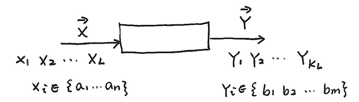

## 无失真信源编码

### 渐进均分性定理（AEP）
- **定理**：\(\vec{X}=(X_1 X_2 \cdots X_L)\)，为独立同分布（i.i.d）随机变量序列，具有渐近均分性质（AEP，Asymptotic equipartition property）：
    \[\forall \varepsilon > 0，当 L \to \infty时，p(X_1,X_2,\cdots,X_L) \to 2^{-L H(X)}\]

- **信源编码模型**：
    - 
    - \(X_i \in \{a_1,\cdots,a_n\}\)
    - \(Y_i \in \{b_1,b_2,\cdots,b_m\}\)

- **证明1**：
    - **互信息**：
        \[
        \begin{align*}
        I(\vec{X}) &= -\log p(X_1,X_2,\cdots,X_L)\\
        &=-\log p(X_1)-\log p(X_2)-\cdots-\log p(X_L)\\
        &=\sum_{i = 1}^{L} I(X_i)
        \end{align*}
        \]
    - **均值**：
        \[
        E\{I(\vec{X})\}=E\left\{\sum_{i = 1}^{L} I(X_i)\right\}=\sum_{i = 1}^{L} E\{I(X_i)\}=\sum_{i = 1}^{L} H(X_i)=L H(X)
        \]
    - **方差**：
        \[
        D\{I(\vec{X})\}=\sum_{i = 1}^{L} D\{I(X_i)\}=L D(I(X))
        \] 其中
        \[
        D(I(X)) = E\left[(I(X)-H(X))^2\right]=\sum_{i = 1}^{n} p(x_i)(-\log p(x_i)-H(X))^2
        \]
    - 根据切比雪夫不等式
        \[
            P_r\{|X - \mu| \geq \varepsilon\} \leq \frac{\sigma^2}{\varepsilon^2}\quad (\varepsilon>0, \sigma>0)
        \] 有：
        \[
        P_r\left\{\left|I(\vec{X})-L H(X)\right| \geq L\varepsilon\right\} \leq \frac{L D(I(X))}{(L\varepsilon)^2}
        \] \[
        P_r\left\{\left|\frac{I(\vec{X})}{L}-H(X)\right| \geq \varepsilon\right\} \leq \frac{D(I(X))}{L\varepsilon^2}
        \] 当 \(L \to \infty\) 时
        \[
        \begin{align*}
        &\frac{D(I(X))}{L\varepsilon^2} \to 0,\\
        &\frac{-\log p(X_1,X_2,\cdots,X_L)}{L} \to H(X),\\
        &p(X_1,X_2,\cdots,X_L) \to 2^{-L H(X)}
        \end{align*}
        \]

- **证明2**：
    - AEP 也可由弱大数定律直接得到
    - 当 \(X\) 为 i.i.d，\(n\) 很大时，\(\frac{1}{n}\sum_{i = 1}^{n} x_i \to E(X)\)
        \[
        \begin{align*}
        -\frac{1}{L}\log p(X_1,X_2,\cdots,X_L)= &-\frac{1}{L}\sum_{i = 1}^{L} \log p(X_i)\\
        \overset{a.s.}{\to} &-E(\log p(X))\\
        = &H(X)
        \end{align*}
        \]

- **典型集\(A_{\varepsilon}\)**
    - **定义**
        \[
        \begin{align*}
        &A_{\varepsilon}=\left\{\vec{x}:\left|\frac{I(\vec{x})}{L}-H(X)\right| \leq \varepsilon\right\}\\
        &A_{\varepsilon}^c=\left\{\vec{x}:\left|\frac{I(\vec{x})}{L}-H(X)\right| > \varepsilon\right\}\\
        &A_{\varepsilon}+A_{\varepsilon}^c = X^L=\{\vec{x}_i\}\quad i = 1,2,\cdots,n^L
        \end{align*}
        \]

    - **性质**
        1. 若 \(\vec{x} \in A_{\varepsilon}\)，则典型集中的元素几乎是等概率出现的:
            \[2^{-L(H(X)+\varepsilon)} \leq p(\vec{x}) \leq 2^{-L(H(X)-\varepsilon)}\]
        2. 当 \(L\) 充分大时，典型集的概率近似为1
            \[P_r\{A_{\varepsilon}\}=\sum_{\vec{x} \in A_{\varepsilon}} p(\vec{x})>1 - \varepsilon\]
        3. 典型集中元素的个数\(|A_{\varepsilon}| \leq 2^{L(H(X)+\varepsilon)}\)
            \[
            \begin{align*}
            &1=\sum_{\vec{x} \in X^L} p(\vec{x}) \geq \sum_{\vec{x} \in A_{\varepsilon}} p(\vec{x}) \geq \sum_{\vec{x} \in A_{\varepsilon}} 2^{-L(H(X)+\varepsilon)}=|A_{\varepsilon}|2^{-L(H(X)+\varepsilon)}\\
            \Rightarrow &|A_{\varepsilon}| \leq 2^{L(H(X)+\varepsilon)}
            \end{align*}
            \]
        4. 典型集中元素的个数\(|A_{\varepsilon}| \geq (1 - \varepsilon)2^{L(H(X)-\varepsilon)}\)
            当 \(L\) 充分大时，\(P_r\{A_{\varepsilon}\}>1 - \varepsilon\)
            \[
            \begin{align*}
            &1-\varepsilon \leq P_r\{A_{\varepsilon}\} = \sum_{\vec{x} \in A_{\varepsilon}} p(\vec{x}) \leq \sum_{\vec{x} \in A_{\varepsilon}} 2^{-L(H(X)-\varepsilon)}=|A_{\varepsilon}|2^{-L(H(X)-\varepsilon)}\\
            \Rightarrow &|A_{\varepsilon}| \geq (1 - \varepsilon)2^{L(H(X)-\varepsilon)}
            \end{align*}
            \]

### 定长编码定理
- **定理**：对于由 \(L\) 个符号组成的，每个符号的熵为 \(H_L(\vec{X})\) 的无记忆平稳符号序列 \(x_1, x_2, \cdots, x_L\)，可用 \(K_L\) 个符号 \(Y_1, Y_2, \cdots, Y_{K_L}\)（每个符号有 \(m\) 种可能值）进行定长编码。对于任意 \(\varepsilon > 0\)，\(\delta > 0\)，只要
    \[\frac{K_L}{L}\log m \geq H_L(\vec{X}) + \varepsilon\]

    则当 \(L\) 足够大时，必可使译码差错小于 \(\delta\)；
    反之，当
    \[\frac{K_L}{L}\log m \leq H_L(\vec{X}) - 2\varepsilon\]

    时，译码差错一定是有限值，当 \(L \to \infty\) 时，译码几乎必定出错。

- **证明**
    - 对 \(A_{\varepsilon}\) 中的元素进行定长编码，为了唯一可译，码符号个数大于等于 \(|A_{\varepsilon}|\)，即
        \[m^{K_L} \geq |A_{\varepsilon}|\]

        此时\(|A_{\varepsilon}|\) 取上界，记平均符号熵\(H_L(\vec{X})\) 为 \(H(X)\)
        \[
        \begin{align*}
        m^{K_L} &\geq 2^{L(H(X) + \varepsilon)}\\
        K_L\log m &\geq L(H(X) + \varepsilon)\\
        \frac{K_L}{L}\log m &\geq H(X) + \varepsilon
        \end{align*}
        \]

        此时，错误译码的概率为 \[P_e = P_r\{A_{\varepsilon}^c\} \leq \frac{D(I(X))}{L\varepsilon^2}\]

        若需 \(P_e \leq \delta\)
        \[
        \begin{align*}
        &\frac{D(I(X))}{L\varepsilon^2} \leq \delta\\
        &L \geq \frac{D(I(X))}{\varepsilon^2\delta}
        \end{align*}
        \]

    - 反之，若 
        \[
        \begin{align*}
        &\frac{K_L}{L}\log m \leq H(X) - 2\varepsilon\\
        &\log m^{K_L} \leq L(H(X) - 2\varepsilon)\\
        &m^{K_L} \leq 2^{L(H(X) - 2\varepsilon)} < (1 - \varepsilon)2^{L(H(X) - \varepsilon)} = |A_{\varepsilon}|_{min}
        \end{align*}
        \]

        即 \(m^{K_L} < |A_{\varepsilon}|\)，码字个数少于\(A_{\varepsilon}\) 中的元素个数

    - 在 \(A_{\varepsilon}\) 中选取 \(m^{K_L}\) 个元素进行一对一编码，
        \[
        \begin{align*}
        P_r(A_{\varepsilon}中m^{K_L}个元素) &\leq m^{K_L} \cdot \max_{\vec{x} \in A_{\varepsilon}} p(\vec{x}) = m^{K_L}2^{-L(H(X) - \varepsilon)}\\
        &\leq 2^{L(H(X) - 2\varepsilon) - L(H(X) - \varepsilon)}\\
        &= 2^{-L\varepsilon}
        \end{align*}
        \]

        译码错误概率为 \(P_e = 1 - 2^{-L\varepsilon}\) ，\(L \to \infty\)，\(P_e \to 1\)

### 单符号变长编码定理
- **定理**：对于离散无记忆信源的符号 \(X\)，其熵为 \(H(X)\)，每个信源符号用 \(m\) 进制码元进行变长编码，一定存在一种无失真编码方法，其（\(m\) 进制）码元平均长度 \(\overline{k}\) 满足下列不等式：
    \[\frac{H(X)}{\log m} \leq \overline{k} < \frac{H(X)}{\log m} + 1\]

- **证明**：
    0. **定义**：\(l_i\) 为符号 \(a_i\) 的码长，\(p(a_i)\) 为符号 \(a_i\) 的概率，\(\overline{k} = \sum_{i = 1}^{n} p(a_i)l_i\) 为码元平均长度。
    1. **证明必存在无失真编码，使得 \(H(X) - (\log m)\overline{k} \leq 0\)**
        \[
        \begin{align*}
        H(X) - (\log m)\overline{k} &= -\sum_{i = 1}^{n} p(a_i)\log p(a_i) - \sum_{i = 1}^{n} p(a_i)l_i\log m\\
        &=\sum_{i = 1}^{n} p(a_i)\log \frac{m^{-l_i}}{p(a_i)}
        \end{align*}
        \]

        根据Jensen不等式 \(E[f(x)] \leq f(E(x))\)，有
        \[
        \begin{align*}
        H(X) - (\log m)\overline{k} \leq \log \sum_{i = 1}^{n} p(a_i)\frac{m^{-l_i}}{p(a_i)} = \log \sum_{i = 1}^{n} m^{-l_i}
        \end{align*}
        \]
        唯一可译码存在（无失真），因此 \(\sum_{i = 1}^{n} m^{-l_i} \leq 1\)
        \[
        \begin{align*}
        &H(X) - (\log m)\overline{k} \leq \log 1 = 0\\
        &\Rightarrow \overline{k} \geq \frac{H(X)}{\log m}
        \end{align*}
        \]

        若要等号成立
        \[
        m^{-l_i} = p(a_i),\quad l_i = \frac{-\log p(a_i)}{\log m}
        \]
    2. **证明 \(\overline{k} < \frac{H(X)}{\log m} + 1\)**
        符号 \(a_i\) 的码长 \(l_i\) 需要是整数，因此取
        \[\frac{-\log p(a_i)}{\log m} \leq l_i < \frac{-\log p(a_i)}{\log m} + 1\]

        由
        \[
        \begin{align*}
        &\frac{-\log p(a_i)}{\log m} \leq l_i\\
        &\Rightarrow -\log p(a_i) \leq \log m^{l_i}\\
        &\Rightarrow p(a_i) \geq m^{-l_i}\\
        &\Rightarrow \sum_{i = 1}^{n} m^{-l_i} \leq \sum_{i = 1}^{n} p(a_i)=1
        \end{align*}
        \]

        表明 \(l_i\) 满足唯一可译码存在的条件。
        由
        \[
        \begin{align*}
        l_i &< \frac{-\log p(a_i)}{\log m} + 1\\
        \sum_{i = 1}^{n} l_i p(a_i) &< \sum_{i = 1}^{n} p(a_i)(\frac{-\log p(a_i)}{\log m} + 1)\\
        \overline{k} &< \frac{H(X)}{\log m} + 1
        \end{align*}
        \]

### 离散平稳无记忆序列变长编码定理（香农第一定理）
- **定理**：对于平均符号熵为 \(H_L(\vec{X})\) 的离散平稳无记忆信源，必存在一种无失真编码方法，使平均信息率 \(\overline{K}\) 满足不等式：
    \[H_L(\vec{X}) \leq \overline{K} < H_L(\vec{X}) + \varepsilon\]
    其中 \(\varepsilon\) 为任意小正数。

- **证明**
    将 \(\vec{X}=(X_1 X_2 \cdots X_L)\) 作为一个整体，构成一个新的单符号信源。因此有：
    \[
    \begin{align*}
    \frac{L H_L(\vec{X})}{\log m} &\leq \overline{k}_L < \frac{L H_L(\vec{X})}{\log m} + 1\\
    H_L(\vec{X}) &\leq \frac{\overline{k}_L}{L} \log m < H_L(\vec{X}) + \frac{\log m}{L}
    \end{align*}
    \]

    令 \(\overline{K}= \frac{\overline{k}_L}{L} \log m\)，则有
    \[H_L(\vec{X}) \leq \overline{K} < H_L(\vec{X}) + \varepsilon \quad L \to \infty\] 