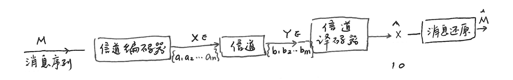
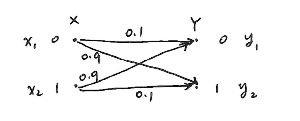
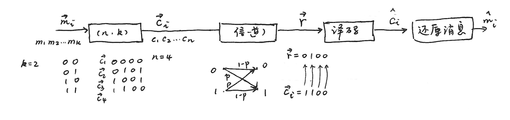
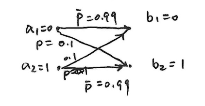
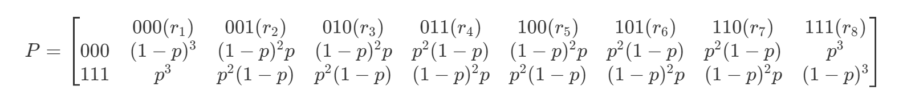

# 第六章 信道编码

---
- [第六章 信道编码](#第六章-信道编码)
    - [译码规则和译码错误概率](#译码规则和译码错误概率)
    - [译码规则](#译码规则)
        - [错误概率](#错误概率)
        - [最佳译码规则](#最佳译码规则)
        - [平均译码错误概率](#平均译码错误概率)
        - [译码错误与信道条件的关系](#译码错误与信道条件的关系)
    - [信道编码定理](#信道编码定理)
        - [最小汉明距离译码](#最小汉明距离译码)
        - [错误概率与编码方法](#错误概率与编码方法)
        - [有噪信道编码定理（香农第二定理）](#有噪信道编码定理香农第二定理)
            - [信道编码正定理](#信道编码正定理)
            - [信道编码逆定理](#信道编码逆定理)

---

## 译码规则和译码错误概率
- 已知信道转移错误概率 \(p = 0.9\)，转移情况如下：
    - 若规定：
        - \(Y = 0 \to \hat{X} = 0\)
        - \(Y = 1 \to \hat{X} = 1\)
        - 即 \(F(y_1) = x_1\)，\(F(y_2) = x_2\)，则译码错误概率 \(P_e = 0.9\)。
    - 反之若：
        - \(Y = 0 \to \hat{X} = 1\)
        - \(Y = 1 \to \hat{X} = 0\)
        - 即 \(F(y_1) = x_2\)，\(F(y_2) = x_1\)，则译码错误概率 \(P_e = 0.1\)。

## 译码规则
- **定义译码规则**：\[F(y_j) = x_i\quad i = 1, 2, \cdots, n；j = 1, 2, \cdots, m\]
- 示例：
    - 设转移概率矩阵 \(P=\begin{bmatrix}0.5&0.3&0.2\\0.2&0.3&0.5\\0.3&0.3&0.4\end{bmatrix}\)，共有\(n^m\)种译码规则，如：
        - 译码规则 \(A\)：\(F(y_1) = x_1\)；\(F(y_2) = x_2\)；\(F(y_3) = x_3\)。
        - 译码规则 \(B\)：\(F(y_1) = x_1\)；\(F(y_2) = x_3\)；\(F(y_3) = x_2\)。
        - \(\cdots\)

### 错误概率
- 若 \(F(y_j) = x_i\)，则：
    - **正确概率**：\[p(F(y_j)|y_j)=p(x_i|y_j)\]
    - **错误概率**：\[p(e|y_j)=1 - p(x_i|y_j)\]
    - **平均错误概率**：\[P_e = E[p(e|y_j)]=\sum_{j = 1}^{m}p(y_j)p(e|y_j)\]

### 最佳译码规则
- 最佳译码就是使平均错误概率最小
    \[P_e=\sum_{j = 1}^{m}p(y_j)p(e|y_j)=1 - p(F(y_j)|y_j)\]

    只需使 \(p(e|y_j)\) 最小（\(j = 1, 2, \cdots, m\)），而 \(p(e|y_j)=1 - p(x_i|y_j)\)。

    因此，最佳译码规则 \(F(y_j)=x^*\)，满足
    \[p(x^*|y_j) \geq p(x_i|y_j)\quad 对所有i = 1, 2, \cdots, n\]

    也常写成**最大后验概率译码**：
    \[x^*=\arg\max_{1\leq i\leq n}p(x_i|y_j)\]

    根据贝叶斯公式\(p(x_i|y_j)=\frac{p(y_j|x_i)p(x_i)}{p(y_j)}\)：
    \[\max_{x_i} p(x_i|y_j) = \max_{x_i} \frac{p(y_j|x_i)p(x_i)}{p(y_j)}\]

    则**最大似然译码规则**为：
    \[x^*=\arg\max_{1\leq i\leq n}p(y_j|x_i)p(x_i)\]

    当\(p(x_i)=\frac{1}{n}\)时，即**信源符号等概率分布时**：
    \[x^*=\arg\max_{1\leq i\leq n}p(y_j|x_i)，j = 1, 2, \cdots, m\]

- 示例：
    - 已知转移概率矩阵\(P =
        \begin{bmatrix}
        \frac{1}{2}&\frac{1}{3}&\frac{1}{6}\\
        \frac{1}{6}&\frac{1}{2}&\frac{1}{3}\\
        \frac{1}{3}&\frac{1}{6}&\frac{1}{2}
        \end{bmatrix}\)，且\(p(x_1)=p(x_2)=p(x_3)=\frac{1}{3}\)，则：
        - \(F(y_1)=\arg\max(p(y_1|x_1),p(y_1|x_2),p(y_1|x_3)) = x_1\)
        - \(F(y_2)=\arg\max(\frac{1}{3},\frac{1}{2},\frac{1}{6}) = x_2\)
        - \(F(y_3)= x_3\)

### 平均译码错误概率
- 平均译码错误概率\(P_e\)：
\[
\begin{align*}
P_e&=\sum_{j = 1}^{m}p(y_j)p(e|y_j)\\
&=\sum_{j = 1}^{m}(1 - p(F(y_j)|y_j))p(y_j)\\
&=\sum_{j = 1}^{m}p(y_j)-\sum_{j = 1}^{m}p(F(y_j),y_j)\\
&=1-\sum_{j = 1}^{m}p(x_j^*,y_j)\\
&=\sum_{x,y}p(x,y)-\sum_{j = 1}^{m}p(x_j^*,y_j)\\
&=\sum_{Y, X-X^*}p(x,y)
\end{align*}
\]

- 示例
    - 已知转移概率矩阵\(P = 
        \begin{bmatrix}
        \frac{1}{2}&\frac{1}{3}&\frac{1}{6}\\
        \frac{1}{6}&\frac{1}{2}&\frac{1}{3}\\
        \frac{1}{3}&\frac{1}{6}&\frac{1}{2}
        \end{bmatrix}\)，且\(p(x_1)=p(x_2)=p(x_3)=\frac{1}{3}\)
        - **译码规则A**：\(\begin{cases}F(y_1)=x_1\\F(y_2)=x_2\\F(y_3)=x_3\end{cases}\) 
        此时\(P_e=\frac{1}{3}(\frac{1}{3}+\frac{1}{6}+\frac{1}{3}+\frac{1}{6}+\frac{1}{3}+\frac{1}{6})=\frac{1}{2}\)
        - **译码规则B**：\(\begin{cases}F(y_1)=x_1\\F(y_2)=x_3\\F(y_3)=x_2\end{cases}\) 
        此时\(P_e=\frac{1}{3}(\frac{1}{6}+\frac{1}{3}+\frac{1}{3}+\frac{1}{2}+\frac{1}{6}+\frac{1}{2})=\frac{2}{3}\)
        - **最佳译码规则的错误概率最小**

### 译码错误与信道条件的关系
- 译码时发生的错误是由信道中噪声引起的，错误概率 \(P_e\) 与信道疑义度 \(H(X|Y)\) 满足以下关系（**费诺不等式**）：
    \[H(X|Y) \leq H(P_e) + P_e \log (n - 1)\]

- **证明**：
    \[
    \begin{align*}
    右式=&H(P_e, 1 - P_e) + P_e \log (n - 1)\\
    =&P_e \log \frac{1}{P_e} + (1 - P_e) \log \frac{1}{1 - P_e} + P_e \log (n - 1)\\
    =&\sum_{Y, X - X^*} p(x, y) \log \frac{n - 1}{P_e} + \sum_{Y} p(x^*, y) \log \frac{1}{1 - P_e}
    \end{align*}
    \]

    \[
    \begin{align*}
    左式=&H(X|Y)\\
    =&\sum_{x, y} p(x, y) \log \frac{1}{p(x|y)}\\
    =&\sum_{Y, X - X^*} p(x, y) \log \frac{1}{p(x|y)} + \sum_{Y} p(x^*, y) \log \frac{1}{p(x^*|y)}
    \end{align*}
    \]

    因此：
    \[
    \begin{align*}
    &H(X|Y) - H(P_e) - P_e \log (n - 1)\\
    =&\sum_{Y, X - X^*} p(x, y) \log \frac{P_e}{(n - 1) p(x|y)} + \sum_{Y} p(x^*, y) \log \frac{1 - P_e}{p(x^*|y)}\\
    \leq&\sum_{Y, X - X^*} p(x, y) \left[\frac{P_e}{(n - 1) p(x|y)} - 1\right] + \sum_{Y} p(x^*, y) \left[\frac{1 - P_e}{p(x^*|y)} - 1\right]\\
    &(利用\log x \leq x - 1放缩)\\
    =&\frac{P_e}{n - 1} \underbrace{\sum_{Y, X - X^*} p(y)}_{= n - 1} - \underbrace{\sum_{Y, X - X^*} p(x, y)}_{= P_e} + (1 - P_e) \sum_{Y} p(y) - (1 - P_e)\\
    =&P_e - P_e + (1 - P_e) - (1 - P_e)\\
    =&0
    \end{align*}
    \]

    由此可得：
    \[H(X|Y) \leq H(P_e) + P_e \log (n - 1)\]

    \[P_e \geq \frac{H(X|Y) - 1}{\log (n - 1)}\]

## 信道编码定理

### 最小汉明距离译码
- \[\hat{C}_i=\arg\max_{1\leq i\leq M}p(\vec{r}|\vec{C}_i)p(\vec{C}_i),\quad M = q^k\]
- 在二进制对称信道（BSC）中：
    - \(p(\vec{r}|\vec{C}_i)=\prod_{j = 1}^{n}p(r_j|c_{ij})\) ，且 \(p(r_j|c_{ij}) =
        \begin{cases}
        p, & c_{ij} \neq r_j \\
        1 - p, & c_{ij} = r_j
        \end{cases}\)
    - 进一步推导可得\[p(\vec{r}|\vec{C}_i)=\prod_{j = 1}^{n}p(r_j|c_{ij})=p^d(1 - p)^{n - d}=(\frac{p}{1 - p})^d(1 - p)^n\] 
    - 其中 \[d = dis(\vec{r},\vec{C}_i)=w(\vec{r}\oplus\vec{C}_i)=\sum_{j = 1}^{n}r_j\oplus c_{ij}\]  即 \(\vec{r}\) 与 \(\vec{C}_i\) 的汉明距离。
    - 由于 \(\frac{p}{1 - p} \ll 1\) ，\((1 - p)^n\) 是常数，所以 \(d\) 越大，\(p(\vec{r}|\vec{C}_i)\) 越小。求 \(\max p(\vec{r}|\vec{C}_i)\) 的问题就转化成求最小汉明距离问题。

### 错误概率与编码方法
- 转移概率如图：
- 采用简单重复编码，\(k = 1\) ，\(n = 3\) ，例如 \(0\rightarrow000\)（\(\vec{C}_1\)） ，\(1\rightarrow111\)（\(\vec{C}_2\)） 。
- 已知信道转移概率 \(p = 0.01\) ，\(\overline{p}=0.99\) ，转移概率矩阵：
    <!-- \[P =\begin{bmatrix}
        & 000(r_1)  & 001(r_2)  & 010(r_3)  & 011(r_4)  & 100(r_5)  & 101(r_6)  & 110(r_7)  & 111(r_8)\\
    000 & (1-p)^3   & (1-p)^2p  & (1-p)^2p  & p^2(1-p)  & (1-p)^2p  & p^2(1-p)  & p^2(1-p)  & p^3\\
    111 & p^3       & p^2(1-p)  & p^2(1-p)  & (1-p)^2p  & p^2(1-p)  & (1-p)^2p  & (1-p)^2p  & (1-p)^3
    \end{bmatrix}\] -->
- 译码规则为 \(F(\vec{r}_1)=\vec{C}_1\) ，\(F(\vec{r}_2)=\vec{C}_2\) ，\(F(\vec{r}_3)=\vec{C}_1\) ，\(F(\vec{r}_4)=\vec{C}_2\) ，\(F(\vec{r}_5)=\vec{C}_1\) ，\(F(\vec{r}_6)=\vec{C}_2\) ，\(F(\vec{r}_7)=\vec{C}_1\) ，\(F(\vec{r}_8)=\vec{C}_2\) 。
- 错误概率 \(P_e=\frac{1}{2}[p^3 + p^2(1 - p)+(1 - p)p^2 + p^2(1 - p)+p(1 - p)^2 + p^2(1 - p)+p(1 - p)^2 + p^3]\approx3\times10^{-4}\)
- 增大 \(n\) ，会继续降低平均错误概率 \(P_e\) ：
    - \(n = 5\) ，\(P_e\approx10^{-5}\) ；
    - \(n = 6\) ，\(P_e\approx4\times10^{-7}\) ；
    - \(n = 9\) ，\(P_e\approx10^{-8}\) ；
    - \(n = 11\) ，\(P_e\approx5\times10^{-10}\) 。
- 信息传输率 \(R=\frac{H(X)}{n}=\frac{\log M}{n}\text{ bit/符号}\) 。随着 \(n\) 增大，信息传输率减小。思考是否能找到一种编码方法，使 \(P_e\) 充分小，且 \(R\) 维持在一定水平？

### 有噪信道编码定理（香农第二定理）
#### 信道编码正定理
- **定理**：设有一离散无记忆平稳信道，其信道容量为 \(C\) ，只要待传送的信息率 \(R < C\) ，则存在一种编码，当输入长度 \(n\) 足够大时，译码错误概率任意小。
- **证明**：
    - 消息序列长度为 \(k\) ，个数为 \(M = 2^k\) ，码长为 \(n\) 。当 \(n\to\infty\) 时，记信息传输率 \(R=\frac{\log M}{n}=\frac{\log 2^k}{n}=\frac{k}{n}=C - \varepsilon\) （\(\varepsilon>0\)），可使 \(P_e\to0\) 。
        - 假设 \(R = \frac{k}{n}=C - \varepsilon\) ，则 \(k = n(C - \varepsilon)\) ，\(M = 2^{n(C - \varepsilon)}\) 为信息序列数量。
    - **编码**：从 \(2^n\) 个矢量集中找出 \(2^{n(C - \varepsilon)}\) 个码字组成一组码。
    - **BSC信道**：错误概率 \(p<\frac{1}{2}\) ，信道容量 \(C = 1 - H(p)\) 。
    - 设发送码字 \(\vec{C}_0\) ，接收到 \(\vec{r}\) ，\(\vec{C}_0\) 与 \(\vec{r}\) 之间的平均汉明距离为 \(np\) 。
    - **译码方法**：以 \(\vec{r}\) 为球心，以 \(np\) 为半径的球体内寻找码字 \(\vec{C}_0\) 。为保证译码可靠，将球体稍微扩大，令半径为 \(n(p+\varepsilon)=np_{\varepsilon}\) ，\(\varepsilon>0\) 任意小，用 \(S(np_{\varepsilon})\) 表示这个球体。如果球体内只有一个唯一的码字，则判定这个码字为发送的码字 \(\vec{C}_0\) 。
    - **译码错误概率 \(P_e\) 表达式**：
        \[
        \begin{align*}
        P_e &= P\{\vec{C}_i\notin S(np_{\varepsilon})\}+P\{\vec{C}_i\in S(np_{\varepsilon})\}\cdot P\{\text{找到一个其他码字}\in S(np_{\varepsilon})\}\\
        &\leq P\{\vec{C}_i\notin S(np_{\varepsilon})\}+P\{\text{找到一个其他码字}\in S(np_{\varepsilon})\}
        \end{align*}
        \]
    - 根据大数定理，\(\vec{C}_i\) 与 \(\vec{r}\) 之间的汉明距离（即 \(\vec{C}_i\) 在信道传输中错误比特数）超过平均值 \(n(p + \varepsilon)\) 的概率很小。因此当 \(n\) 足够大时：
        \[P\{\vec{C}_i\notin S(np_{\varepsilon})\} < \delta\]

        \[
        \begin{align*}
        P\{\text{至少有一个其他码字} \in S(np_{\varepsilon})\} &\leq \sum_{\vec{C}_x \neq \vec{C}_i} P\{\vec{C}_x \in S(np_{\varepsilon})\} \\
        &\leq (M - 1)P\{\vec{C}_x \in S(np_{\varepsilon})\}
        \end{align*}
        \] 其中 \(P\{\vec{C}_x \in S(np_{\varepsilon})\} = \max_{\vec{C}_x \neq \vec{C}_i} P\{\vec{C}_x \in S(np_{\varepsilon})\}\) 。

    - 由此可得：
        \[P_e \leq \delta + (M - 1)P\{\vec{C}_x \in S(np_{\varepsilon})\}\]
        其中\(\vec{C}_x \neq \vec{C}_0\)，\(\vec{C}_x\) 为与 \(\vec{C}_0\) 距离最近的码字
        右式前一项与编码无关，后一项依赖于码字的选择。

    - **随机编码**：从 \(2^n\) 个可能的序列中，随机选取 \(M\) 个作为有效码字。每次选一个码字有 \(2^n\) 种可能，选 \(M\) 个码字，共有 \(2^{nM}\) 种不同的编码方式。
        - 对于每一种编码方式都有：
            \[P_e \leq \delta + (M - 1)P\{\vec{C}_x \in S(np_{\varepsilon})\},\quad \vec{C}_x \neq \vec{C}_i\]
        - 对 \(2^{nM}\) 种可能的编码取平均：
            \[E[P_e] \leq \delta + (M - 1)E[P\{\vec{C}_x \in S(np_{\varepsilon})\}]\]
        - 于是，所有可能落在 \(S(np_{\varepsilon})\) 内的序列总数为：
            \[N(np_{\varepsilon}) = C_{n}^{0} + C_{n}^{1} + C_{n}^{2} + \cdots + C_{n}^{np_{\varepsilon}} = \sum_{k = 0}^{np_{\varepsilon}} C_{n}^{k}\]
        - 则 \[E[P\{\vec{C}_x \in S(np_{\varepsilon})\}] = \frac{N(np_{\varepsilon})}{2^{n}} = \sum_{k = 0}^{np_{\varepsilon}} C_{n}^{k}/2^{n}\]
    - 引用二项式系数不等式 \(\sum_{k = 0}^{np_{\varepsilon}} C_{n}^{k} \leq 2^{nH(p_{\varepsilon})}\) （\(p_{\varepsilon} < \frac{1}{2}\)），可得：\[E[P_e] \leq \delta + M2^{-n[1 - H(p_{\varepsilon})]}\quad (p_{\varepsilon} < \frac{1}{2})\] 
        - 式中
            \[
            \begin{align*}
            1 - H(p_{\varepsilon}) &= 1 - H(p + \varepsilon)\\
            &= 1 - H(p) + H(p) - H(p + \varepsilon)\\
            &= C - [H(p + \varepsilon) - H(p)]
            \end{align*}
            \]
        - 因为 \(H(p)\) 是 \(p\) 的上凸函数，所以有：
            \[
            \begin{align*}
            H(p + \varepsilon) &\leq H(p) + \varepsilon\frac{dH(p)}{dp}\\
            &\leq H(p) + \varepsilon\log\frac{1 - p}{p} \quad (p < \frac{1}{2}, \log\frac{1 - p}{p} > 0)
            \end{align*}
            \]
        - 进而可得 \(1 - H(p_{\varepsilon}) \geq C - \varepsilon\log\frac{1 - p}{p}\) 。
        - 令 \(\varepsilon_1 = \varepsilon\log\frac{1 - p}{p}\) ，\(M = 2^{n(C - \varepsilon_2)}\) ，则：
            \[E[P_e] \leq \delta + 2^{n(C - \varepsilon_2) - n(C - \varepsilon_1)} = \delta + 2^{-n(\varepsilon_2 - \varepsilon_1)}\] 
        - 式中 \(\varepsilon_2 - \varepsilon_1 = \varepsilon_2 - \varepsilon\log\frac{1 - p}{p}\) ，只要 \(\varepsilon\) 足够小，总能满足 \(\varepsilon_2 - \varepsilon_1 > 0\) 。当 \(n \to \infty\) 时，\(E[P_e] \to 0\) 。 
    - 因为 \(E[P_e]\) 是对所有 \(2^{nM}\) 种随机编码求导的平均值，所以必然存在一些码字错误概率 \(< E[P_e]\) 。故必存在一种编码，当 \(n \to \infty\) 时， \(P_e \to 0\) 。 

#### 信道编码逆定理
- **逆定理**：设有一离散无记忆平稳信道，其信道容量为 \(C\) 。对于任意 \(\varepsilon>0\) ，若选用码字总数 \(M = 2^{n(C + \varepsilon)}\)（信息传输率 \(R>C\)），则无论 \(n\) 取多大，也找不到一种码，使译码错误概率 \(P_e\) 任意小。
- **证明**：
    - 已知信息传输率 \(R=\frac{\log M}{n}=C + \varepsilon\) ，其中 \(M = 2^{n(C + \varepsilon)}\) 为码字总数。
    - 假设 \(M\) 个码字等概率分布 \[H(X^n)=\log M = n(C + \varepsilon)\]
        - \(n\) 次扩展信道的平均互信息为 \[I(X^n;Y^n)=H(X^n)-H(X^n|Y^n)\leq nC\]
        - 由此可得 \[H(X^n|Y^n)\geq H(X^n)-nC = n\varepsilon\]
        - 根据费诺不等式：
            \[
            \begin{align*}
            H(X^n|Y^n)&\leq H(P_e,1 - P_e)+P_e\log(M - 1)\\
            &\leq 1+P_e\log M\\
            &=1+P_e n(C + \varepsilon)
            \end{align*}
            \]
        - 由于 \(n\varepsilon\leq H(X^n|Y^n)\leq 1+P_e n(C + \varepsilon)\) ，所以有：
            \[
            \begin{align*}
            n\varepsilon&\leq 1+P_e n(C + \varepsilon)\\
            P_e&\geq\frac{n\varepsilon - 1}{n(C + \varepsilon)}=\frac{\varepsilon+\frac{1}{n}}{C + \varepsilon}
            \end{align*}
            \]
        - 当 \(n\to\infty\) 时， \(P_e\) 不会趋于 \(0\) 。

    - 因此，当信息传输率 \(R>C\) 时，无法完成消息的无错误传输。香农第二定理和它的逆定理表明：在任何信道中，信道容量等于进行可靠传输的最大信息传输率。